# Plan Tecnico - Lab 03: Evolucion de Arquitecturas Distribuidas

---

## Glosario del Temario

| Termino | Seccion | Descripcion |
|---------|---------|-------------|
| [Guia 2.2](#guia-22---movieserver-tcp) | §2.2 | Movie TCP Server — sockets TCP, protocolo texto |
| [Ejercicio 2.3](#ejercicio-23---gestion-salones-tcp) | §2.3 | Gestion de salones via TCP |
| [Guia 3.2](#guia-32---moviehttpserver) | §3.2 | Movie HTTP Server — HTTP basico con JDK |
| [Ejercicio 3.3](#ejercicio-33---gestion-salones-http) | §3.3 | Gestion de salones via HTTP |
| [Guia 4.2](#guia-42---movieservice-rmi) | §4.2 | Movie Service con Java RMI |
| [Ejercicio 4.3](#ejercicio-43---inventario-laboratorios-rmi) | §4.3 | Inventario de laboratorios con RMI |
| [Guia 5.2](#guia-52---movieservice-grpc) | §5.2 | Movie Service con gRPC y protobuf |
| [Ejercicio 5.3](#ejercicio-53---bienestar-universitario-grpc) | §5.3 | Bienestar universitario con gRPC |
| [Guia 6.2](#guia-62---microservicios-peliculas) | §6.2 | Microservicios de peliculas |
| [Ejercicio 6.3](#ejercicio-63---microservicios-bienestar) | §6.3 | Microservicios de bienestar |
| [Guia 7.2](#guia-72---moviegateway) | §7.2 | API Gateway para peliculas |
| [Ejercicio 7.3](#ejercicio-73---wellnessgateway) | §7.3 | Wellness Gateway |
| [Ejercicio 8](#ejercicio-8---eciciencia) | §8 | Ejercicio integrador ECICIENCIA |

---

## Referencia Rapida

### Limpiar todos los archivos generados (directorios target)

```bash
# Compilar todos los modulos (seguro: no borra target/ generado por protobuf)
run.bat

# NOTA: Use 'run.bat' para compilar y ejecutar guias/ejercicios individuales.
# Para compilar todo desde Maven directamente: mvn compile
# Luego recargue el servidor de lenguaje Java en VSCode: Ctrl+Shift+P → Java: Reload Projects
```

### Scripts de ayuda

Se incluyen dos scripts para facilitar el uso del proyecto:

| Script | Descripcion |
|--------|-------------|
| `clean.bat` | Menu seguro de compilacion/limpieza |
| `run.bat`   | Lanzador interactivo para guias y ejercicios |

> **⚠️ VSCode + protobuf:** Si usa `clean.bat` opcion 2 (limpiar y recompilar), VSCode mostrara errores temporales en archivos que usan clases generadas por protobuf (guide5_2, exercise5_3, guide6_2, exercise6_3, exercise8). **Solucion:** Cierre y reabra el archivo, o use `Ctrl+Shift+P → Java: Reload Projects`. Para evitarlo, use `clean.bat` opcion 1 (compilar sin limpiar).

```bash
# Compilar todo (seguro)
clean.bat

# Lanzador de guias y ejercicios
run.bat
```

---

## Introduccion

Este plan tecnico documenta el proceso de reorganizacion e implementacion progresiva del Laboratorio 3 de Arquitecturas de Software. El laboratorio sigue la evolucion de los mecanismos de comunicacion distribuida: desde sockets TCP hasta un API Gateway, pasando por HTTP, RMI, gRPC y microservicios.

Cada guia numerada (`guideX_Y`) corresponde a la seccion §X.Y del documento `contexto.md` y representa un ejemplo guiado. Cada ejercicio (`excerciseX_Y`) representa el ejercicio aplicado de esa misma seccion.

---

## Estructura del Proyecto

```
src/edu/eci/arsw/
|-- guide2_2/        # §2.2 Guia: MovieServer TCP
|-- excercise2_3/    # §2.3 Ejercicio: Gestion de Salones (TCP)
|-- guide3_2/        # §3.2 Guia: MovieHttpServer
|-- excercise3_3/    # §3.3 Ejercicio: Gestion de Salones (HTTP)
|-- guide4_2/        # §4.2 Guia: MovieService RMI
|-- excercise4_3/    # §4.3 Ejercicio: Inventario de Laboratorios (RMI)
|-- guide5_2/        # §5.2 Guia: MovieService gRPC
|-- excercise5_3/    # §5.3 Ejercicio: Sistema de Bienestar Universitario (gRPC)
|-- guide6_2/        # §6.2 Guia: Microservicios de Peliculas (completado)
|-- excercise6_3/    # §6.3 Ejercicio: Microservicios Bienestar (completado)
|-- guide7_2/        # §7.2 Guia: MovieGateway (completado)
|-- excercise7_3/    # §7.3 Ejercicio: WellnessGateway (completado)
|-- excercise8/      # §8   Ejercicio Integrador - ECICIENCIA (implementado)
```

---

## Guia 2.2 - MovieServer TCP

**Paquete:** `src/edu/eci/arsw/guide2_2/`

**Estado:** Implementada.

### Arquitectura

El sistema consta de dos procesos que se comunican via un socket TCP. `MovieServer` escucha en el puerto 35000 y contiene un `MovieRepository` en memoria con tres peliculas pre-cargadas. `MovieClient` se conecta al servidor, envia una solicitud en formato texto `MOVIE:<id>` y recibe una respuesta CSV (`id,title,director,year`). No hay intermediarios — el cliente escribe directamente en el `OutputStream` del socket y lee del `InputStream`. El protocolo es ad-hoc: ambas partes deben acordar el formato exacto del texto (`MOVIE:<id>`), el delimitador (`:`) y la estructura de la respuesta.

### Archivos

| Archivo | Descripcion |
|---------|-------------|
| `Movie.java` | Modelo de datos con serializacion CSV |
| `MovieRepository.java` | Repositorio en memoria con 3 peliculas precargadas |
| `MovieServer.java` | Servidor TCP en puerto 35000 |
| `MovieClient.java` | Cliente TCP por consola |

### Protocolo

| Comando | Respuesta |
|---------|-----------|
| `MOVIE:<id>` | `id,title,director,year` |
| ID inexistente | `ERROR: pelicula no encontrada` |
| Formato invalido | `ERROR: formato invalido. Use MOVIE:id` |

### Conceptos clave

1. **Socket TCP:** Canal de comunicacion bidireccional entre dos procesos a traves de la red. Proporciona entrega ordenada y confiable de bytes, pero no interpreta el contenido.
2. **ServerSocket:** Clase del JDK que permite a un servidor escuchar conexiones entrantes en un puerto. El metodo `accept()` se bloquea hasta que un cliente se conecta y devuelve un objeto `Socket` para la comunicacion.
3. **Protocolo de capa de aplicacion:** TCP solo transporta bytes; las aplicaciones deben definir el formato de los mensajes. Aqui se usa `MOVIE:<id>` como convencion de texto. No hay un contrato formal validable automaticamente.
4. **Acoplamiento por contrato implicito:** Cliente y servidor deben conocer y cumplir exactamente el mismo formato de mensajes. Cualquier discrepancia (cambio de `MOVIE:` a `GET_MOVIE:`) rompe la comunicacion.
5. **Sin concurrencia:** El servidor atiende una conexion a la vez (acepta, procesa, responde, cierra). Si un segundo cliente se conecta mientras el primero esta siendo atendido, queda en espera.

### Flujo detallado

1. `MovieServer.main()` instancia `MovieRepository` (precarga 3 peliculas) y crea un `ServerSocket` vinculado al puerto `35000`.
2. El servidor entra en un bucle infinito (`while(true)`) y llama a `serverSocket.accept()`. El hilo se bloquea hasta que un cliente establece una conexion.
3. Cuando un cliente se conecta, `accept()` devuelve un objeto `Socket`. El servidor obtiene:
   - `InputStream` → envuelto en `InputStreamReader` → envuelto en `BufferedReader` para leer lineas de texto.
   - `OutputStream` → envuelto en `PrintWriter` con `autoFlush=true` para escribir lineas de texto.
4. El servidor lee una linea completa con `in.readLine()`. Esta linea contiene el mensaje del cliente (ej. `MOVIE:1`).
5. Se invoca `processRequest(request, repository)` que ejecuta la siguiente logica:
   - **Paso A — Validacion de prefijo:** Si `request` es `null` o no comienza con `MOVIE:`, retorna `"ERROR: formato invalido. Use MOVIE:id"`.
   - **Paso B — Extraccion de ID:** Divide el string por `:` y toma el segundo segmento. Intenta convertirlo a `int` con `Integer.parseInt()`. Si falla, retorna `"ERROR: solicitud invalida"`.
   - **Paso C — Busqueda en repositorio:** Llama a `repository.findById(id)`. Si retorna `null`, responde `"ERROR: pelicula no encontrada"`.
   - **Paso D — Serializacion:** Si la pelicula existe, llama a `movie.toText()` que produce `"id,title,director,year"` y lo retorna.
6. El servidor escribe la respuesta en el `PrintWriter` con `out.println(response)`.
7. El servidor cierra los streams (`in.close()`, `out.close()`) y el socket del cliente (`clientSocket.close()`).
8. El ciclo se repite desde el paso 2.
9. Paralelamente, `MovieClient.main()`:
   - Muestra `"Ingrese el ID de la pelicula: "` y lee la entrada del usuario con `Scanner.nextLine()`.
   - Crea un `Socket("127.0.0.1", 35000)` para conectarse al servidor.
   - Obtiene `PrintWriter` (output) y `BufferedReader` (input) del socket.
   - Envia `"MOVIE:" + id` con `out.println()`.
   - Lee la respuesta del servidor con `in.readLine()`.
   - Imprime `"Respuesta del servidor: " + response` en consola.
   - Cierra streams y socket.

### Detalle de implementacion paso a paso

#### Paso 1 — Modelo de Datos (`Movie.java`)

```java
package edu.eci.arsw.guide2_2;

public class Movie {
    private int id;
    private String title;
    private String director;
    private int year;

    public Movie(int id, String title, String director, int year) {
        this.id = id;
        this.title = title;
        this.director = director;
        this.year = year;
    }

    public int getId() { return id; }

    public String toText() {
        return id + "," + title + "," + director + "," + year;
    }
}
```

**Funcion:** Define la estructura de una pelicula y su serializacion a CSV.

**Decisiones de diseno:**
- `toText()` produce el formato exacto que viaja por la red (`1,Interstellar,Christopher Nolan,2014`). Centralizar la serializacion aqui evita esparcir la logica de formato entre el servidor y potenciales clientes. Si en el futuro se cambiara a JSON, solo este metodo se modificaria.
- No implementa `Serializable`. A diferencia de RMI (que si lo requiere), la comunicacion TCP es puramente textual; no hay necesidad de marshalling de objetos Java. Implementar `Serializable` agregaria sobrecarga innecesaria y expondria detalles de implementacion interna.
- El getter `getId()` es necesario para que `MovieRepository` pueda, en el futuro, implementar busquedas alternativas sin depender del campo interno. Tambien permite que frameworks de serializacion (Jackson, Gson) accedan al ID sin usar reflexion sobre campos privados.
- No hay setters: las peliculas son inmutables una vez creadas. Esto evita estados inconsistentes en un entorno distribuido donde los datos solo se consultan, no se modifican. La inmutabilidad tambien facilita el uso en entornos multihilo (guia 6.2) porque elimina riesgos de condicion de carrera sobre los datos.
- **Alternativa descartada — String compuesto:** Podriamos haber usado un solo String "id,title,director,year" sin clase Movie. Se descarto porque mezclaria logica de parseo en todos los componentes y dificultaria la extension a nuevos atributos.
- **Formato CSV vs binario:** CSV es legible por humanos, depurable con telnet y no requiere librerias externas. La desventaja es que no tiene validacion de tipos automatica: un campo `year` mal formado solo se detecta en el cliente al parsear.

#### Paso 2 — Repositorio en Memoria (`MovieRepository.java`)

```java
package edu.eci.arsw.guide2_2;

import java.util.HashMap;
import java.util.Map;

public class MovieRepository {
    private Map<Integer, Movie> movies = new HashMap<>();

    public MovieRepository() {
        movies.put(1, new Movie(1, "Interstellar", "Christopher Nolan", 2014));
        movies.put(2, new Movie(2, "Matrix", "Wachowski", 1999));
        movies.put(3, new Movie(3, "Inception", "Christopher Nolan", 2010));
    }

    public Movie findById(int id) { return movies.get(id); }
}
```

**Funcion:** Almacena el catalogo de peliculas en un `HashMap` y permite consultas por ID.

**Decisiones de diseno:**
- `HashMap<Integer, Movie>` ofrece O(1) promedio en insercion y consulta por clave, con O(n) en el peor caso (colisiones de hash). Como el catalogo es pequeno (3-10 peliculas) y las claves son `Integer` (hash predecible), las colisiones son insignificantes.
- La precarga en el constructor elimina la necesidad de archivos, bases de datos o configuracion externa. El servidor funciona inmediatamente al iniciar. Esto sigue el requisito del taller: "sin base de datos; toda la informacion en memoria".
- Capacidad inicial y factor de carga: se usa el constructor por defecto (`16` cubetas, `0.75` load factor). Para 3 elementos nunca hay re-hashing. Si el catalogo creciera a ~12 elementos, ocurriria un re-hash (creacion de nuevo array de 32 cubetas y re-ubicacion de todas las entradas).
- `Map<Integer, Movie>` (interfaz) en vez de `HashMap<Integer, Movie>` (implementacion): programar contra la interfaz permite cambiar la implementacion a `TreeMap` (ordenado), `LinkedHashMap` (insercion ordenada) o `ConcurrentHashMap` (hilos) sin modificar el codigo cliente.
- Un unico metodo `findById(int)` mantiene el repositorio minimalista. El uso de `int` primitivo evita auto-boxing en la clave del mapa (la clave es `Integer`, pero Java auto-boxea automaticamente).
- No hay metodo `save()` ni `delete()` porque la guia 2.2 solo consulta. El ejercicio 2.3 (salones) si requerira operaciones de escritura, y alli se extendera el patron.
- **Alternativa descartada — `Hashtable`:** Es sincronizada (thread-safe) pero con sobrecarga de sincronizacion innecesaria para un entorno monohilo. Se prefiere `HashMap` y agregar sincronizacion solo cuando sea necesario (guia 6.2).

#### Paso 3 — Servidor TCP (`MovieServer.java`)

```java
package edu.eci.arsw.guide2_2;

import java.io.BufferedReader;
import java.io.InputStreamReader;
import java.io.PrintWriter;
import java.net.ServerSocket;
import java.net.Socket;

public class MovieServer {
    public static void main(String[] args) throws Exception {
        MovieRepository repository = new MovieRepository();
        ServerSocket serverSocket = new ServerSocket(35000);
        System.out.println("MovieServer TCP escuchando en puerto 35000...");

        while (true) {
            Socket clientSocket = serverSocket.accept();
            BufferedReader in = new BufferedReader(
                    new InputStreamReader(clientSocket.getInputStream()));
            PrintWriter out = new PrintWriter(clientSocket.getOutputStream(), true);
            String request = in.readLine();
            String response = processRequest(request, repository);
            out.println(response);
            in.close();
            out.close();
            clientSocket.close();
        }
    }

    private static String processRequest(String request, MovieRepository repository) {
        if (request == null || !request.startsWith("MOVIE:"))
            return "ERROR: formato invalido. Use MOVIE:id";
        try {
            int id = Integer.parseInt(request.split(":")[1]);
            Movie movie = repository.findById(id);
            if (movie == null) return "ERROR: pelicula no encontrada";
            return movie.toText();
        } catch (Exception e) {
            return "ERROR: solicitud invalida";
        }
    }
}
```

**Funcion:** Escucha en el puerto `35000`, recibe peticiones `MOVIE:<id>`, consulta el repositorio y responde en texto plano.

**Decisiones de diseno:**

- **`ServerSocket` puro:** Se usa la clase minima del JDK. No se emplea NIO (`ServerSocketChannel`), frameworks (Netty) ni APIs de hilos. El objetivo es exponer la capa de transporte en su expresion mas elemental para que el estudiante comprenda que todo sistema distribuido, en el fondo, lee y escribe bytes desde un socket.
- **Puerto 35000:** Fuera del rango de puertos bien conocidos (0-1023) y del rango registrado (1024-49151). Esto evita conflictos con servicios del sistema (HTTP en 80, SSH en 22, etc.) y con servicios comunes de desarrollo (Tomcat en 8080, PostgreSQL en 5432).
- **Bucle `while(true)` con `accept()` bloqueante:** Es el patron clasico "one connection at a time". Es deliberadamente simple para que las guias posteriores puedan contrastarlo con:
  - Servidores multihilo (un hilo por conexion).
  - Servidores asincronos con NIO.
  - Servidores con pool de hilos (`ExecutorService`).
- **`autoFlush=true` en `PrintWriter`:** Garantiza que cada `println()` envie los datos inmediatamente a traves de la red, sin necesidad de llamar `flush()` manualmente. Esto es adecuado para un protocolo de linea simple, pero ineficiente para mensajes grandes (cada `println()` hace un `write()` + `flush()` individual, lo que genera un segmento TCP por linea).
- **Tamaño del backlog:** `ServerSocket(int port)` usa un backlog por defecto de 50 conexiones en espera. Si 50 clientes se conectan simultaneamente antes de que el servidor los atienda, el 51° recibe `ConnectionException`. El backlog se puede ajustar con `ServerSocket(int port, int backlog)`.
- **`throws Exception` en `main()`:** Se propaga la excepcion hacia la JVM, que imprime el stack trace y termina el proceso. En un servidor real se manejaria cada excepcion individualmente: `SocketException` (cliente desconectado), `IOException` (error de E/S), etc., con reintentos o registro de errores.
- **`processRequest()` con validacion por capas:** Cada condicion de error tiene su propio mensaje descriptivo:

  | Entrada | Falla en | Respuesta |
  |---------|----------|-----------|
  | `null` o `"INVALIDO"` | Validacion de prefijo | `ERROR: formato invalido. Use MOVIE:id` |
  | `"MOVIE:abc"` | `Integer.parseInt()` | `ERROR: solicitud invalida` |
  | `"MOVIE:999"` | `repository.findById()` | `ERROR: pelicula no encontrada` |
  | `"MOVIE:1"` | Exito | `1,Interstellar,Christopher Nolan,2014` |

  Este diseno demuestra que incluso en un protocolo de texto simple, la gestion de errores es fundamental para la usabilidad y la depuracion. Nótese que el catch genérico `catch (Exception e)` captura cualquier error imprevisto, pero en una implementacion real se discriminaria entre `NumberFormatException`, `ArrayIndexOutOfBoundsException` (por `split(":")` sin segundo elemento), etc.
- **Limitacion de lectura:** `readLine()` lee hasta encontrar `\n`, `\r` o `\r\n`. Si el cliente enviara un mensaje sin salto de linea (ej. usando `write()` en vez de `println()`), el servidor se bloquearia indefinidamente esperando el fin de linea. Esto se conoce como "hang" y es una vulnerabilidad clasica de protocolos basados en lineas.

#### Paso 4 — Cliente TCP (`MovieClient.java`)

```java
package edu.eci.arsw.guide2_2;

import java.io.BufferedReader;
import java.io.InputStreamReader;
import java.io.PrintWriter;
import java.net.Socket;
import java.util.Scanner;

public class MovieClient {
    public static void main(String[] args) throws Exception {
        Scanner scanner = new Scanner(System.in);
        System.out.print("Ingrese el ID de la pelicula: ");
        String id = scanner.nextLine();

        Socket socket = new Socket("127.0.0.1", 35000);
        PrintWriter out = new PrintWriter(socket.getOutputStream(), true);
        BufferedReader in = new BufferedReader(
                new InputStreamReader(socket.getInputStream()));

        out.println("MOVIE:" + id);
        String response = in.readLine();
        System.out.println("Respuesta del servidor: " + response);

        in.close();
        out.close();
        socket.close();
    }
}
```

**Funcion:** Lee un ID de pelicula desde la consola, se conecta al servidor TCP, envia la consulta y muestra la respuesta.

**Decisiones de diseno:**
- **`127.0.0.1` (localhost):** Permite ejecutar cliente y servidor en la misma maquina sin configuracion de red, DNS ni firewalls. Si el servidor estuviera en otra maquina, solo cambiaria esta direccion. No se usa `localhost` (nombre de host) para evitar dependencia del sistema de resolucion de nombres (`/etc/hosts`, DNS).
- **`Scanner` para entrada de usuario:** Es la API mas simple del JDK para leer desde `System.in`. No requiere manejo de excepciones de E/S adicionales. Nota: `Scanner` no se cierra explicitamente porque cerrarlo cerraria tambien `System.in`, impidiendo su reuso si el cliente se ejecutara en un bucle.
- **Simetria de E/S:** El cliente usa exactamente los mismos wrappers que el servidor (`PrintWriter`/`BufferedReader`). Esto demuestra que el contrato de comunicacion es bilateral: ambas partes deben acordar el formato de serializacion y el protocolo de lineas.
- **Conexion efimera:** El cliente abre el socket, envia un mensaje, recibe una respuesta y cierra. No mantiene estado entre invocaciones. Esto es coherente con el modelo "request-response" del protocolo. La alternativa seria mantener el socket abierto para multiples intercambios (keep-alive), pero eso requeriria un protocolo de framing para delimitar mensajes.
- **Sin timeout de conexion:** `Socket("127.0.0.1", 35000)` usa el timeout por defecto (0 = infinito). Si el servidor no responde, el cliente se bloquea indefinidamente. Se podria configurar `socket.setSoTimeout(5000)` para que `readLine()` lance `SocketTimeoutException` tras 5 segundos sin datos.
- **Sin validacion de la respuesta:** El cliente imprime la respuesta sin verificar si es un error o datos validos. Una version mas robusta detectaria el prefijo `"ERROR:"` y mostraria un mensaje diferenciado al usuario.
- **Cierre de recursos en orden inverso:** Se cierra `in`, luego `out`, luego `socket`. Este orden evita escribir en un stream cuyo socket ya fue cerrado. `PrintWriter.close()` tambien cierra el `OutputStream` subyacente, pero se prefiere el cierre explicito para claridad.

#### Paso 5 — Ejecucion

```bash
# Terminal 1 — iniciar servidor
# Limpiar primero si es necesario: clean.bat
run.bat guide2_2 compile
run.bat guide2_2 server

# Terminal 2 — ejecutar cliente
run.bat guide2_2 client
```

**Orden:** El servidor debe iniciar antes que el cliente; de lo contrario, `Socket("127.0.0.1", 35000)` lanzara `ConnectException: Connection refused` porque no hay un proceso escuchando en ese puerto.

**Restricciones y escenarios de error:**

| Escenario | Sintoma | Causa raiz |
|-----------|---------|------------|
| Servidor no iniciado | `Connection refused` | No hay `ServerSocket` en 35000 |
| Puertos incorrecto | `Connection refused` o conexion a otro servicio | Cliente en 35001, servidor en 35000 |
| Servidor ya en uso | `Address already in use: bind` | Otro proceso ocupa el puerto 35000 |
| Firewall activo | `Connection timed out` | El SO bloquea el puerto 35000 |
| Cliente y servidor en distintas redes | `No route to host` | IP no alcanzable o ruta inexistente |
| Cliente envia `MOVIE:` sin ID | `ERROR: solicitud invalida` | `split(":")` produce array de 1 elemento |
| Cliente envia mensaje sin `\n` | Servidor bloqueado | `readLine()` espera el fin de linea |

**Prueba esperada:**

```
Terminal 1:
MovieServer TCP escuchando en puerto 35000...

Terminal 2 (sesion 1 — pelicula existente):
Ingrese el ID de la pelicula: 1
Respuesta del servidor: 1,Interstellar,Christopher Nolan,2014

Terminal 2 (sesion 2 — otra pelicula):
Ingrese el ID de la pelicula: 2
Respuesta del servidor: 2,Matrix,Wachowski,1999

Terminal 2 (sesion 3 — ID inexistente):
Ingrese el ID de la pelicula: 5
Respuesta del servidor: ERROR: pelicula no encontrada

Terminal 2 (sesion 4 — entrada invalida):
Ingrese el ID de la pelicula: abc
Respuesta del servidor: ERROR: solicitud invalida
```

**Verificacion con herramientas externas:**
```bash
# netcat (Linux/Mac)
echo "MOVIE:1" | nc localhost 35000

# PowerShell
$stream = [System.Net.Sockets.TcpClient]::new("127.0.0.1", 35000).GetStream()
$writer = [System.IO.StreamWriter]::new($stream)
$writer.WriteLine("MOVIE:1")
$writer.Flush()
$reader = [System.IO.StreamReader]::new($stream)
$reader.ReadLine()
```

#### Paso 6 — Verificacion

```bash
# Limpiar primero si es necesario: clean.bat
run.bat guide2_2 compile
# Sin errores de compilacion
```

Se generan 4 archivos `.class` en `bin/edu/eci/arsw/guide2_2/`:
- `Movie.class`
- `MovieClient.class`
- `MovieRepository.class`
- `MovieServer.class`

### Reflexion arquitectonica

- **El contrato es implicito:** No existe un archivo de interfaz, un esquema o un WSDL que defina formalmente el protocolo. El contrato vive unicamente en la documentacion y en la logica de `processRequest()`. Cualquier cambio requiere modificacion manual en ambos lados.
- **Acoplamiento fuerte:** Cliente y servidor comparten el mismo modelo de datos (`Movie`), el mismo formato de serializacion (CSV) y la misma convencion de mensajes (`MOVIE:<id>`). No pueden evolucionar independientemente.
- **Sin abstraccion de red:** El codigo del servidor mezcla logica de negocio (buscar pelicula) con logica de transporte (leer del socket, escribir en el socket). Esto dificulta las pruebas unitarias y el reuso.
- **Sin concurrencia:** Dos clientes simultaneos se encolan. Si el primer cliente tarda en enviar su mensaje, el segundo experimenta un retraso innecesario. Esto se resolvera en guias posteriores con hilos o NIO.
- **Sin manejo de excepciones de red:** Si el cliente se desconecta antes de enviar el mensaje completo, el servidor puede recibir `null` o datos corruptos. El unico resguardo es la validacion de `null` en `processRequest()`.

---

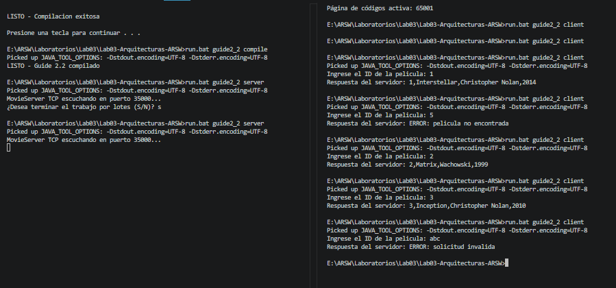

## Ejercicio 2.3 - Gestion Salones TCP

**Paquete:** `src/edu/eci/arsw/excercise2_3/`

**Estado:** :ballot_box_with_check: Implementada.

### Arquitectura

El sistema sigue el mismo patron cliente-servidor que la Guia 2.2, pero con un protocolo y dominio diferentes. `RoomServer` escucha en el puerto 36000 y mantiene un `RoomRepository` en memoria con cuatro salones (E301–E304). `RoomClient` envia un comando en el formato `COMANDO,CODIGO` (ej. `RESERVAR_SALON,E303`) y recibe una respuesta en texto plano. La coma (`,`) como separador distingue este protocolo del protocolo de peliculas (que usa `:`). A diferencia del servidor de peliculas (solo lectura), este servidor soporta operaciones de escritura (reservar/liberar) que mutan el estado compartido del repositorio.

### Archivos

| Archivo | Descripcion |
|---------|-------------|
| `Room.java` | Modelo de salon con codigo y estado de reserva |
| `RoomRepository.java` | Repositorio en memoria con 4 salones precargados |
| `RoomServer.java` | Servidor TCP en puerto 36000 |
| `RoomClient.java` | Cliente TCP por consola |

### Protocolo

| Comando | Respuesta exitosa | Respuesta error |
|---------|------------------|-----------------|
| `CONSULTAR_SALON,CODIGO` | `SALON_DISPONIBLE` / `SALON_RESERVADO` | `ERROR_SALON_NO_EXISTE` |
| `RESERVAR_SALON,CODIGO` | `RESERVA_EXITOSA` | `ERROR_SALON_NO_EXISTE` / `ERROR_SALON_RESERVADO` |
| `LIBERAR_SALON,CODIGO` | `LIBERACION_EXITOSA` | `ERROR_SALON_NO_EXISTE` / `ERROR_OPERACION_INVALIDA` |

A diferencia de la guia 2.2 (que usa `:` como separador), este protocolo usa `,` como separador entre comando y codigo. El formato es `COMANDO,CODIGO` donde CODIGO puede ser E301, E302, E303 o E304.

### Detalle de implementacion paso a paso

#### Paso 1 — Modelo de Datos (`Room.java`)

```java
public class Room {
    private String code;
    private boolean reserved;

    public Room(String code) {
        this.code = code;
        this.reserved = false;
    }

    public String toStatusText() {
        return reserved ? "SALON_RESERVADO" : "SALON_DISPONIBLE";
    }
}
```

**Funcion:** Representa un salon con un codigo unico y un estado de reserva.

**Decisiones de diseno:**
- A diferencia de `Movie` (inmutable), `Room` tiene un setter `setReserved()` porque el ejercicio requiere modificar el estado. Esto introduce estado mutable que debe manejarse con cuidado en entornos concurrentes.
- `toStatusText()` devuelve directamente las constantes del protocolo (`SALON_DISPONIBLE`, `SALON_RESERVADO`), eliminando la necesidad de logica condicional en el servidor.
- El estado inicial es `false` (disponible) para todos los salones.

#### Paso 2 — Repositorio en Memoria (`RoomRepository.java`)

```java
public class RoomRepository {
    private Map<String, Room> rooms = new HashMap<>();

    public RoomRepository() {
        rooms.put("E301", new Room("E301"));
        rooms.put("E302", new Room("E302"));
        rooms.put("E303", new Room("E303"));
        rooms.put("E304", new Room("E304"));
    }

    public String consult(String code) {
        Room room = rooms.get(code);
        if (room == null) return "ERROR_SALON_NO_EXISTE";
        return room.toStatusText();
    }

    public String reserve(String code) {
        Room room = rooms.get(code);
        if (room == null) return "ERROR_SALON_NO_EXISTE";
        if (room.isReserved()) return "ERROR_SALON_RESERVADO";
        room.setReserved(true);
        return "RESERVA_EXITOSA";
    }

    public String release(String code) {
        Room room = rooms.get(code);
        if (room == null) return "ERROR_SALON_NO_EXISTE";
        if (!room.isReserved()) return "ERROR_OPERACION_INVALIDA";
        room.setReserved(false);
        return "LIBERACION_EXITOSA";
    }
}
```

**Funcion:** Almacena 4 salones y ofrece operaciones de consulta, reserva y liberacion.

**Decisiones de diseno:**
- Clave `String` en vez de `Integer`: los codigos de salon (`E301`, `E302`, etc.) son alfanumericos y no tienen un ID numerico natural.
- Cada metodo retorna directamente el string de respuesta del protocolo. Esto evita que el servidor tenga que interpretar codigos intermedios.
- `reserve()` y `release()` validan dos condiciones (existencia + estado actual) antes de modificar el salon, siguiendo el principio de "fallo rapido".
- **Condiciones de carrera:** Si dos clientes ejecutan `RESERVAR_SALON,E303` simultaneamente, ambos pueden pasar la validacion `isReserved()` antes de que el primer `setReserved(true)` se complete. Esto se conoce como condicion de carrera "check-then-act". En un entorno monohilo no ocurre, pero en un servidor con hilos (guia 6.3) se requeriria sincronizacion con `synchronized` o `ReentrantLock`.
- **Alternativa descartada — `ConcurrentHashMap`:** No resuelve la condicion de carrera porque el problema no es la atomicidad del `put`, sino la secuencia `check` → `act` en dos lineas separadas. Se necesitaria un bloque sincronizado o un `compareAndSet`.

#### Paso 3 — Servidor TCP (`RoomServer.java`)

```java
ServerSocket serverSocket = new ServerSocket(36000);
while (true) {
    Socket clientSocket = serverSocket.accept();
    BufferedReader in = new BufferedReader(
            new InputStreamReader(clientSocket.getInputStream()));
    PrintWriter out = new PrintWriter(clientSocket.getOutputStream(), true);
    String request = in.readLine();
    String response = processRequest(request, repository);
    out.println(response);
    in.close(); out.close(); clientSocket.close();
}
```

**Funcion:** Escucha en el puerto `36000`, recibe comandos `COMANDO,CODIGO`, los procesa y responde.

**Decisiones de diseno:**
- Puerto `36000`: continua la convencion de usar puertos en el rango 35000-36000 para los ejercicios TCP del laboratorio.
- `processRequest()` usa `split(",", 2)` con limite 2 para evitar que codigos de salon que contengan comas (no aplica aqui, pero es una buena practica) rompan el parseo.
- `trim()` en cada parte del mensaje elimina espacios accidentales que el usuario podria escribir.
- **Switch sobre String:** Se usa `switch(command)` en vez de `if-else if` por claridad. Java soporta `switch` sobre String desde Java 7.
- **Mensajes de error descriptivos:** Cada error de parseo tiene su propio mensaje (`"ERROR: solicitud vacia"`, `"ERROR: formato invalido"`, `"ERROR: comando desconocido"`), facilitando la depuracion.

**Validacion de comandos:**

| Entrada | Respuesta |
|---------|-----------|
| `null` | `ERROR: solicitud vacia` |
| `SOLO_UN_CAMPO` | `ERROR: formato invalido. Use COMANDO,CODIGO` |
| `COMANDO_INEXISTENTE,E301` | `ERROR: comando desconocido` |
| `CONSULTAR_SALON,E301` | `SALON_DISPONIBLE` |

#### Paso 4 — Cliente TCP (`RoomClient.java`)

```java
System.out.print("Ingrese comando (CONSULTAR_SALON, RESERVAR_SALON, LIBERAR_SALON): ");
String command = scanner.nextLine().trim();

System.out.print("Ingrese codigo del salon (E301, E302, E303, E304): ");
String code = scanner.nextLine().trim();

Socket socket = new Socket("127.0.0.1", 36000);
PrintWriter out = new PrintWriter(socket.getOutputStream(), true);
BufferedReader in = new BufferedReader(
        new InputStreamReader(socket.getInputStream()));

String message = command + "," + code;
out.println(message);
String response = in.readLine();
System.out.println("Respuesta del servidor: " + response);
```

**Funcion:** Solicita comando y codigo al usuario, envia la peticion TCP y muestra la respuesta.

**Decisiones de diseno:**
- A diferencia del cliente de peliculas (que pide solo un ID), este cliente pide dos entradas: comando y codigo. Esto permite probar las 3 operaciones sin modificar el codigo.
- `trim()` en ambas entradas elimina espacios accidentales. Esto es importante porque el protocolo es sensible al formato exacto.
- El mensaje se construye como `command + "," + code`, que coincide exactamente con el formato esperado por el servidor.

#### Paso 5 — Ejecucion

```bash
# Terminal 1 — iniciar servidor
# Limpiar primero si es necesario: clean.bat
run.bat exercise2_3 compile
run.bat exercise2_3 server

# Terminal 2 — ejecutar cliente
run.bat exercise2_3 client
```

**Prueba esperada:**

```
Terminal 1:
RoomServer TCP escuchando en puerto 36000...

Terminal 2:
=== Sistema de Gestion de Salones ===
Ingrese comando (CONSULTAR_SALON, RESERVAR_SALON, LIBERAR_SALON): CONSULTAR_SALON
Ingrese codigo del salon (E301, E302, E303, E304): E303
Respuesta del servidor: SALON_DISPONIBLE
```

**Secuencia completa de prueba:**

```
# Terminal 2 - Sesion 1
CONSULTAR_SALON, E303 → SALON_DISPONIBLE
RESERVAR_SALON, E303  → RESERVA_EXITOSA
CONSULTAR_SALON, E303 → SALON_RESERVADO
LIBERAR_SALON, E303   → LIBERACION_EXITOSA
CONSULTAR_SALON, E303 → SALON_DISPONIBLE

# Terminal 2 - Sesion 2 (errores)
RESERVAR_SALON, E999  → ERROR_SALON_NO_EXISTE
RESERVAR_SALON, E303  → RESERVA_EXITOSA
RESERVAR_SALON, E303  → ERROR_SALON_RESERVADO
LIBERAR_SALON, E303   → LIBERACION_EXITOSA
LIBERAR_SALON, E303   → ERROR_OPERACION_INVALIDA
```

#### Paso 6 — Verificacion

```bash
# Limpiar primero si es necesario: clean.bat
run.bat exercise2_3 compile
# Sin errores
```

Se generan 4 archivos `.class`:
- `Room.class`
- `RoomClient.class`
- `RoomRepository.class`
- `RoomServer.class`

### Diferencias con la guia 2.2

| Aspecto | Guia 2.2 (MovieServer) | Ejercicio 2.3 (RoomServer) |
|---------|----------------------|---------------------------|
| Separador | `:` (`MOVIE:1`) | `,` (`CONSULTAR_SALON,E303`) |
| Operaciones | Solo lectura | Lectura, escritura, liberacion |
| Modelo | Inmutable (`Movie`) | Mutable (`Room`) |
| Puerto | 35000 | 36000 |
| Cliente | Pregunta solo ID | Pregunta comando + codigo |
| Errores adicionales | — | `ERROR_SALON_RESERVADO`, `ERROR_OPERACION_INVALIDA` |

### Preguntas de reflexion

- **Que tan facil seria agregar una nueva operacion?** Solo requiere: (1) agregar el metodo en `RoomRepository`, (2) agregar un `case` en `processRequest()`, (3) documentar el nuevo comando. El protocolo textual hace que el cambio sea simple pero propenso a errores si cliente y servidor no se actualizan al mismo tiempo.
- **Que ocurre si dos clientes intentan reservar el mismo salon simultaneamente?** En el servidor monohilo actual, el segundo cliente espera a que el primero termine, por lo que no hay condicion de carrera. Pero si el servidor usara hilos, ambos podrian pasar la validacion `isReserved()` antes de que cualquiera ejecute `setReserved(true)`, resultando en una doble reserva.
- **Donde esta definido realmente el contrato de comunicacion?** Como en la guia 2.2, el contrato es implicito: existe en la documentacion y en la logica de `processRequest()`. No hay un archivo de interfaz, un esquema o un WSDL que lo formalice.

### Como ejecutar

```bash
# Terminal 1 - Servidor
# Limpiar primero si es necesario: clean.bat
run.bat exercise2_3 compile
run.bat exercise2_3 server

# Terminal 2 - Cliente
run.bat exercise2_3 client
```

---

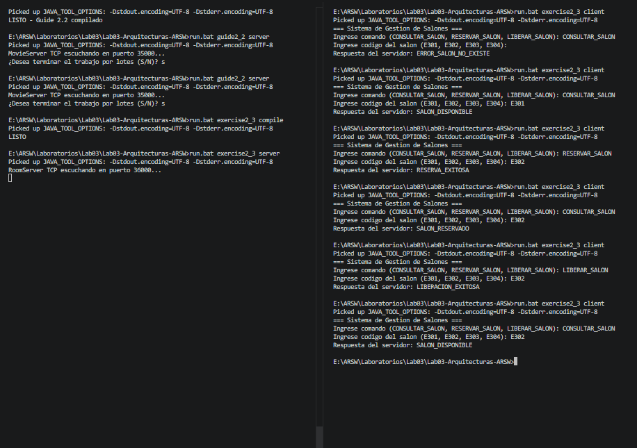

### Diagrama de Arquitectura

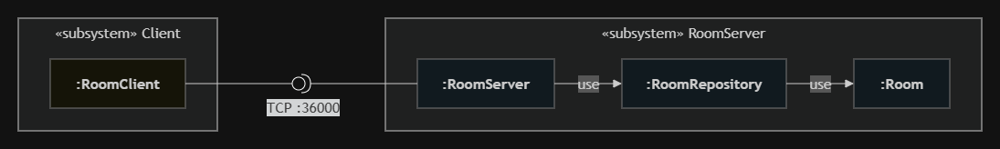

**Por que esta forma:** `RoomClient` requiere el socket TCP para enviar comandos de texto (`CONSULTAR_SALON`, `RESERVAR_SALON`, `LIBERAR_SALON`). `RoomServer` provee TCP :36000, analiza el comando y delega en `RoomRepository`, que encapsula los 4 salones (`Room`). Es el estilo cliente-servidor mas simple: un puerto, un protocolo, analisis manual de texto.

## Guia 3.2 - MovieHttpServer

**Paquete:** `src/edu/eci/arsw/guide3_2/`

**Estado:** :ballot_box_with_check: Implementada.

### Arquitectura

El sistema reemplaza el cliente TCP personalizado por cualquier cliente HTTP estandar (navegador, curl, Postman). `MovieHttpServer` corre en el puerto 8080 usando `com.sun.net.httpserver.HttpServer` (incluido en el JDK). Registra un `MovieHandler` en el contexto `/movie`, que extrae el parametro `id` del query string de las peticiones `GET`, consulta el `MovieRepository` y retorna el resultado como una pagina HTML minimalista. El cambio arquitectonico critico es que el cliente ya no necesita codigo Java personalizado — el contrato ahora es el protocolo HTTP estandar: metodo (`GET`), ruta (`/movie`) y parametro de consulta (`id=1`).

### Archivos

| Archivo | Descripcion |
|---------|-------------|
| `Movie.java` | Modelo de datos (identico al de guide2_2) |
| `MovieRepository.java` | Repositorio en memoria (identico al de guide2_2) |
| `MovieHttpServer.java` | Servidor HTTP en puerto 8080 con `MovieHandler` interno |

### Protocolo

| Elemento | Valor |
|----------|-------|
| Metodo | `GET` |
| Ruta | `/movie` |
| Parametro | `id=<numero>` |
| Respuesta exitosa | `200 OK` con cuerpo HTML |
| Respuesta error | `200 OK` con cuerpo HTML ("no encontrada") |

**Ejemplos:**

```
GET /movie?id=1  →  200 OK  →  <html><body><h1>1,Interstellar,Christopher Nolan,2014</h1></body></html>
GET /movie?id=5  →  200 OK  →  <html><body><h1>Pelicula no encontrada</h1></body></html>
```

### Conceptos clave

1. **HTTP sobre TCP:** HTTP es un protocolo de capa de aplicacion que se construye sobre TCP. Cada peticion HTTP tiene estructura estandar: metodo, ruta, encabezados y cuerpo. A diferencia del protocolo `MOVIE:<id>` (ad-hoc), HTTP es entendido por cualquier cliente.
2. **`com.sun.net.httpserver.HttpServer`:** Servidor HTTP incluido en el JDK desde Java 6. No requiere dependencias externas. Proporciona enrutamiento por ruta (`createContext`), codigos de estado y flujo de cuerpo.
3. **`HttpHandler`:** Interfaz con un unico metodo `handle(HttpExchange)`. Es el equivalente a `processRequest()` de la guia 2.2, pero recibe un objeto estructurado en vez de un string plano.
4. **`HttpExchange`:** Objeto que encapsula la peticion entera: metodo, URI, encabezados, cuerpo de entrada y salida. Reemplaza a `BufferedReader`/`PrintWriter`.
5. **Query string:** Los parametros viajan en la URL despues de `?` (ej. `?id=1`). `HttpExchange` expone el query string pero no lo parsea automaticamente — el handler debe hacerlo.

### Flujo detallado

1. `HttpServer.create(new InetSocketAddress(8080), 0)` crea el servidor HTTP vinculado al puerto 8080.
2. `server.createContext("/movie", handler)` registra `MovieHandler` para peticiones cuya ruta comience con `/movie`.
3. `server.setExecutor(null)` configura el executor por defecto (monohilo, mismo comportamiento que guide2_2).
4. `server.start()` inicia el servidor en un hilo de fondo.
5. Por cada peticion `GET /movie?id=1`, `HttpServer` invoca `MovieHandler.handle(exchange)`.
6. `exchange.getRequestURI().getQuery()` extrae `"id=1"`.
7. `extractId()` valida el prefijo `id=` y extrae el valor numerico. Retorna `-1` si es invalido.
8. `repository.findById(id)` busca la pelicula.
9. Se construye la respuesta HTML: exito → `"<html>...<h1>" + movie.toText() + "</h1>..."`, error → `"<html>...<h1>Pelicula no encontrada</h1>..."`.
10. `exchange.sendResponseHeaders(200, response.getBytes().length)` envia codigo 200 y el header `Content-Length`.
11. `exchange.getResponseBody()` devuelve el `OutputStream` para escribir el cuerpo.
12. Se escribe la respuesta, se cierra el stream, y la respuesta se completa.

### Detalle de implementacion paso a paso

#### Paso 1 — Modelo y Repositorio (`Movie.java`, `MovieRepository.java`)

Identicos a la guia 2.2. Se recrean en el paquete `edu.eci.arsw.guide3_2` para mantener cada guia autocontenida. Esto demuestra que la logica de negocio no cambia entre estilos arquitectonicos — solo cambia la capa de transporte.

**Decision de diseno:** Podriamos haber reutilizado las clases de `guide2_2` via classpath, pero mantener copias separadas hace que cada guia sea autocontenida y compilable independientemente. En un proyecto real se compartirian via un modulo comun.

#### Paso 2 — Servidor HTTP (`MovieHttpServer.java`)

```java
public class MovieHttpServer {
    public static void main(String[] args) throws Exception {
        HttpServer server = HttpServer.create(new InetSocketAddress(8080), 0);
        MovieRepository repository = new MovieRepository();
        server.createContext("/movie", new MovieHandler(repository));
        server.setExecutor(null);
        server.start();
        System.out.println("MovieHttpServer escuchando en http://localhost:8080/movie?id=1");
    }
}
```

**Decisiones de diseno:**

- **`HttpServer.create(new InetSocketAddress(8080), 0)`:** El primer parametro es la direccion y puerto. `InetSocketAddress(8080)` vincula a todas las interfaces de red en el puerto 8080. El segundo parametro es el backlog (0 = valor por defecto del sistema).
- **`createContext("/movie", handler)`:** Registra un `HttpContext` cuyo path base es `/movie`. Cualquier peticion a `/movie` o `/movie/algo` sera manejada por `MovieHandler`. Solo el metodo `GET` es soportado implicitamente — `POST` o `PUT` tambien llegarian al handler, que los ignoraria al no leer el metodo.
- **`setExecutor(null)`:** Usa el executor por defecto, que procesa las peticiones secuencialmente en el hilo del `Acceptor`. Pasar un `Executors.newFixedThreadPool(10)` habilitaria concurrencia.
- **Puerto 8080:** Puerto convencional para servidores HTTP de desarrollo. Es reconocido por navegadores, curl y herramientas HTTP. A diferencia del puerto 35000 (TCP), no requiere especificar el protocolo en el cliente.
- **`throws Exception`:** Similar a guide2_2, propaga errores fatales (ej. puerto en uso) a la JVM.

#### Paso 3 — Manejador HTTP (`MovieHandler`)

```java
static class MovieHandler implements HttpHandler {
    private MovieRepository repository;

    public MovieHandler(MovieRepository repository) { ... }

    @Override
    public void handle(HttpExchange exchange) {
        try {
            String query = exchange.getRequestURI().getQuery();
            int id = extractId(query);
            Movie movie = repository.findById(id);
            String response;
            if (movie == null) {
                response = "<html><body><h1>Pelicula no encontrada</h1></body></html>";
            } else {
                response = "<html><body><h1>" + movie.toText() + "</h1></body></html>";
            }
            exchange.sendResponseHeaders(200, response.getBytes().length);
            OutputStream os = exchange.getResponseBody();
            os.write(response.getBytes());
            os.close();
        } catch (Exception e) { e.printStackTrace(); }
    }

    private int extractId(String query) {
        if (query == null || !query.startsWith("id=")) return -1;
        return Integer.parseInt(query.substring(3));
    }
}
```

**Decisiones de diseno:**

- **`HttpHandler` como clase interna:** Se define como clase interna estatica de `MovieHttpServer` para mantener el ejemplo en un solo archivo. En una aplicacion real se separaria en su propio archivo.
- **`exchange.getRequestURI().getQuery()`:** Retorna el query string crudo (todo lo que esta despues de `?` en la URL). Para `?id=1` retorna `"id=1"`. Para una URL sin query retorna `null`.
- **`extractId()` — parseo manual del query string:** `HttpServer` no provee parseo automatico de parametros. Se implementa manualmente verificando el prefijo `id=` y extrayendo el substring. Si el query es `null`, no comienza con `id=`, o el valor no es numerico, retorna `-1`. Esto desencadena el flujo de "no encontrada".
- **`Integer.parseInt` sin try especifico:** Si el query es `id=abc`, `parseInt` lanza `NumberFormatException`, que es capturado por el `catch (Exception e)` general. La respuesta al cliente queda incompleta — el navegador mostraria un error de conexion. Una implementacion robusta capturaria `NumberFormatException` y retornaria `400 Bad Request`.
- **Respuesta HTML:** Se eligio HTML porque es el formato nativo del navegador. La guia 2.2 usaba CSV (legible por maquina). El cambio de formato refleja que HTTP sirve a clientes humanos (navegador) mientras que TCP sirve a clientes maquina.
- **`sendResponseHeaders(200, length)`:** Envia el codigo de estado HTTP y el header `Content-Length`. Si se pasa `-1` como longitud, se usa chunked transfer encoding. Pasar la longitud exacta permite al cliente saber cuando termina la respuesta.
- **Hardcoded 200:** Todas las respuestas usan 200 OK, incluso cuando la pelicula no existe. Una API RESTful correcta usaria `404 Not Found`. Esta simplificacion es intencional para mantener el ejemplo enfocado en el transporte HTTP, no en el diseno de APIs.

#### Paso 4 — Ejecucion

```bash
# Limpiar primero si es necesario: clean.bat
run.bat guide3_2 compile
run.bat guide3_2 server
```

**Prueba esperada:**

```
# Terminal
MovieHttpServer escuchando en http://localhost:8080/movie?id=1

# curl
curl "http://localhost:8080/movie?id=1"
# <html><body><h1>1,Interstellar,Christopher Nolan,2014</h1></body></html>

curl "http://localhost:8080/movie?id=999"
# <html><body><h1>Pelicula no encontrada</h1></body></html>

curl "http://localhost:8080/"
# 404 Not Found (respuesta por defecto de HttpServer)
```

#### Paso 5 — Verificacion

```bash
# Limpiar primero si es necesario: clean.bat
run.bat guide3_2 compile
# Sin errores
```

### Comparacion: TCP vs HTTP

| Aspecto | Guia 2.2 (TCP) | Guia 3.2 (HTTP) |
|---------|---------------|-----------------|
| **Transporte** | Socket TCP crudo | HTTP 1.1 sobre TCP |
| **Contrato** | Ad-hoc `MOVIE:<id>` | Estandar: `GET /movie?id=<n>` |
| **Cliente** | Solo Java (`MovieClient`) | Cualquier cliente HTTP |
| **Estructura mensaje** | Una linea de texto | Metodo + ruta + query + headers + cuerpo |
| **Parseo peticion** | `split(":")` manual | `HttpExchange.getRequestURI().getQuery()` |
| **Formato respuesta** | Texto plano (CSV) | HTML con etiquetas |
| **Codigos error** | Texto en respuesta | 200 OK siempre (sin 404) |
| **Puerto** | 35000 | 8080 |
| **API servidor** | `ServerSocket` + `accept()` | `HttpServer` + `createContext()` |
| **Concurrencia** | Monohilo bloqueante | Monohilo (`setExecutor(null)`) |
| **Interoperabilidad** | Baja (protocolo propio) | Alta (protocolo estandar) |

### Reflexion arquitectonica

- **HTTP estandariza el contrato:** El protocolo ya no es `MOVIE:<id>` sino `GET /movie?id=<numero>`. Cualquier cliente HTTP entiende esta estructura sin documentacion adicional. El metodo, la ruta y los parametros son conceptos universales.
- **El modelo de negocio no cambia:** `Movie` y `MovieRepository` son identicos a la guia 2.2. Solo se reemplazo la capa de transporte. Esto confirma el principio de separacion de preocupaciones: la logica de negocio es independiente del mecanismo de comunicacion.
- **Interoperabilidad inmediata:** El servicio se prueba con curl, navegador o Postman sin escribir una sola linea de codigo cliente. Esta es la ventaja fundamental de HTTP sobre TCP puro.
- **Limitaciones del servidor integrado:**
  - No parsea parametros automaticamente (hay que llamar `getQuery()` y parsear manualmente).
  - No hay negociacion de contenido (siempre retorna HTML, no soporta JSON).
  - No usa codigos de estado HTTP correctos (siempre 200, nunca 404 o 400).
  - No soporta HTTPS ni peticiones asincronas.
- **Proximo paso:** Esta implementacion sirve de puente conceptual entre TCP (guia 2.2) y RMI (guia 4.2). Muestra como un protocolo estandarizado (HTTP) reduce el acoplamiento cliente-servidor sin necesidad de frameworks.

### Como ejecutar

```bash
# Terminal
# Limpiar primero si es necesario: clean.bat
run.bat guide3_2 compile
run.bat guide3_2 server

# Probar con curl
curl "http://localhost:8080/movie?id=1"
```

---

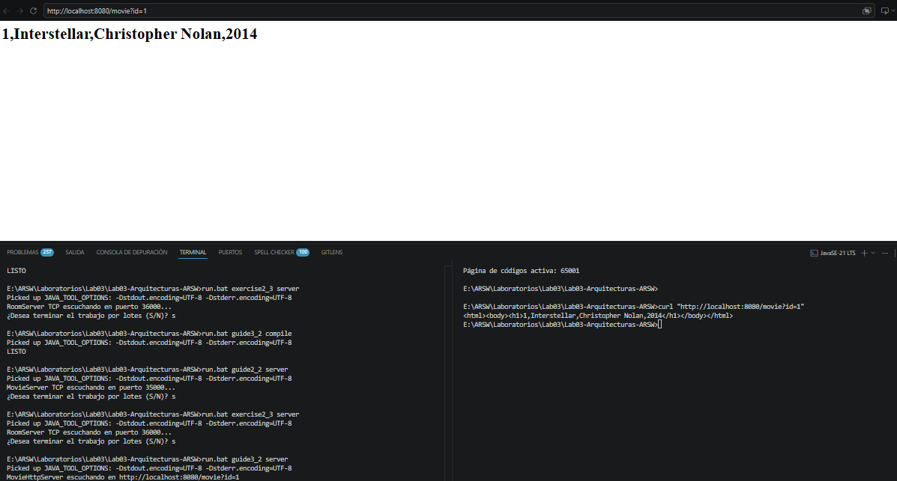

## Ejercicio 3.3 - Gestion Salones HTTP

**Paquete:** `src/edu/eci/arsw/excercise3_3/`

**Estado:** :ballot_box_with_check: Implementada.

### Problema

Transformar el sistema de gestion de salones TCP (ejercicio 2.3) a HTTP usando `com.sun.net.httpserver`. El dominio (salones con reserva/liberacion) es el mismo, pero el protocolo cambia de un formato ad-hoc (`COMANDO,CODIGO`) a rutas HTTP estandarizadas.

### Arquitectura

El sistema extiende el patron HTTP de la Guia 3.2 para soportar multiples operaciones sobre un mismo recurso. `RoomHttpServer` corre en el puerto 8081 y registra un unico `RoomsHandler` en el contexto `/rooms`. A diferencia del servidor de peliculas (que solo maneja GET), este handler inspecciona tanto el metodo HTTP (`GET` vs `POST`) como la ruta (`/rooms`, `/rooms/reserve`, `/rooms/release`) para despachar al metodo correcto del `RoomRepository`: `findAll()` para listar, `consult()` para consultar, `reserve()` para reservar y `release()` para liberar. La logica de negocio (`Room` y `RoomRepository`) es identica a la version TCP (Ejercicio 2.3), con la adicion de `findAll()` para soportar el nuevo endpoint de listado completo.

### Archivos

| Archivo | Descripcion |
|---------|-------------|
| `Room.java` | Modelo de datos (identico al de excercise2_3) |
| `RoomRepository.java` | Repositorio en memoria. Se agrega `findAll()` respecto al de excercise2_3 |
| `RoomHttpServer.java` | Servidor HTTP en puerto 8081 con `RoomsHandler` interno |

### Rutas implementadas

| Metodo | Ruta | Query | Descripcion |
|--------|------|-------|-------------|
| `GET` | `/rooms` | *(ninguno)* | Listar todos los salones con su estado |
| `GET` | `/rooms` | `id=E303` | Consultar estado de un salon especifico |
| `POST` | `/rooms/reserve` | `id=E303` | Reservar un salon |
| `POST` | `/rooms/release` | `id=E303` | Liberar un salon |

### Protocolo

| Elemento | Valor |
|----------|-------|
| Metodos | `GET`, `POST` |
| Ruta base | `/rooms` |
| Formato query | `id=<codigo>` |
| Respuesta exitosa | `200 OK` con cuerpo HTML |
| Respuesta error | `200 OK` con cuerpo HTML (mensaje de error en el cuerpo) |
| Respuesta 404 | `200 OK` con cuerpo HTML indicando "Ruta no encontrada" |

**Ejemplos:**

```
GET /rooms                  →  200 OK  →  <html><body><h1>Salones disponibles:</h1><ul>...</ul></body></html>
GET /rooms?id=E303          →  200 OK  →  <html><body><h1>E303: SALON_DISPONIBLE</h1></body></html>
POST /rooms/reserve?id=E303 →  200 OK  →  <html><body><h1>E303: RESERVA_EXITOSA</h1></body></html>
POST /rooms/release?id=E303 →  200 OK  →  <html><body><h1>E303: LIBERACION_EXITOSA</h1></body></html>
```

### Conceptos clave

1. **Enrutamiento por path y metodo:** A diferencia de la guia 3.2 que solo exponia GET, este ejercicio requiere distinguir entre GET `/rooms` y POST `/rooms/reserve`. `HttpServer.createContext("/rooms", handler)` captura todas las rutas que empiezan con `/rooms`. El handler debe inspeccionar `exchange.getRequestMethod()` y `exchange.getRequestURI().getPath()` para despachar correctamente.
2. **Dos variantes del mismo path:** GET `/rooms` sin query lista todos los salones; GET `/rooms` con query `id=E303` consulta uno especifico. La presencia o ausencia del query string determina el comportamiento. Esto demuestra que el query string no solo lleva datos sino que tambien puede indicar la intencion de la peticion.
3. **`findAll()` como nueva operacion:** El repositorio de salones se extiende con `findAll()` para soportar la lista completa. En el ejercicio TCP (2.3) no existia esta operacion — el cliente debia conocer los codigos de antemano. HTTP permite descubrimiento via el endpoint de lista.
4. **Puerto 8081:** Se usa un puerto diferente al de la guia 3.2 (8080) para permitir ejecutar ambos servidores simultaneamente. Esto refleja la misma decision de diseno de los ejercicios TCP (35000 vs 36000).

### Flujo detallado

1. `HttpServer.create(new InetSocketAddress(8081), 0)` crea el servidor en puerto 8081.
2. `createContext("/rooms", new RoomsHandler())` registra el handler para toda ruta que comience con `/rooms`.
3. `handler.handle(exchange)` es invocado para cada peticion entrante.
4. `exchange.getRequestMethod()` retorna `"GET"` o `"POST"`.
5. `exchange.getRequestURI().getPath()` retorna `"/rooms"`, `"/rooms/reserve"` o `"/rooms/release"`.
6. `exchange.getRequestURI().getQuery()` retorna el query string (ej. `"id=E303"`) o `null` si no hay.
7. El handler aplica la logica de despacho:
   - `GET /rooms` sin query → `listAll()` → repositorio.findAll() → construye HTML con lista.
   - `GET /rooms` con query → `extractId(query)` → `repository.consult(code)` → construye HTML.
   - `POST /rooms/reserve` → `extractId(query)` → `repository.reserve(code)` → construye HTML.
   - `POST /rooms/release` → `extractId(query)` → `repository.release(code)` → construye HTML.
   - Cualquier otra combinacion → HTML con mensaje 404.
8. `exchange.sendResponseHeaders(200, length)` envia codigo 200.
9. `exchange.getResponseBody()` devuelve el `OutputStream`, se escribe la respuesta y se cierra.

### Detalle de implementacion paso a paso

#### Paso 1 — Modelo de datos (`Room.java`)

Identico al del ejercicio 2.3. Se recrea en el paquete `edu.eci.arsw.excercise3_3` para mantener el ejercicio autocontenido.

```java
public class Room {
    private String code;
    private boolean reserved;

    public Room(String code) { ... }
    public String getCode() { ... }
    public boolean isReserved() { ... }
    public void setReserved(boolean reserved) { ... }
    public String toStatusText() { ... }
}
```

**Decision de diseno:** No se modifico el modelo. Aunque ahora se usa HTTP, el salon sigue siendo el mismo objeto de dominio. Esto demuestra que el modelo de negocio es independiente del protocolo de transporte.

#### Paso 2 — Repositorio (`RoomRepository.java`)

Identico al del ejercicio 2.3, con una adicion:

```java
public Collection<Room> findAll() {
    return rooms.values();
}
```

**Decision de diseno:** `findAll()` es necesario porque el endpoint `GET /rooms` (sin id) debe listar todos los salones. En el ejercicio TCP no existia este requerimiento — el cliente TCP solo podia consultar/ reservar/liberar salones individuales. HTTP introduce una operacion de descubrimiento que no existia en el protocolo TCP.

La pregunta de diseno es: ¿deberia `findAll()` exponer la coleccion directamente (riesgo de mutacion externa) o retornar una copia defensiva? Se opto por exponer la coleccion directamente por simplicidad educativa, pero en produccion se retornaria `Collections.unmodifiableCollection(rooms.values())`.

#### Paso 3 — Servidor HTTP (`RoomHttpServer.java`)

```java
public class RoomHttpServer {
    public static void main(String[] args) throws Exception {
        HttpServer server = HttpServer.create(new InetSocketAddress(8081), 0);
        server.createContext("/rooms", new RoomsHandler());
        server.setExecutor(null);
        server.start();
        System.out.println("RoomHttpServer escuchando en http://localhost:8081/rooms");
    }
}
```

**Decisiones de diseno:**

- **Puerto 8081:** Se evita conflicto con la guia 3.2 (puerto 8080). Sigue la convencion de los ejercicios TCP (35000 vs 36000).
- **Un solo contexto (`/rooms`):** En lugar de crear contextos separados para `/rooms`, `/rooms/reserve` y `/rooms/release`, se registra un solo handler que despacha internamente. Esto es posible porque `HttpServer` usa matching por prefijo: cualquier ruta que comience con `/rooms` (incluyendo `/rooms/reserve`) llega al mismo handler.
- **Handler sin repositorio externo:** A diferencia de la guia 3.2 (que recibia el repositorio por constructor), `RoomsHandler` crea su propio `RoomRepository` internamente. Esto simplifica el ejemplo ya que no hay configuracion externa. En una aplicacion real se usaria inyeccion de dependencias.

#### Paso 4 — Despachador HTTP (`RoomsHandler`)

```java
static class RoomsHandler implements HttpHandler {
    private RoomRepository repository = new RoomRepository();

    @Override
    public void handle(HttpExchange exchange) {
        String method = exchange.getRequestMethod();
        String path = exchange.getRequestURI().getPath();
        String query = exchange.getRequestURI().getQuery();

        if ("GET".equals(method) && path.equals("/rooms")) {
            if (query == null) {
                response = listAll();
            } else {
                String code = extractId(query);
                response = toHtml(code, repository.consult(code));
            }
        } else if ("POST".equals(method) && path.equals("/rooms/reserve")) {
            String code = extractId(query);
            response = toHtml(code, repository.reserve(code));
        } else if ("POST".equals(method) && path.equals("/rooms/release")) {
            String code = extractId(query);
            response = toHtml(code, repository.release(code));
        } else {
            response = "...404 - Ruta no encontrada...";
        }
        // ...send response...
    }
}
```

**Decisiones de diseno:**

- **Despacho manual por metodo + path:** `HttpServer` no provee enrutamiento por metodo HTTP (GET vs POST). Tampoco hay un framework de routing. El handler debe inspeccionar `exchange.getRequestMethod()` y `exchange.getRequestURI().getPath()` manualmente. Esto replica la logica de `processRequest()` del ejercicio TCP, pero operando sobre la estructura HTTP en vez de sobre un string crudo.
- **`path.equals("/rooms")` exacto:** Se usa comparacion exacta (no `startsWith`) para evitar que `/rooms/algo` sea interpretado como lista de salones. Solo `/rooms` exactamente lista todos los salones.
- **Query como diferenciador:** GET `/rooms` sin query lista todos; GET `/rooms` con query consulta uno especifico. El handler usa `query == null` como condicion para distinguir. Esto es una decision de disiono de API: podrian haber sido rutas separadas (`/rooms` vs `/rooms/consult?id=E303`), pero se eligio usar el query string porque el spec lo especifica asi.
- **`extractId()` generica:** A diferencia de la guia 3.2 que extraia un entero, `extractId()` retorna el valor del query como String. Los codigos de salon son alfanumericos (E301, E302, etc.), no enteros. Si el query falta o no comienza con `id=`, retorna `""` (string vacio), que luego genera `ERROR_SALON_NO_EXISTE` en el repositorio.
- **`toHtml()` factorizado:** Se extrajo un metodo `toHtml(code, message)` para evitar repetir el HTML wrapper en cada rama del dispatch. Esto mejora la legibilidad y centraliza el formato de respuesta.
- **`listAll()` separado:** La logica de listar todos los salones se aislo en su propio metodo. Construye una lista HTML `<ul>` con el codigo y estado de cada salon. Podria haberse delegado al repositorio, pero se mantiene en el handler para mantener el repositorio enfocado en logica de negocio.
- **404 catch-all:** Cualquier combinacion no soportada (ej. `POST /rooms` sin reserve/release, `DELETE /rooms`, `GET /rooms/reserve`) recibe un mensaje 404 en el cuerpo. Notar que el codigo HTTP sigue siendo 200 — esta es la misma limitacion de la guia 3.2.

#### Paso 5 — Ejecucion

```bash
# Limpiar primero si es necesario: clean.bat
run.bat exercise3_3 compile
run.bat exercise3_3 server
```

**Prueba esperada:**

```
# Terminal
RoomHttpServer escuchando en http://localhost:8081/rooms

# GET /rooms (listar todos)
curl "http://localhost:8081/rooms"
# <html><body><h1>Salones disponibles:</h1><ul><li>E301 - SALON_DISPONIBLE</li>...</ul></body></html>

# GET /rooms?id=E303 (consultar uno)
curl "http://localhost:8081/rooms?id=E303"
# <html><body><h1>E303: SALON_DISPONIBLE</h1></body></html>

# POST /rooms/reserve?id=E303 (reservar)
curl -X POST "http://localhost:8081/rooms/reserve?id=E303"
# <html><body><h1>E303: RESERVA_EXITOSA</h1></body></html>

# POST /rooms/release?id=E303 (liberar)
curl -X POST "http://localhost:8081/rooms/release?id=E303"
# <html><body><h1>E303: LIBERACION_EXITOSA</h1></body></html>

# POST /rooms/reserve?id=E303 (doble reserva)
curl -X POST "http://localhost:8081/rooms/reserve?id=E303"
# <html><body><h1>E303: RESERVA_EXITOSA</h1></body></html>
curl -X POST "http://localhost:8081/rooms/reserve?id=E303"
# <html><body><h1>E303: ERROR_SALON_RESERVADO</h1></body></html>

# Salon inexistente
curl "http://localhost:8081/rooms?id=INVALIDO"
# <html><body><h1>INVALIDO: ERROR_SALON_NO_EXISTE</h1></body></html>

# Ruta no soportada
curl "http://localhost:8081/rooms/xyz"
# <html><body><h1>404 - Ruta no encontrada: GET /rooms/xyz</h1></body></html>
```

#### Paso 6 — Verificacion

```bash
# Limpiar primero si es necesario: clean.bat
run.bat exercise3_3 compile
# Sin errores
```

### Comparacion: Ejercicio 2.3 (TCP) vs Ejercicio 3.3 (HTTP)

| Aspecto | Ejercicio 2.3 (TCP) | Ejercicio 3.3 (HTTP) |
|---------|--------------------|----------------------|
| **Transporte** | Socket TCP crudo | HTTP 1.1 sobre TCP |
| **Formato mensaje** | `COMANDO,CODIGO` | GET/POST + ruta + query |
| **Comandos** | `CONSULTAR_SALON`, `RESERVAR_SALON`, `LIBERAR_SALON` | GET `/rooms?id=`, POST `/rooms/reserve?id=`, POST `/rooms/release?id=` |
| **Listar salones** | No soportado | GET `/rooms` |
| **Parseo** | `split(",", 2)` manual | `exchange.getRequestMethod()`, `getPath()`, `getQuery()` |
| **Separador** | Coma (`,`) | Ruta y query string |
| **Formato respuesta** | Texto plano | HTML con etiquetas |
| **Puerto** | 36000 | 8081 |
| **Cliente** | Solo Java (`RoomClient`) | Cualquier cliente HTTP |
| **Enrutamiento** | `switch(command)` con 3 casos | `if (method+path)` con 4 casos + catch-all 404 |
| **Repositorio** | Solo operaciones individuales | Se agrega `findAll()` para lista completa |

### Reflexion arquitectonica

- **HTTP estructura el contrato:** En TCP, el cliente debia saber que enviar `RESERVAR_SALON,E303` en una linea de texto. En HTTP, la intencion se expresa mediante la combinacion de metodo (POST = accion), ruta (`/rooms/reserve` = que recurso y que accion) y query (`id=E303` = parametro). Cada parte tiene un significado estandarizado.
- **Descubrimiento de recursos:** El endpoint `GET /rooms` (sin id) es una operacion que no existia en TCP. HTTP introduce naturalmente la necesidad de listar recursos, algo que TCP no incentiva porque cada operacion requiere un formato de mensaje distinto.
- **GET vs POST refleja semantica:** GET se usa para consultas (lectura, sin efectos secundarios). POST se usa para acciones (reservar/liberar, con efectos secundarios). Esta distincion semantica no existia en TCP, donde todos los mensajes eran lineas de texto indistintas.
- **El repositorio se extiende, el modelo no:** El modelo `Room` no cambio respecto al ejercicio TCP. Solo el repositorio agrego `findAll()`. Esto confirma que la capa de transporte (TCP→HTTP) afecta las operaciones del repositorio pero no el modelo de dominio.
- **Sin framework, el enrutamiento es manual:** No hay anotaciones `@GetMapping("/rooms")`. Todo el despacho se hace con `if/else if`. Esto es explicito y educativo, pero no escalable — en el modulo de microservicios se introducira Spring Boot que abstrae este enrutamiento.
- **Hardcoded 200 (misma limitacion que guia 3.2):** Todas las respuestas usan codigo 200. Un diseno RESTful correcto usaria 201 para reserva exitosa, 409 para conflicto (doble reserva), 404 para salon no encontrado, etc. Esta simplificacion es intencional para mantener el foco en la migracion TCP→HTTP.

### Preguntas de reflexion (del contexto.md)

1. **?Que ventajas ofrece HTTP frente a un protocolo de texto manual?**
   - Estandarizacion: cualquier cliente HTTP (navegador, curl, Postman) puede consumir el servicio sin codigo personalizado.
   - Semantica incorporada: GET (lectura) vs POST (escritura) expresan la intencion.
   - Estructura: metodo, ruta, query, headers y cuerpo son conceptos universales.
   - Herramientas: depuracion con DevTools, proxies como Fiddler, clientes como Postman.

2. **?Que limitaciones tiene construir un servidor HTTP sin framework?**
   - Enrutamiento manual (no hay `@GetMapping`).
   - Parameo manual del query string (no hay `@RequestParam`).
   - Sin negociacion de contenido (no hay JSON vs XML).
   - Sin codigos de estado correctos (siempre 200).
   - Sin manejo de errores estructurado.
   - Sin validacion de entrada automatica.
   - Sin soporte para HTTPS, CORS, sesiones, etc.

3. **?Como cambiaria la solucion usando JSON en lugar de HTML?**
   - La respuesta seria `{"codigo": "E303", "estado": "SALON_DISPONIBLE"}` en vez de HTML.
   - Seria mas facil de parsear por clientes maquina (JavaScript, Python, etc.).
   - Se perderia la visualizacion directa en navegador.
   - Requiriria una libreria JSON (Jackson, Gson) o parseo manual.
   - `Content-Type` cambiaria de `text/html` a `application/json`.

### Como ejecutar

```bash
# Limpiar primero si es necesario: clean.bat
run.bat exercise3_3 compile
run.bat exercise3_3 server

# Probar con curl
curl "http://localhost:8081/rooms"
curl "http://localhost:8081/rooms?id=E303"
curl -X POST "http://localhost:8081/rooms/reserve?id=E303"
curl -X POST "http://localhost:8081/rooms/release?id=E303"
```

---

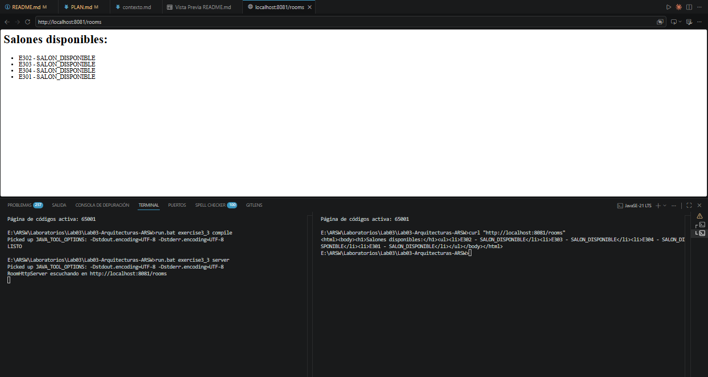
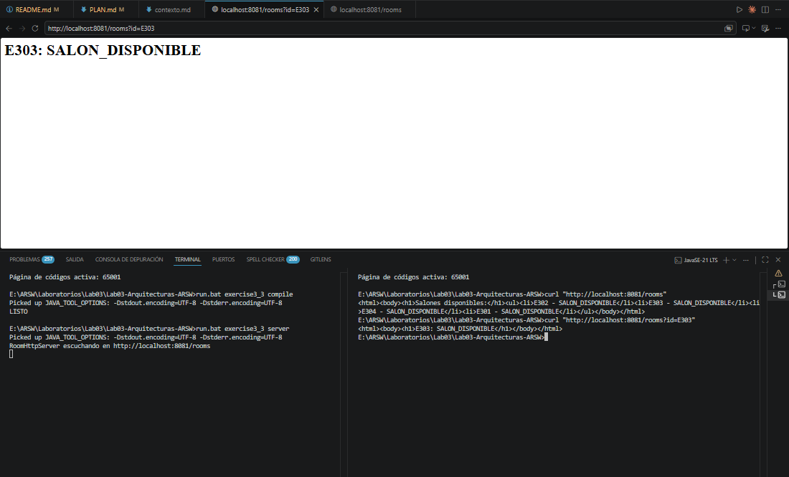
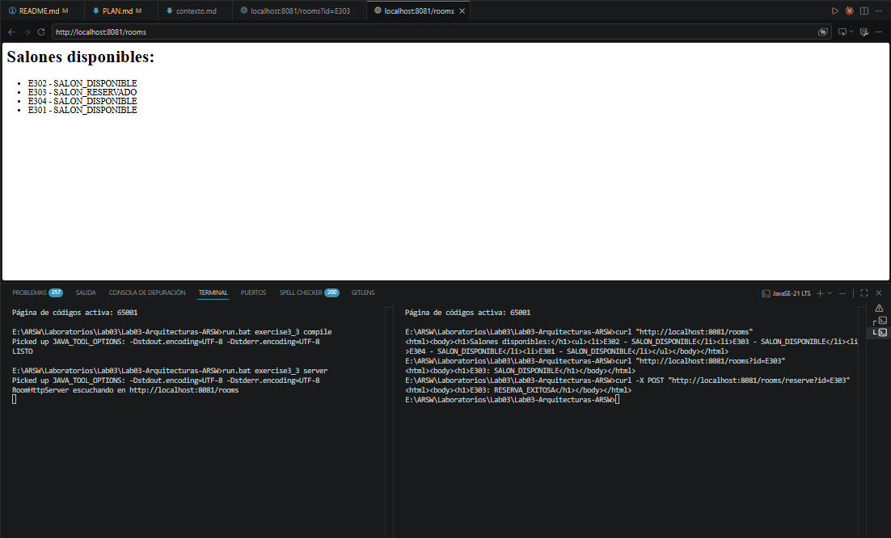

### Diagrama de Arquitectura

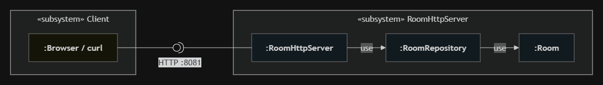

**Por que esta forma:** `Browser` requiere HTTP para hacer solicitudes GET/POST. `RoomHttpServer` provee HTTP :8081 y enruta por metodo + ruta (`GET /rooms`, `POST /rooms/reserve`, `POST /rooms/release`). Frente a TCP (Ejercicio 2.3), HTTP anade estructura estandar, codigos de estado y compatibilidad con navegadores. El costo es un handler mas complejo que debe analizar metodos, rutas y parametros manualmente.

## Guia 4.2 - MovieService RMI

**Paquete:** `src/edu/eci/arsw/guide4_2/`

**Estado:** :ballot_box_with_check: Implementada.

### Arquitectura

El sistema introduce una arquitectura RMI de tres niveles. `MovieRmiServer` crea un `MovieServiceImpl` (que extiende `UnicastRemoteObject` para auto-exportarse como objeto remoto) y lo vincula a un `Registry` RMI en el puerto 23000 bajo el nombre `"movieService"`. `MovieRmiClient` se conecta al mismo Registry via `LocateRegistry.getRegistry()`, busca `"movieService"` para obtener un stub (un proxy dinamico que implementa `MovieService` localmente) y llama a `getMovie(2)` como si fuera un metodo local. Detras de escena, RMI serializa el argumento `int`, lo transmite a la JVM del servidor, lo deserializa, invoca la implementacion real, serializa el objeto `Movie` retornado y lo envia de vuelta al cliente donde se deserializa en una copia local. El Registry actua como servicio de nombres (analogo a DNS), desacoplando al cliente de la referencia directa al objeto remoto.

### Archivos

| Archivo | Descripcion |
|---------|-------------|
| `Movie.java` | Modelo de datos, implementa `Serializable` (necesario para paso por valor) |
| `MovieService.java` | Interfaz remota que extiende `Remote` |
| `MovieServiceImpl.java` | Implementacion que extiende `UnicastRemoteObject` |
| `MovieRmiServer.java` | Crea Registry en puerto 23000 y publica el servicio |
| `MovieRmiClient.java` | Obtiene referencia remota e invoca `getMovie()` |

### Contrato remoto

```java
public interface MovieService extends Remote {
    Movie getMovie(int id) throws RemoteException;
}
```

| Elemento | Descripcion |
|----------|-------------|
| Interfaz | `MovieService` extiende `java.rmi.Remote` |
| Metodo | `Movie getMovie(int id)` |
| Excepcion | `RemoteException` (toda llamada remota debe declararla) |
| Paso de parametros | `int id` — por valor (los primitivos siempre se copian) |
| Retorno | `Movie` — por valor (serializacion), se copia el objeto completo |
| Puerto Registry | 23000 |
| Nombre servicio | `"movieService"` |

### Conceptos clave

1. **Proxy remoto:** Cuando el cliente hace `registry.lookup("movieService")`, obtiene un *stub* (proxy) que implementa `MovieService`. El stub se encarga de: serializar los argumentos, enviarlos al servidor via RMI, recibir la respuesta deserializada y retornarla al cliente. El desarrollador nunca ve los bytes.
2. **`UnicastRemoteObject`:** Base para objetos remotos que se comunican via TCP directo (unicast). El constructor exporta el objeto automaticamente, haciendolo accesible desde otras JVMs.
3. **`RemoteException`:** Toda invocacion remota puede fallar por: caida de red, servidor caido, timeouts, versiones incompatibles. El compilador obliga a declarar o capturar `RemoteException`.
4. **Serializacion para paso por valor:** `Movie` implementa `Serializable` no por eleccion sino por necesidad: RMI serializa el objeto para transmitirlo por la red y lo deserializa en el cliente. Sin `Serializable`, RMI lanza `java.rmi.MarshalException`.
5. **Registry:** Servicio de nombres de RMI. Permite asociar un nombre logico (`"movieService"`) a un objeto remoto. El cliente consulta al Registry para obtener la referencia. Es analogo a un DNS dentro de RMI.

### Flujo detallado

1. `MovieRmiServer.main()` crea `MovieServiceImpl`, que extiende `UnicastRemoteObject` y se exporta automaticamente.
2. `LocateRegistry.createRegistry(23000)` crea un proceso Registry en el puerto 23000 dentro de la misma JVM.
3. `registry.rebind("movieService", service)` asocia el nombre `"movieService"` a la referencia remota.
4. `MovieRmiClient.main()` llama `LocateRegistry.getRegistry("127.0.0.1", 23000)` para conectarse al Registry.
5. `registry.lookup("movieService")` obtiene el stub (proxy) del servicio remoto. El stub es un objeto que implementa `MovieService` localmente pero delega cada llamada al servidor.
6. `service.getMovie(2)` invoca el metodo en el proxy. RMI serializa el argumento `2` (int → 4 bytes via DataOutputStream) y lo envia al servidor.
7. En el servidor, RMI deserializa los argumentos, invoca `MovieServiceImpl.getMovie(2)`, obtiene el objeto `Movie`, y lo serializa de vuelta al cliente.
8. En el cliente, RMI deserializa el objeto `Movie` (creando una copia local) y lo retorna al codigo de usuario.

### Detalle de implementacion paso a paso

#### Paso 1 — Modelo serializable (`Movie.java`)

```java
public class Movie implements Serializable {
    private int id;
    private String title;
    private String director;
    private int year;
    // constructor, getters, toString()
}
```

**Decision de diseno:** `toString()` retorna `"1 - Interstellar (2014) - Christopher Nolan"` (formato del contexto.md). Difiere de `toText()` en guias anteriores que usaba CSV (`1,Interstellar,...`). El cambio es cosmetico pero relevante: RMI no necesita parseo de texto, el objeto entero se transmite serializado.

**`Serializable` sin `serialVersionUID`:** Se omite intencionalmente el `serialVersionUID`. En produccion es obligatorio para evitar `InvalidClassException` al cambiar la clase. Aqui se omite por simplicidad educativa.

#### Paso 2 — Interfaz remota (`MovieService.java`)

```java
public interface MovieService extends Remote {
    Movie getMovie(int id) throws RemoteException;
}
```

**Decision de diseno:** La interfaz debe extender `java.rmi.Remote` (interfaz marcadora, sin metodos). Sin esto, `UnicastRemoteObject` no puede exportar el objeto. Cada metodo debe declarar `throws RemoteException` — es la unica forma que tiene RMI de notificar fallos de red al cliente.

**Un solo metodo:** `getMovie(int)` es suficiente para el caso de uso. En un sistema real habria `getAllMovies()`, `addMovie()`, etc. Se mantiene minimalista para enfocarse en el mecanismo RMI.

#### Paso 3 — Implementacion (`MovieServiceImpl.java`)

```java
public class MovieServiceImpl extends UnicastRemoteObject implements MovieService {
    private Map<Integer, Movie> movies = new HashMap<>();

    public MovieServiceImpl() throws RemoteException {
        movies.put(1, new Movie(1, "Interstellar", "Christopher Nolan", 2014));
        movies.put(2, new Movie(2, "Matrix", "Wachowski", 1999));
        movies.put(3, new Movie(3, "Inception", "Christopher Nolan", 2010));
    }

    @Override
    public Movie getMovie(int id) throws RemoteException {
        return movies.get(id);
    }
}
```

**Decisiones de diseno:**

- **`extends UnicastRemoteObject`:** Es la clase base para objetos remotos RMI que se comunican via TCP directo. El constructor `UnicastRemoteObject()` exporta automaticamente el objeto en un puerto anonimo (no confundir con el puerto del Registry). Sin esta herencia, habria que llamar `UnicastRemoteObject.exportObject(this, 0)` manualmente.
- **`throws RemoteException` en constructor:** Aunque el constructor no hace llamadas remotas, `UnicastRemoteObject()` puede lanzar `RemoteException` si falla la exportacion del objeto (ej. puerto en uso). Es obligatorio declararla.
- **HashMap interno:** El catalogo de peliculas se mantiene en memoria dentro del objeto remoto. Como el objeto vive en el servidor, el HashMap es accesible solo a traves de los metodos remotos. No hay riesgo de acceso concurrente porque el servidor RMI es monohilo (a menos que se configure multi-threading).
- **Retorna `null` para IDs inexistentes:** `Map.get()` retorna `null` si la clave no existe. El cliente debe manejar este caso. Alternativa: lanzar `RemoteException` con un mensaje descriptivo, pero se opto por `null` para mantener la simplicidad.

#### Paso 4 — Servidor (`MovieRmiServer.java`)

```java
public class MovieRmiServer {
    public static void main(String[] args) throws Exception {
        MovieService service = new MovieServiceImpl();
        Registry registry = LocateRegistry.createRegistry(23000);
        registry.rebind("movieService", service);
        System.out.println("MovieService RMI publicado en puerto 23000...");
    }
}
```

**Decisiones de diseno:**

- **`LocateRegistry.createRegistry(23000)` vs `rmiregistry` externo:** Se crea el Registry dentro de la misma JVM del servidor. Esto evita tener que ejecutar `rmiregistry` en una terminal aparte. El puerto 23000 se eligio arbitrariamente (ningun otro servicio usa este puerto).
- **`rebind()` vs `bind()`:** `rebind()` reemplaza cualquier binding existente. `bind()` lanza `AlreadyBoundException` si el nombre ya existe. Se usa `rebind()` porque es mas tolerante a reinicios del servidor.
- **`throws Exception`:** El metodo principal propaga cualquier excepcion (fallo de red, puerto en uso) a la JVM. En produccion se manejaria con un bloque try-catch y reintentos.

#### Paso 5 — Cliente (`MovieRmiClient.java`)

```java
public class MovieRmiClient {
    public static void main(String[] args) throws Exception {
        Registry registry = LocateRegistry.getRegistry("127.0.0.1", 23000);
        MovieService service = (MovieService) registry.lookup("movieService");
        Scanner scanner = new Scanner(System.in);
        System.out.print("Ingrese ID de pelicula (1-3): ");
        int id = scanner.nextInt();
        Movie movie = service.getMovie(id);
        if (movie != null) {
            System.out.println("Película recibida: " + movie);
        } else {
            System.out.println("Película no encontrada");
        }
    }
}
```

**Decisiones de diseno:**

- **`getRegistry("127.0.0.1", 23000)`:** Se conecta al Registry en localhost, puerto 23000. Si el servidor estuviera en otra maquina, se usaria su IP.
- **`lookup()` retorna `Remote` (cast necesario):** `registry.lookup("movieService")` retorna `Remote` (la interfaz base). El cast a `MovieService` es necesario para acceder a los metodos de la interfaz. Si el nombre no existe, `lookup()` lanza `java.rmi.NotBoundException`.
- **Scanner para entrada interactiva:** A diferencia de las guias TCP (que usaban Scanner) y HTTP (que usaba curl), el cliente RMI es interactivo. Permite probar diferentes IDs sin recompilar.
- **Manejo de `null`:** `service.getMovie(id)` puede retornar `null`. El cliente lo verifica explicitamente.

#### Paso 6 — Ejecucion

```bash
# Limpiar primero si es necesario: clean.bat
run.bat guide4_2 compile
run.bat guide4_2 server
run.bat guide4_2 client
```

**Prueba esperada:**

```
# Terminal 1
MovieService RMI publicado en puerto 23000...

# Terminal 2
Ingrese ID de pelicula (1-3): 1
Película recibida: 1 - Interstellar (2014) - Christopher Nolan

Ingrese ID de pelicula (1-3): 5
Película no encontrada
```

#### Paso 7 — Verificacion

```bash
# Limpiar primero si es necesario: clean.bat
run.bat guide4_2 compile
# Sin errores
```

### Comparacion: HTTP (Guia 3.2) vs RMI (Guia 4.2)

| Aspecto | Guia 3.2 (HTTP) | Guia 4.2 (RMI) |
|---------|-----------------|-----------------|
| **Paradigma** | Request-response via URL | Invocacion remota de metodos |
| **Contrato** | Implicito (GET /movie?id=n) | Explicito (interfaz `MovieService`) |
| **Serializacion** | Manual a HTML | Automatica via Java Serialization |
| **Parseo peticion** | Manual (query string) | Automatico (argumentos Java) |
| **Formato respuesta** | HTML (texto) | Objeto Java serializado |
| **Cliente** | Cualquier HTTP client | Solo Java (misma interfaz) |
| **Puerto** | 8080 (servidor) | 23000 (Registry) + puerto anonimo (objeto) |
| **Acoplamiento** | Bajo (solo URL conocida) | Alto (misma interfaz Java) |
| **Interoperabilidad** | Alta (HTTP es universal) | Baja (solo Java) |
| **Error handling** | Codigos HTTP + cuerpo | `RemoteException` + posibles nulls |

### Reflexion arquitectonica

- **RMI elimina el parseo manual:** No hay `split(":")` ni `exchange.getRequestURI().getQuery()`. Los argumentos se pasan como parametros de metodo Java. RMI se encarga de serializar, transmitir, deserializar y enrutar.
- **El contrato es una interfaz Java:** Cualquiera que tenga la interfaz `MovieService` sabe exactamente que metodos y tipos existen. No hay documentacion externa ni experimentos con curl para descubrir la API.
- **El objeto viaja por la red:** `Movie` se transmite completo (por valor). El cliente recibe una copia local. No hay referencia al objeto original — modificar la copia no afecta el servidor.
- **Acoplamiento extremo:** Cliente y servidor deben compartir la misma interfaz `MovieService` y la misma clase `Movie`. Cambiar el paquete, agregar un campo, o cambiar la version de serializacion rompe la comunicacion. RMI sacrifica interoperabilidad por transparencia.
- **`RemoteException` es contagiosa:** Cualquier metodo que invoque un servicio remoto debe declarar o capturar `RemoteException`. Esto contamina la firma de los metodos del cliente — un efecto secundario del modelo RPC.
- **El servidor es tambien cliente del Registry:** `MovieRmiServer` debe conectarse a `LocateRegistry` para publicar el servicio. Esto es analogo a DNS: el servidor registra su nombre, el cliente lo consulta.
- **Proximo paso:** gRPC (guia 5.2) resuelve las limitaciones de RMI: define el contrato en un archivo `.proto` independiente del lenguaje y usa HTTP/2 como transporte, permitiendo clientes en cualquier lenguaje.

---

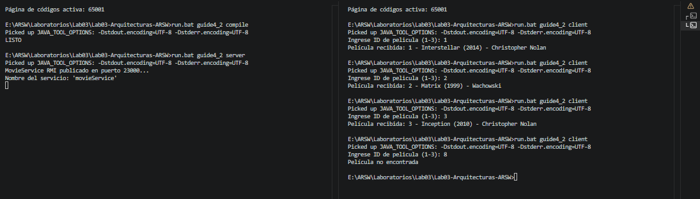

## Ejercicio 4.3 - Inventario Laboratorios RMI

**Paquete:** `src/edu/eci/arsw/excercise4_3/`

**Estado:** :ballot_box_with_check: Implementada.

### Problema

Transformar el sistema de gestion de equipos de laboratorio a RMI. A diferencia del dominio de salones (ejercicio 2.3/3.3) que trabajaba con strings planos, el inventario de laboratorios requiere retornar objetos estructurados (`Equipment`) y listas (`List<String>`). RMI maneja esta complejidad automaticamente via serializacion.

### Arquitectura

El sistema sigue el mismo patron RMI de la Guia 4.2 pero con un contrato mas rico que incluye recuperacion de colecciones (`List<String> consultarEquipos()`) y operaciones de escritura (`boolean reservarEquipo()`, `boolean liberarEquipo()`). `EquipmentRmiServer` publica un `EquipmentServiceImpl` (auto-exportado via `UnicastRemoteObject`) en el puerto 24000 bajo el nombre `"equipmentService"`. La implementacion mantiene un `HashMap<String, Equipment>` con cinco equipos de laboratorio. El cliente busca el servicio e interactua a traves de cuatro metodos remotos: `consultarEquipos()` retorna un `ArrayList<String>` serializado, `consultarEquipo()` retorna un string de estado (o mensaje de error), mientras que `reservarEquipo()` y `liberarEquipo()` retornan `boolean` — un enfoque de senalizacion de errores mas simple pero menos informativo que los strings descriptivos usados en los ejercicios TCP/HTTP de salones.

### Archivos

| Archivo | Descripcion |
|---------|-------------|
| `Equipment.java` | Modelo serializable (codigo, nombre, laboratorio, estado) |
| `EquipmentService.java` | Interfaz remota con 4 metodos |
| `EquipmentServiceImpl.java` | Implementacion con HashMap de 5 equipos |
| `EquipmentRmiServer.java` | Crea Registry en puerto 24000 y publica `"equipmentService"` |
| `EquipmentRmiClient.java` | Cliente interactivo que prueba todos los metodos |

### Contrato remoto

```java
public interface EquipmentService extends Remote {
    List<String> consultarEquipos() throws RemoteException;
    String consultarEquipo(String codigo) throws RemoteException;
    boolean reservarEquipo(String codigo) throws RemoteException;
    boolean liberarEquipo(String codigo) throws RemoteException;
}
```

| Metodo | Retorno | Descripcion |
|--------|---------|-------------|
| `consultarEquipos()` | `List<String>` | Lista de todos los equipos (formato texto) |
| `consultarEquipo(codigo)` | `String` | Estado de un equipo especifico o mensaje de error |
| `reservarEquipo(codigo)` | `boolean` | `true` si se reserva exitosamente, `false` si no existe o ya reservado |
| `liberarEquipo(codigo)` | `boolean` | `true` si se libera exitosamente, `false` si no existe o ya disponible |

### Datos de prueba

| Codigo | Nombre | Laboratorio | Estado inicial |
|--------|--------|-------------|----------------|
| LAP001 | Laptop Dell XPS 15 | Lab de Computacion | Disponible |
| LAP002 | Laptop HP Spectre | Lab de Computacion | Disponible |
| OSC001 | Osciloscopio Tektronix | Lab de Electronica | Disponible |
| MIC001 | Microscopio Olympus | Lab de Biologia | Disponible |
| CEN001 | Centrifuga Eppendorf | Lab de Biologia | Disponible |

### Conceptos clave

1. **`List<String>` como tipo de retorno remoto:** `List` es una interfaz, no una clase concreta. RMI serializa la implementacion concreta (tipicamente `ArrayList`) en el servidor y la deserializa en el cliente. El cliente recibe una copia local independiente.
2. **`boolean` como indicador de exito:** A diferencia de los ejercicios anteriores que usaban strings de error (`"ERROR_SALON_NO_EXISTE"`), los metodos de reserva/liberacion retornan `boolean`. Esto simplifica el contrato pero reduce la informacion de error. El cliente solo sabe "funciono" o "no funciono", no por que.
3. **`String consultarEquipo()` con mensaje de error:** A diferencia de `reservarEquipo()` (que retorna boolean), `consultarEquipo()` retorna un String que puede ser el estado o un mensaje de error. Esta asimetria en el diseno del contrato es intencional para mostrar diferentes enfoques de manejo de errores en RMI.
4. **Puerto 24000:** Sigue la convencion de los ejercicios: guide4_2 usa 23000, excercise4_3 usa 24000. Esto permite ejecutar ambos servidores simultaneamente.

### Flujo detallado

1. `EquipmentRmiServer.main()` crea `EquipmentServiceImpl`, que extiende `UnicastRemoteObject`.
2. `LocateRegistry.createRegistry(24000)` crea el Registry.
3. `registry.rebind("equipmentService", service)` publica el servicio.
4. El cliente obtiene el Registry remoto y hace lookup.
5. `service.consultarEquipos()` retorna `ArrayList<String>` serializado.
6. `service.consultarEquipo("LAP001")` retorna String descriptivo o error.
7. `service.reservarEquipo("LAP001")` retorna `true` si existe y esta disponible.
8. `service.liberarEquipo("LAP001")` retorna `true` si existe y esta reservado.

### Detalle de implementacion paso a paso

#### Paso 1 — Modelo serializable (`Equipment.java`)

```java
public class Equipment implements Serializable {
    private String code;
    private String name;
    private String lab;
    private boolean reserved;
    // constructor, getters, setter, toString()
}
```

**Decisiones de diseno:**

- **`Serializable`:** Obligatorio para que RMI pueda transmitir el objeto. Equipment no se expone en la interfaz remota (solo se usa String y boolean), pero al vivir en el HashMap del servidor podria transmitirse en el futuro.
- **`toString()` con estado:** Incluye el estado (DISPONIBLE/RESERVADO) en la representacion textual. Esto permite que `consultarEquipos()` retorne strings informativos sin necesidad de un segundo metodo.
- **`setReserved()` publico:** Necesario para que `EquipmentServiceImpl` pueda modificar el estado. Alternativa: crear un metodo `toggleReserved()` en Equipment, pero se opto por setter simple.

#### Paso 2 — Interfaz remota (`EquipmentService.java`)

```java
public interface EquipmentService extends Remote {
    List<String> consultarEquipos() throws RemoteException;
    String consultarEquipo(String codigo) throws RemoteException;
    boolean reservarEquipo(String codigo) throws RemoteException;
    boolean liberarEquipo(String codigo) throws RemoteException;
}
```

**Decisiones de diseno:**

- **`List<String>` en vez de `List<Equipment>`:** La interfaz retorna strings en vez de objetos `Equipment`. Esto evita que el cliente necesite la clase `Equipment` en su classpath (aunque en la practica ambos lados son Java). Es una decision de encapsulamiento: el servidor controla el formato de la informacion.
- **`boolean` para operaciones de escritura:** `reservarEquipo()` y `liberarEquipo()` retornan `boolean`. Esto es intencionalmente diferente al dominio de salones (que usaba strings como "RESERVA_EXITOSA"). Muestra que RMI puede usar tipos primitivos como retorno, y que el diseno del contrato afecta cuanta informacion de error recibe el cliente.
- **`String` para consultas:** `consultarEquipo()` retorna un String descriptivo que incluye el mensaje de error si el equipo no existe. Esto da al cliente informacion contextual sobre el fallo, a diferencia del `boolean` de los metodos de escritura.

#### Paso 3 — Implementacion (`EquipmentServiceImpl.java`)

```java
public class EquipmentServiceImpl extends UnicastRemoteObject implements EquipmentService {
    private Map<String, Equipment> equipment = new HashMap<>();

    public EquipmentServiceImpl() throws RemoteException {
        equipment.put("LAP001", new Equipment("LAP001", "Laptop Dell XPS 15", "Lab de Computacion"));
        equipment.put("LAP002", new Equipment("LAP002", "Laptop HP Spectre", "Lab de Computacion"));
        equipment.put("OSC001", new Equipment("OSC001", "Osciloscopio Tektronix", "Lab de Electronica"));
        equipment.put("MIC001", new Equipment("MIC001", "Microscopio Olympus", "Lab de Biologia"));
        equipment.put("CEN001", new Equipment("CEN001", "Centrifuga Eppendorf", "Lab de Biologia"));
    }

    @Override
    public List<String> consultarEquipos() {
        List<String> result = new ArrayList<>();
        for (Equipment eq : equipment.values()) {
            result.add(eq.toString());
        }
        return result;
    }

    @Override
    public String consultarEquipo(String codigo) {
        Equipment eq = equipment.get(codigo);
        if (eq == null) return "ERROR: equipo no encontrado";
        return eq.toString();
    }

    @Override
    public boolean reservarEquipo(String codigo) {
        Equipment eq = equipment.get(codigo);
        if (eq == null || eq.isReserved()) return false;
        eq.setReserved(true);
        return true;
    }

    @Override
    public boolean liberarEquipo(String codigo) {
        Equipment eq = equipment.get(codigo);
        if (eq == null || !eq.isReserved()) return false;
        eq.setReserved(false);
        return true;
    }
}
```

**Decisiones de diseno:**

- **No hay `synchronized`:** Como en los ejercicios TCP, el servidor RMI por defecto es monohilo (cada llamada remota se atiende secuencialmente). No hay riesgo de condicion de carrera en `reservarEquipo()` con un solo cliente. En un entorno con multiples clientes concurrentes, se necesitaria `synchronized` en los metodos que modifican estado.
- **`consultarEquipos()` retorna `ArrayList<String>`:** La JVM del servidor elige la implementacion concreta de `List` (tipicamente `ArrayList`). El cliente la recibe como `List<String>` (por la interfaz), pero la instancia subyacente es `ArrayList`. Esto es transparente para el desarrollador.
- **Validacion combinada en metodos de escritura:** La condicion `if (eq == null || eq.isReserved())` combina dos casos de error en una sola linea. Esto simplifica el codigo pero impide que el cliente distinga "equipo no existe" de "equipo ya reservado". Una mejor practica seria lanzar excepciones distintas (ej. `EquipmentNotFoundException`, `EquipmentAlreadyReservedException`), pero se opto por simplicidad educativa.
- **`consultarEquipos()` sin orden garantizado:** `HashMap.values()` no garantiza orden de iteracion. Los equipos aparecen en orden arbitrario en la lista. En produccion se usaria `LinkedHashMap` para mantener orden de insercion.

#### Paso 4 — Servidor (`EquipmentRmiServer.java`)

```java
public class EquipmentRmiServer {
    public static void main(String[] args) throws Exception {
        EquipmentService service = new EquipmentServiceImpl();
        Registry registry = LocateRegistry.createRegistry(24000);
        registry.rebind("equipmentService", service);
        System.out.println("EquipmentService RMI publicado en puerto 24000...");
    }
}
```

**Decisiones de diseno:**

- **Puerto 24000:** Diferente al de guide4_2 (23000) para permitir ejecucion simultanea.
- **Nombre del servicio:** `"equipmentService"` — sigue la convencion de nombres camelCase de RMI.
- **`createRegistry(24000)` integrado:** No se necesita `rmiregistry` externo.

#### Paso 5 — Cliente (`EquipmentRmiClient.java`)

A diferencia del cliente de la Guia 4.2 (que ejecutaba una sola consulta y terminaba), este cliente implementa un **bucle interactivo con menu** para que el usuario pueda realizar multiples operaciones en una misma sesion sin reiniciar el programa.

```java
while (true) {
    System.out.println("Operaciones disponibles:");
    System.out.println("  1. Listar todos los equipos");
    System.out.println("  2. Consultar un equipo");
    System.out.println("  3. Reservar un equipo");
    System.out.println("  4. Liberar un equipo");
    System.out.println("  5. Salir");
    System.out.print("Seleccione una opcion: ");
    String opcion = scanner.nextLine().trim();

    switch (opcion) {
        case "1":
            List<String> equipos = service.consultarEquipos();
            for (String eq : equipos) System.out.println("  " + eq);
            break;
        case "2":
            System.out.print("Ingrese codigo del equipo: ");
            String codConsultar = scanner.nextLine().trim();
            System.out.println("Resultado: " + service.consultarEquipo(codConsultar));
            break;
        case "3":
            System.out.print("Ingrese codigo del equipo: ");
            String codReservar = scanner.nextLine().trim();
            boolean reservo = service.reservarEquipo(codReservar);
            System.out.println(reservo ? "RESERVA_EXITOSA" : "ERROR: no se pudo reservar (no existe o ya reservado)");
            break;
        case "4":
            System.out.print("Ingrese codigo del equipo: ");
            String codLiberar = scanner.nextLine().trim();
            boolean libero = service.liberarEquipo(codLiberar);
            System.out.println(libero ? "LIBERACION_EXITOSA" : "ERROR: no se pudo liberar (no existe o ya disponible)");
            break;
        case "5":
            System.out.println("Saliendo...");
            return;
        default:
            System.out.println("Opcion invalida. Use 1-5.");
    }
}
```

**Decisiones de diseno del menu interactivo:**

- **`while (true)` con `return` en opcion 5:** El bucle se ejecuta indefinidamente hasta que el usuario elige "Salir". No hay contador de iteraciones ni limite de operaciones — el usuario decide cuando terminar.
- **`switch` sobre `String` (no `int`):** Se lee la opcion como `String` con `nextLine().trim()` en vez de `nextInt()`. Esto evita que el programa se rompa si el usuario ingresa texto no numerico (ej. "abc"). Cualquier opcion invalida cae en `default`.
- **Variables locales dentro de cada `case`:** Cada `case` declara sus propias variables (`codConsultar`, `codReservar`, `codLiberar`). Esto evita reutilizar una variable compartida y hace cada operacion autocontenida. No hay riesgo de que un `case` olvide el valor de una iteracion anterior.
- **Mensajes de error descriptivos:** Cuando `reservarEquipo()` retorna `false`, el mensaje dice `"no se pudo reservar (no existe o ya reservado)"`. Aunque el `boolean` no distingue la causa exacta, el mensaje en el cliente informa al usuario ambas posibilidades.
- **Conexion RMI persistente:** El lookup y la obtencion del stub se hacen una sola vez al inicio del `main()`. El bucle reusa el mismo `service` para todas las operaciones. No se reconecta al Registry en cada iteracion.
- **`Scanner` compartido:** Se usa un solo `Scanner` durante toda la vida del cliente. No se cierra ni se recrea, evitando el problema de `Scanner.close()` que cierra `System.in` y hace que futuras lecturas fallen.

**Prueba esperada (menu interactivo, opcion 5 para salir):**

```
Terminal 1:
EquipmentService RMI publicado en puerto 24000...

Terminal 2:
=== Sistema de Inventario de Laboratorios ===

Operaciones disponibles:
  1. Listar todos los equipos
  2. Consultar un equipo
  3. Reservar un equipo
  4. Liberar un equipo
  5. Salir
Seleccione una opcion: 1
Equipos disponibles:
  CEN001 - Centrifuga Eppendorf (Lab de Biologia) - DISPONIBLE
  MIC001 - Microscopio Olympus (Lab de Biologia) - DISPONIBLE
  OSC001 - Osciloscopio Tektronix (Lab de Electronica) - DISPONIBLE
  LAP002 - Laptop HP Spectre (Lab de Computacion) - DISPONIBLE
  LAP001 - Laptop Dell XPS 15 (Lab de Computacion) - DISPONIBLE

--- Consultar equipo existente ---
Seleccione una opcion: 2
Ingrese codigo del equipo: LAP001
Resultado: LAP001 - Laptop Dell XPS 15 (Lab de Computacion) - DISPONIBLE

--- Reservar y verificar cambio de estado ---
Seleccione una opcion: 3
Ingrese codigo del equipo: LAP001
RESERVA_EXITOSA

Seleccione una opcion: 2
Ingrese codigo del equipo: LAP001
Resultado: LAP001 - Laptop Dell XPS 15 (Lab de Computacion) - RESERVADO

--- Doble reserva falla ---
Seleccione una opcion: 3
Ingrese codigo del equipo: LAP001
ERROR: no se pudo reservar (no existe o ya reservado)

--- Liberar y verificar ---
Seleccione una opcion: 4
Ingrese codigo del equipo: LAP001
LIBERACION_EXITOSA

--- Equipo inexistente ---
Seleccione una opcion: 2
Ingrese codigo del equipo: EQUIPO_INEXISTENTE
Resultado: ERROR: equipo no encontrado

--- Salir ---
Seleccione una opcion: 5
Saliendo...
```

#### Paso 6 — Verificacion

```bash
# Limpiar primero si es necesario: clean.bat
run.bat exercise4_3 compile
# Sin errores
```

### Comparacion: HTTP (Ejercicio 3.3) vs RMI (Ejercicio 4.3)

| Aspecto | Ejercicio 3.3 (HTTP) | Ejercicio 4.3 (RMI) |
|---------|---------------------|---------------------|
| **Paradigma** | GET/POST sobre recursos | Invocacion remota de metodos |
| **Contrato** | Rutas + metodos HTTP | Interfaz Java `EquipmentService` |
| **Serializacion** | HTML manual (strings) | Automatica (`List<String>`, `boolean`) |
| **Errores** | Mensajes en cuerpo HTML | `boolean` false + strings de error |
| **Clientes** | Cualquier HTTP client | Solo Java |
| **Puerto** | 8081 | 24000 (Registry) |
| **Operaciones lectura** | GET (semantica HTTP) | `consultarEquipos()`, `consultarEquipo()` |
| **Operaciones escritura** | POST (semantica HTTP) | `reservarEquipo()`, `liberarEquipo()` |

### Reflexion arquitectonica

- **RMI abstrae la red casi por completo:** El cliente llama `service.reservarEquipo("LAP001")` como si fuera un objeto local. No hay URL, no hay query string, no hay `OutputStream`. La complejidad de la red (serializacion, sockets, protocolo) esta oculta.
- **`List<String>` viaja por la red transparentemente:** Un `ArrayList` se serializa, transmite y deserializa sin que el desarrollador escriba una linea de parsing. Esto era imposible en TCP (split manual) y engorroso en HTTP (construir HTML y parsearlo).
- **`boolean` como retorno es insuficiente:** Cuando `reservarEquipo()` retorna `false`, el cliente no sabe si fue porque el equipo no existe o porque ya esta reservado. En los ejercicios TCP/HTTP, los mensajes de error eran explicitos. RMI permitiria lanzar excepciones personalizadas, pero se opto por `boolean` por simplicidad — a costa de la claridad del error.
- **El contrato Java es el mas fuerte hasta ahora:** A diferencia de TCP (contrato implicito en el texto) y HTTP (contrato implicito en las rutas), RMI tiene un contrato formal compilable. Si la interfaz cambia, el compilador detecta la violacion del contrato inmediatamente. Esto es seguridad en tiempo de compilacion versus descubrimiento en tiempo de ejecucion.
- **Proximo paso:** gRPC (guia 5.2) toma lo mejor de RMI (contrato formal, invocacion remota) y lo mejor de HTTP (interoperabilidad multi-lenguaje), definiendo el contrato en un archivo `.proto` independiente del lenguaje.

### Preguntas de reflexion (del contexto.md)

1. **?Que cambio al pasar de HTTP a RMI?**
   - Desaparece el concepto de "ruta" y "metodo HTTP". Ahora hay metodos Java.
   - Desaparece el parseo manual de parametros (query string). Ahora hay parametros de metodo.
   - Aparece `RemoteException` — toda llamada remota puede fallar.
   - El cliente ya no es universal (navegador/curl) sino exclusivamente Java.
   - La serializacion es automatica: objetos Java viajan por la red sin conversion a texto.

2. **?Donde esta definido el contrato de comunicacion?**
   - En la interfaz `EquipmentService` que extiende `Remote`.
   - Cualquier cambio en la interfaz (nuevo metodo, cambio de firma) requiere recompilar cliente y servidor.
   - No hay documento externo — la interfaz Java ES el contrato.

3. **?Que problemas tendria este sistema con un cliente que no sea Java?**
   - RMI usa Java Object Serialization, un formato binario privado de Java.
   - No hay forma de que un cliente Python, JavaScript o Go consuma el servicio.
   - El puerto 24000 no habla HTTP — no se puede probar con curl ni Postman.
   - Solucion: gRPC (proxima seccion) define el contrato en un archivo `.proto` que genera codigo en cualquier lenguaje.

### Como ejecutar

```bash
# Limpiar primero si es necesario: clean.bat
run.bat exercise4_3 compile
run.bat exercise4_3 server
run.bat exercise4_3 client
```

---

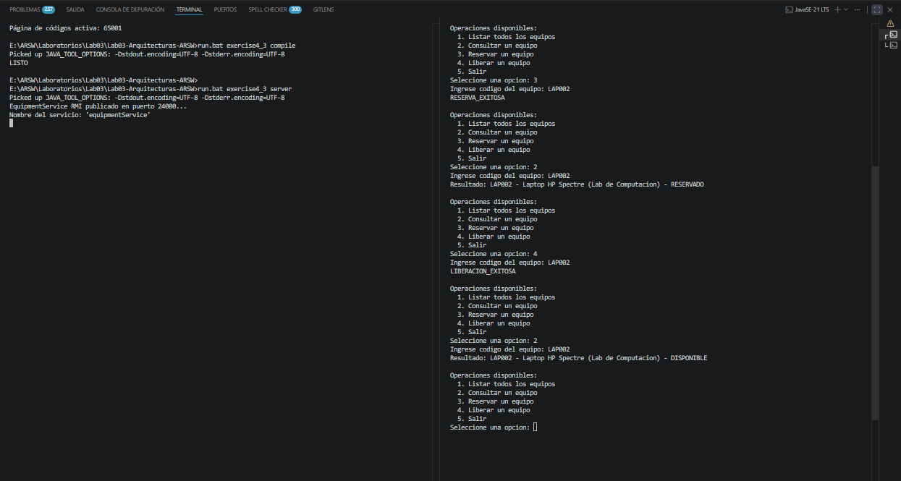

### Diagrama de Arquitectura

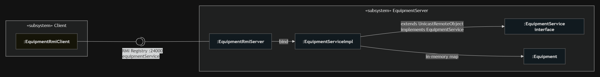

**Por que esta forma:** `EquipmentRmiClient` requiere el Registry RMI :24000 para buscar `"equipmentService"`. `EquipmentRmiServer` provee el registro y vincula la implementacion remota. `EquipmentServiceImpl` implementa la interfaz `EquipmentService` con un Map en memoria. El cliente invoca `consultarEquipos()`, `reservarEquipo()`, `liberarEquipo()` como si fueran locales. RMI oculta la serializacion y el transporte, pero bloquea el sistema al ecosistema JVM.

## Guia 5.2 - MovieService gRPC

**Paquete:** `src/edu/eci/arsw/guide5_2/` (proyecto Maven independiente)

**Estado:** :ballot_box_with_check: Implementada.

### Arquitectura

gRPC introduce un cambio fundamental respecto a RMI: el contrato se define en un archivo `.proto` independiente del lenguaje. A partir de ese archivo, una herramienta (`protoc`) genera codigo tanto para el servidor como para el cliente en cualquier lenguaje soportado (Java, Python, Go, C#, etc.). El servidor implementa la interfaz generada y el cliente la invoca como si fuera local, pero la comunicacion subyacente usa HTTP/2 con mensajes binarios serializados via Protocol Buffers.

`MovieGrpcServer` se ejecuta en el puerto 50051 usando `ServerBuilder.forPort()`. Registra `MovieServiceImpl` que extiende la clase base generada `MovieServiceGrpc.MovieServiceImplBase` y sobreescribe `getMovie()`. `MovieGrpcClient` crea un `ManagedChannel` hacia `localhost:50051`, construye un `MovieServiceBlockingStub` a partir del canal, e invoca `stub.getMovie(request)`. El stub se encarga de serializar el `MovieRequest` a formato binario, enviarlo por HTTP/2, recibir la respuesta binaria y deserializarla a `MovieResponse`.

### Novedades respecto a RMI

| Aspecto | RMI (Guia 4.2) | gRPC (Guia 5.2) |
|---------|----------------|-----------------|
| Contrato | Interfaz Java (`Remote`) | Archivo `.proto` (lenguaje neutral) |
| Serializacion | Java Object Serialization | Protocol Buffers (binario, schema-driven) |
| Transporte | TCP directo (RMI protocol) | HTTP/2 |
| Cliente | Solo Java | Multi-lenguaje |
| Generacion de codigo | Manual (escribes la interfaz) | Automatica (`protoc` genera stubs y servers) |
| Tipos de dato | Objetos Java arbitrarios | Mensajes definidos en `.proto` con tipos fijos |
| Evolucion del contrato | Ruptura si cambia la clase | Compatible hacia atras con campos numerados |

### Archivos

| Archivo | Ruta dentro del proyecto Maven | Descripcion |
|---------|-------------------------------|-------------|
| `pom.xml` | `guide5_2/pom.xml` | Configuracion Maven con dependencias gRPC y plugin protobuf |
| `movie.proto` | `guide5_2/src/main/proto/movie.proto` | Definicion del servicio y mensajes |
| `MovieGrpcServer.java` | `guide5_2/src/main/java/edu/eci/arsw/guide5_2/MovieGrpcServer.java` | Servidor gRPC con implementacion del servicio |
| `MovieGrpcClient.java` | `guide5_2/src/main/java/edu/eci/arsw/guide5_2/MovieGrpcClient.java` | Cliente gRPC con stub bloqueante |

**Nota:** El `pom.xml` y el plugin `protobuf-maven-plugin` generan automaticamente las clases Java a partir del `.proto` durante `run.bat guide5_2 compile`. Las clases generadas aparecen en `target/generated-sources/protobuf/` e incluyen `MovieServiceGrpc.java`, `MovieRequest.java`, `MovieResponse.java`, etc.

### Contrato (.proto)

```protobuf
syntax = "proto3";
option java_multiple_files = true;
option java_package = "edu.eci.arsw.guide5_2";
option java_outer_classname = "MovieProto";

service MovieService {
  rpc GetMovie (MovieRequest) returns (MovieResponse);
}

message MovieRequest {
  int32 id = 1;
}

message MovieResponse {
  int32 id = 1;
  string title = 2;
  string director = 3;
  int32 year = 4;
  bool found = 5;
}
```

**Elementos del contrato:**

- `syntax = "proto3"` — Usa la version 3 de Protocol Buffers (mas simple que proto2, sin campos requeridos/opcionales).
- `option java_multiple_files = true` — Genera una clase Java separada por cada mensaje, en vez de una sola clase gigante.
- `option java_package = "edu.eci.arsw.guide5_2"` — Paquete Java de las clases generadas. No necesita coincidir con la estructura de directorios.
- `service MovieService` — Define un servicio RPC con un unico metodo `GetMovie`.
- `rpc GetMovie (MovieRequest) returns (MovieResponse)` — RPC unario (request-response). gRPC soporta tambien streaming server, streaming client y bidireccional.
- `int32 id = 1` — Campo numerado. El `= 1` es el *field number* usado en la serializacion binaria. Una vez asignado, no debe cambiarse para mantener compatibilidad hacia atras.
- `bool found = 5` — Campo que indica si la pelicula existe. En RMI se usaba `null` para indicar "no encontrada". Protobuf no soporta objetos nulos; en su lugar se usa un booleano.

### Conceptos clave

1. **`.proto` como contrato universal:** El archivo `.proto` es el equivalente a la interfaz `Remote` de RMI, pero independiente del lenguaje. Un equipo puede definir el servicio en un `.proto` y el equipo de frontend genera un cliente JavaScript, mientras el backend genera un servidor Java.
2. **Protocol Buffers (protobuf):** Formato de serializacion binario mas compacto y rapido que JSON y que Java Serialization. Los mensajes son fuertemente tipados y definidos por un schema. Los campos se identifican por numero, no por nombre, lo que permite renombrar campos sin romper clientes viejos.
3. **Code generation:** El `protobuf-maven-plugin` invoca `protoc` durante `run.bat guide5_2 compile` para generar las clases Java. No se escriben a mano las clases `MovieRequest` ni `MovieResponse`. Si el `.proto` cambia, se recompila y las clases se regeneran automaticamente.
4. **gRPC sobre HTTP/2:** A diferencia de RMI que usa un protocolo binario propietario sobre TCP, gRPC usa HTTP/2. Esto significa que los mensajes viajan sobre un protocolo web estandar, permitiendo features como multiplexacion, compression de headers, y streaming.
5. **Stub bloqueante vs asincrono:** El cliente usa `MovieServiceGrpc.newBlockingStub(channel)` que bloquea hasta recibir la respuesta. gRPC tambien ofrece `newFutureStub()` (asincrono con `ListenableFuture`) y `newStub()` (streaming con callbacks).

### Flujo detallado

1. `run.bat guide5_2 compile` ejecuta el plugin protobuf, que genera `MovieServiceGrpc.java`, `MovieRequest.java`, `MovieResponse.java`, etc. en `target/generated-sources/protobuf/`.
2. `MovieGrpcServer.main()` crea un `MovieServiceImpl` (que extiende `MovieServiceGrpc.MovieServiceImplBase`) y lo registra via `ServerBuilder.forPort(50051).addService().build().start()`.
3. El servidor queda a la espera de conexiones gRPC en el puerto 50051.
4. `MovieGrpcClient.main()` crea un `ManagedChannel` hacia `localhost:50051` con `usePlaintext()` (sin TLS, para desarrollo).
5. A partir del canal, crea un `MovieServiceBlockingStub`. El stub implementa la interfaz `MovieService` del lado del cliente usando el canal HTTP/2.
6. El cliente construye un `MovieRequest` via `MovieRequest.newBuilder().setId(1).build()`, invoca `stub.getMovie(request)`.
7. gRPC serializa `MovieRequest` a binario protobuf, lo envia como trama HTTP/2, el servidor lo deserializa, ejecuta `getMovie()`, serializa `MovieResponse` y lo retorna.
8. El cliente deserializa la respuesta y accede a los campos via getters generados.

### Detalle de implementacion paso a paso

#### Paso 1 — `pom.xml`

El `pom.xml` declara las dependencias `grpc-netty-shaded` (transporte HTTP/2 con Netty), `grpc-protobuf` (serializacion protobuf), `grpc-stub` (clases stub), `protobuf-java` y `javax.annotation-api`. Ademas configura el `protobuf-maven-plugin` que ejecuta `protoc` durante `run.bat guide5_2 compile` para generar codigo a partir del `.proto`.

**Decisiones de diseno:**
- **`grpc-netty-shaded`:** Incluye Netty (servidor HTTP/2) empaquetado (shaded) para evitar conflictos de versiones con otras dependencias Netty en el classpath.
- **`os-maven-plugin`:** Detecta el sistema operativo y arquitectura (`windows-x86_64`) para descargar el binario correcto de `protoc`.
- **`protocArtifact` y `pluginArtifact`:** El plugin protobuf descarga automaticamente `protoc` (compilador protobuf) y `protoc-gen-grpc-java` (plugin gRPC para protoc) de Maven Central segun el OS detectado.

#### Paso 2 — `movie.proto`

```protobuf
service MovieService {
  rpc GetMovie (MovieRequest) returns (MovieResponse);
}
```

**Decisiones de diseno:**
- **Un solo RPC:** Similar a RMI, el servicio expone un unico metodo `GetMovie`. Esto mantiene la simetria entre las guias a traves de todas las tecnologias.
- **`bool found` en lugar de `null`:** Protobuf no tiene concepto de `null`. Para indicar "pelicula no encontrada", se usa un campo `bool found`. Si es `false`, el cliente ignora los demas campos.
- **`int32` para el ID:** Protobuf usa `int32` (no `int` como Java). El plugin genera el tipo Java `int` para campos `int32`.

#### Paso 3 — Servidor (`MovieGrpcServer.java`)

```java
static class MovieServiceImpl extends MovieServiceGrpc.MovieServiceImplBase {
    private Map<Integer, MovieResponse> movies = new HashMap<>();

    public MovieServiceImpl() {
        movies.put(1, MovieResponse.newBuilder()
                .setId(1).setTitle("Interstellar")
                .setDirector("Christopher Nolan").setYear(2014).setFound(true).build());
        // ...
    }

    @Override
    public void getMovie(MovieRequest request,
                         StreamObserver<MovieResponse> responseObserver) {
        MovieResponse response = movies.get(request.getId());
        if (response == null) {
            response = MovieResponse.newBuilder()
                    .setId(request.getId()).setFound(false).build();
        }
        responseObserver.onNext(response);
        responseObserver.onCompleted();
    }
}
```

**Decisiones de diseno:**
- **`extends MovieServiceGrpc.MovieServiceImplBase`:** Clase base generada por protobuf. Tiene un metodo `getMovie()` con la firma exacta del `.proto`. Si el `.proto` cambia, esta clase se regenera y el compilador detecta cualquier desajuste.
- **`StreamObserver<MovieResponse>`:** Mecanismo de gRPC para enviar la respuesta. Se llama `onNext()` con la respuesta y `onCompleted()` para indicar que no hay mas mensajes. En un RPC unario, `onNext()` se llama una sola vez.
- **`MovieResponse.newBuilder().build()`:** Patron Builder generado por protobuf. Todos los mensajes protobuf son inmutables una vez construidos. Para modificarlos, se usa el builder.
- **Datos hardcodeados en el servidor:** Igual que en todas las guias anteriores. La unica diferencia es que los datos se almacenan como `MovieResponse` (objeto generado) en vez de `Movie` (objeto de dominio). No hay una clase `Movie` separada — el `.proto` es la unica fuente de verdad para la estructura de datos.

#### Paso 4 — Cliente (`MovieGrpcClient.java`)

```java
ManagedChannel channel = ManagedChannelBuilder
        .forAddress("localhost", 50051).usePlaintext().build();
MovieServiceGrpc.MovieServiceBlockingStub stub =
        MovieServiceGrpc.newBlockingStub(channel);
MovieRequest request = MovieRequest.newBuilder().setId(1).build();
MovieResponse response = stub.getMovie(request);
```

**Decisiones de diseno:**
- **`usePlaintext()`:** Deshabilita TLS para desarrollo local. En produccion se usaria SSL/TLS con certificados.
- **BlockingStub:** El stub bloqueante es el mas simple de usar. La llamada `stub.getMovie(request)` bloquea hasta recibir la respuesta. Para alta concurrencia se usaria un FutureStub.
- **`MovieRequest.newBuilder().setId(1).build()`:** Construye un mensaje protobuf. Todos los campos del builder tienen valores por defecto (0 para numeros, "" para strings, false para booleanos).

#### Paso 5 — Ejecucion

```bash
# Compilar (genera codigo a partir del .proto)
# Limpiar primero si es necesario: clean.bat
run.bat guide5_2 compile

# Terminal 1 — servidor
run.bat guide5_2 server

# Terminal 2 — cliente
run.bat guide5_2 client
```

**Prueba esperada:**

```
Terminal 1:
Movie gRPC Server iniciado en puerto 50051

Terminal 2:
Pelicula: Interstellar - Christopher Nolan - 2014
```

Para probar con un ID diferente, cambiar `setId(1)` por otro valor en `MovieGrpcClient.java` y recompilar (`run.bat guide5_2 compile`).

#### Paso 6 — Verificacion

```bash
# Limpiar primero si es necesario: clean.bat
run.bat guide5_2 compile
# BUILD SUCCESS — 8 source files compiled (3 generados + 5 escritos a mano)
```

### Comparacion: RMI (Guia 4.2) vs gRPC (Guia 5.2)

| Aspecto | Guia 4.2 (RMI) | Guia 5.2 (gRPC) |
|---------|----------------|-----------------|
| **Definicion del servicio** | Interfaz Java `extends Remote` | Archivo `.proto` |
| **Mensajes** | Clases Java arbitrarias (Serializable) | Mensajes protobuf con schema |
| **Serializacion** | Java Object Serialization (binario, pesado) | Protocol Buffers (binario, compacto) |
| **Transporte** | RMI protocol sobre TCP | HTTP/2 |
| **Cliente** | Solo Java | Java, Python, Go, JS, C#, etc. |
| **Codigo generado** | No (se escribe a mano la interfaz) | Si (`protoc` genera stubs y servers) |
| **Manejo de nulos** | `null` en Java | Campo `bool found` o `oneof` |
| **Builder** | No (constructor/ setters) | Si (patron Builder generado) |
| **Puerto** | 23000 (Registry) + anonimo (objeto) | 50051 (unico puerto para todo) |
| **Herramientas** | `rmiregistry`, `javac` | `protoc`, plugin Maven |

### Reflexion arquitectonica

- **El `.proto` es el contrato:** Cualquiera que lea `movie.proto` sabe exactamente que servicios, metodos y tipos existen, sin importar el lenguaje. Ya no se comparte una interfaz Java — se comparte un archivo de texto.
- **Cliente multi-lenguaje:** El mismo servidor gRPC puede ser consumido desde Python, JavaScript, Go, etc. Esto era imposible con RMI. Para demostrarlo, bastaria generar un cliente Python desde el mismo `.proto`.
- **Code generation elimina errores manuales:** En RMI, el desarrollador escribia la interfaz y la implementacion a mano. Si la interfaz cambiaba, habia que actualizar manualmente todos los clientes. Con gRPC, solo se cambia el `.proto`, se recompila, y el codigo se regenera automaticamente.
- **Protobuf es mas eficiente que Java Serialization:** Los mensajes protobuf son binarios, compactos y con esquema conocido. Ocupan menos bytes en la red y se serializan/deserializan mas rapido que Java Object Serialization.
- **HTTP/2 como transporte:** gRPC se beneficia de HTTP/2: multiplexacion (varias llamadas simultaneas por la misma conexion), compression de headers, y streaming bidireccional. RMI abria una conexion TCP por cada objeto remoto.
- **No hay `RemoteException`:** gRPC usa `StatusRuntimeException` con codigos de error estandarizados (NOT_FOUND, INTERNAL, UNAVAILABLE, etc.), mas portables entre lenguajes que `RemoteException`.
- **Proximo paso:** Microservicios (guia 6.2) aplica gRPC para dividir el sistema en servicios independientes con responsabilidades unicas.

### Como ejecutar

```bash
# Compilar
# Limpiar primero si es necesario: clean.bat
run.bat guide5_2 compile

# Servidor (Terminal 1)
run.bat guide5_2 server

# Cliente (Terminal 2)
run.bat guide5_2 client
```

---

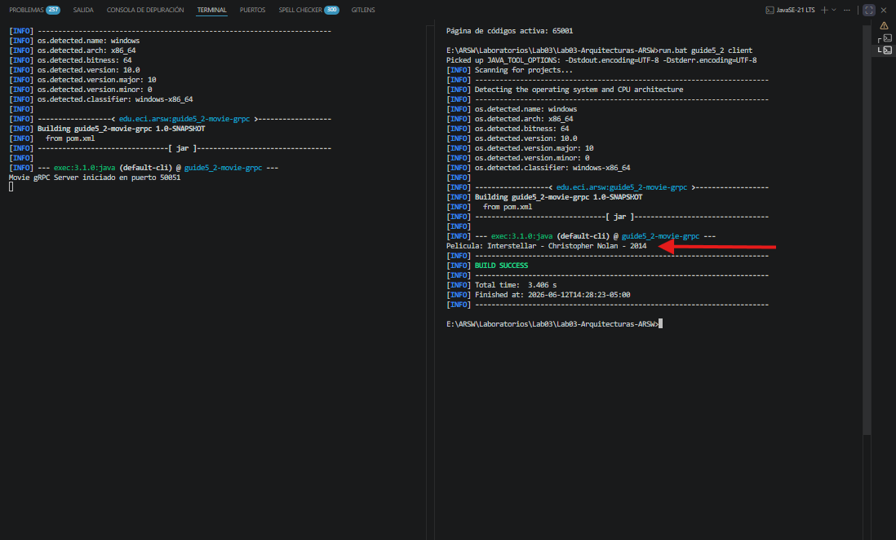

## Ejercicio 5.3 - Bienestar Universitario gRPC

**Paquete:** `src/edu/eci/arsw/excercise5_3/` (proyecto Maven independiente)

**Estado:** :ballot_box_with_check: Implementada.

### Problema

Implementar un sistema de gestion de citas de bienestar universitario usando gRPC. A diferencia del dominio de peliculas (solo consulta), este sistema requiere tres operaciones: solicitar una cita (creacion), cancelar una cita (modificacion de estado) y consultar las citas de un estudiante (listado filtrado). Todo en memoria, con estado mutable en el servidor.

### Arquitectura

El sistema sigue el mismo patron gRPC que la Guia 5.2 pero con tres RPCs en vez de uno. `WellnessGrpcServer` se ejecuta en el puerto 50061 y registra un `AppointmentServiceImpl` que extiende `AppointmentServiceGrpc.AppointmentServiceImplBase`. El cliente es interactivo con menu (opciones 1-4) y usa un `AppointmentServiceBlockingStub` para invocar los metodos remotos.

El `.proto` define tres entidades principales (`Student`, `Appointment`, `ServiceType`, `Status`) y cinco mensajes de request/response. A diferencia de la guia 5.2 donde el `.proto` solo tenia dos mensajes, aqui hay cinco mensajes y dos enumeraciones, demostrando la riqueza del lenguaje protobuf para modelar dominios complejos.

### Archivos

| Archivo | Ruta dentro del proyecto Maven | Descripcion |
|---------|-------------------------------|-------------|
| `pom.xml` | `excercise5_3/pom.xml` | Mismo pom.xml que la guia 5.2 pero con diferente artifactId |
| `appointment.proto` | `excercise5_3/src/main/proto/appointment.proto` | Servicio, mensajes y enumeraciones |
| `WellnessGrpcServer.java` | `excercise5_3/src/main/java/edu/eci/arsw/excercise5_3/WellnessGrpcServer.java` | Servidor con `AppointmentServiceImpl` |
| `WellnessGrpcClient.java` | `excercise5_3/src/main/java/edu/eci/arsw/excercise5_3/WellnessGrpcClient.java` | Cliente interactivo con menu |

### Contrato (.proto)

```protobuf
enum ServiceType {
  MEDICINE = 0;
  PSYCHOLOGY = 1;
  DENTISTRY = 2;
}

enum Status {
  REQUESTED = 0;
  CANCELLED = 1;
  ATTENDED = 2;
}

service AppointmentService {
  rpc RequestAppointment (AppointmentRequest) returns (AppointmentResponse);
  rpc CancelAppointment (CancelRequest) returns (CancelResponse);
  rpc GetAppointments (StudentRequest) returns (AppointmentList);
}
```

### Mensajes del .proto

| Mensaje | Campos | Uso |
|---------|--------|-----|
| `AppointmentRequest` | `studentId`, `serviceType`, `date` | Solicitar una nueva cita |
| `AppointmentResponse` | `success`, `message`, `appointment` | Resultado de la solicitud |
| `CancelRequest` | `appointmentId` | Cancelar una cita por ID |
| `CancelResponse` | `success`, `message` | Resultado de la cancelacion |
| `StudentRequest` | `studentId` | Consultar citas de un estudiante |
| `AppointmentList` | `repeated Appointment appointments` | Lista de citas |
| `Appointment` | `id`, `studentId`, `serviceType`, `date`, `status` | Datos completos de una cita |

### Entidades del dominio

| Entidad | Campos | Detalle |
|---------|--------|---------|
| `Student` | id, name, institutionalEmail | Definida en el `.proto` pero no utilizada en el servidor actual (persistencia minima) |
| `Appointment` | id, studentId, serviceType, date, status | Almacenada en un `HashMap<String, Appointment>` en el servidor |
| `ServiceType` | MEDICINE=0, PSYCHOLOGY=1, DENTISTRY=2 | Enumeracion protobuf |
| `Status` | REQUESTED=0, CANCELLED=1, ATTENDED=2 | Enumeracion protobuf |

**Nota:** `Student` se definio en el `.proto` pero no se usa activamente en el servidor. Esta incluida para futura expansion y para mostrar como protobuf soporta entidades que pueden ser utilizadas por otros servicios.

### Conceptos clave

1. **Enumeraciones en protobuf:** `ServiceType` y `Status` se definen dentro del `.proto`. Se generan como `enum` en Java. Los valores se transmiten como enteros (0, 1, 2), no como strings.
2. **`repeated` para listas:** `AppointmentList` usa `repeated Appointment appointments` para representar una lista de citas. En Java se genera como `List<Appointment>`.
3. **Servicio con 3 RPCs:** Demuestra que un `.proto` puede definir multiples metodos en un solo servicio. Cada metodo tiene su propio par de mensajes request/response.
4. **Estado mutable en el servidor:** `AppointmentServiceImpl` mantiene un `HashMap<String, Appointment>` que se modifica con cada `requestAppointment()` y `cancelAppointment()`. gRPC, al igual que RMI y TCP, es monohilo por defecto, pero un entorno multi-cliente requeriria sincronizacion.
5. **UUID como ID de cita:** Se usa `UUID.randomUUID().toString().substring(0, 8)` para generar IDs unicos de 8 caracteres. Esto evita colisiones y no requiere un contador centralizado.

### Detalle de implementacion paso a paso

#### Paso 1 — `appointment.proto`

El `.proto` define el servicio `AppointmentService` con tres RPCs, los mensajes request/response, las entidades `Student` y `Appointment`, y las enumeraciones `ServiceType` y `Status`.

**Decisiones de diseno:**
- **`AppointmentResponse` incluye `Appointment`:** El response contiene tanto un booleano `success` como el objeto `Appointment` completo. Esto permite al cliente mostrar los detalles de la cita creada (ID, fecha, estado) sin hacer una segunda consulta.
- **`CancelResponse` no incluye `Appointment`:** A diferencia de la solicitud, la cancelacion solo retorna `success` y `message`. No es necesario devolver la cita completa. Esta decision de diseno es asimetrica a proposito para mostrar diferentes patrones de respuesta.
- **`repeated Appointment appointments`:** Lista ordenada de citas. Si no hay citas, la lista esta vacia (`getAppointmentsCount() == 0`).
- **Enumeraciones con valores explicitos:** `MEDICINE = 0` es el valor por defecto en protobuf. `REQUESTED = 0` tambien. Esto es importante: si un cliente no envia un enum, se asume el valor 0.

#### Paso 2 — Servidor (`WellnessGrpcServer.java`)

```java
static class AppointmentServiceImpl extends AppointmentServiceGrpc.AppointmentServiceImplBase {
    private Map<String, Appointment> appointments = new HashMap<>();

    @Override
    public void requestAppointment(AppointmentRequest request,
                                    StreamObserver<AppointmentResponse> responseObserver) {
        String id = UUID.randomUUID().toString().substring(0, 8);
        Appointment appointment = Appointment.newBuilder()
                .setId(id).setStudentId(request.getStudentId())
                .setServiceType(request.getServiceType())
                .setDate(request.getDate()).setStatus(Status.REQUESTED)
                .build();
        appointments.put(id, appointment);
        responseObserver.onNext(AppointmentResponse.newBuilder()
                .setSuccess(true).setMessage("Cita solicitada exitosamente")
                .setAppointment(appointment).build());
        responseObserver.onCompleted();
    }

    @Override
    public void cancelAppointment(CancelRequest request,
                                   StreamObserver<CancelResponse> responseObserver) {
        Appointment existing = appointments.get(request.getAppointmentId());
        if (existing == null) {
            responseObserver.onNext(CancelResponse.newBuilder()
                    .setSuccess(false).setMessage("ERROR: cita no encontrada").build());
        } else if (existing.getStatus() == Status.CANCELLED) {
            responseObserver.onNext(CancelResponse.newBuilder()
                    .setSuccess(false).setMessage("ERROR: la cita ya fue cancelada").build());
        } else {
            Appointment updated = existing.toBuilder().setStatus(Status.CANCELLED).build();
            appointments.put(request.getAppointmentId(), updated);
            responseObserver.onNext(CancelResponse.newBuilder()
                    .setSuccess(true).setMessage("Cita cancelada exitosamente").build());
        }
        responseObserver.onCompleted();
    }

    @Override
    public void getAppointments(StudentRequest request,
                                 StreamObserver<AppointmentList> responseObserver) {
        AppointmentList.Builder listBuilder = AppointmentList.newBuilder();
        for (Appointment a : appointments.values()) {
            if (a.getStudentId().equals(request.getStudentId())) {
                listBuilder.addAppointments(a);
            }
        }
        responseObserver.onNext(listBuilder.build());
        responseObserver.onCompleted();
    }
}
```

**Decisiones de diseno:**
- **`toBuilder()` para modificar:** Los mensajes protobuf son inmutables. Para "modificar" el estado de una cita (cancelar), se llama `existing.toBuilder().setStatus(Status.CANCELLED).build()` que crea un nuevo objeto con el cambio. Esto es intencional: protobuf fomenta la inmutabilidad.
- **Validacion en tres niveles en `cancelAppointment`:** Primero verifica existencia, luego verifica que no este ya cancelada. Son dos errores distintos, cada uno con su propio mensaje.
- **Filtro en `getAppointments`:** Itera sobre todos los valores del HashMap y filtra por `studentId`. Esto es O(n) donde n es el numero total de citas. En produccion se usaria un indice secundario (`Map<String, List<Appointment>>` por estudiante).

#### Paso 3 — Cliente (`WellnessGrpcClient.java`)

El cliente usa el mismo patron de menu interactivo que el Exercise 4.3, pero con operaciones de bienestar.

**Opciones del menu:**
1. Solicitar cita — pide studentId, serviceType, date
2. Cancelar cita — pide appointmentId
3. Consultar citas de un estudiante — pide studentId
4. Salir

**Decisiones de diseno del menu:**
- **`ServiceType.valueOf(serviceTypeStr)`:** Convierte el string ingresado por el usuario al enum protobuf. Si el usuario escribe "MEDICINE", funciona. Si escribe "medicina", lanza `IllegalArgumentException` que se captura y muestra un mensaje de error.
- **Mensajes de error descriptivos:** `cancelAppointment()` retorna `CancelResponse` con un mensaje que distingue "cita no encontrada" de "cita ya cancelada". Esto compensa la limitacion del `boolean` del Exercise 4.3.
- **Un solo canal para toda la sesion:** El `ManagedChannel` se crea una vez al inicio y se reusa para todas las operaciones. Se cierra solo al salir (opcion 4).

#### Paso 4 — Ejecucion

```bash
# Compilar
# Limpiar primero si es necesario: clean.bat
run.bat exercise5_3 compile

# Terminal 1 — servidor
run.bat exercise5_3 server

# Terminal 2 — cliente
run.bat exercise5_3 client
```

**Prueba esperada (menu interactivo, opcion 4 para salir):**

```
Terminal 1:
Wellness gRPC Server iniciado en puerto 50061

Terminal 2:
=== Sistema de Bienestar Universitario ===

--- Solicitar cita ---
Operaciones disponibles:
  1. Solicitar cita
  2. Cancelar cita
  3. Consultar citas de un estudiante
  4. Salir
Seleccione una opcion: 1
ID del estudiante: S123
Tipo de servicio (MEDICINE, PSYCHOLOGY, DENTISTRY): MEDICINE
Fecha (YYYY-MM-DD): 2026-06-15
Cita solicitada exitosamente
  ID cita: 62c333d4 | Fecha: 2026-06-15 | Estado: REQUESTED

--- Consultar citas del estudiante ---
Seleccione una opcion: 3
ID del estudiante: S123
Citas de S123:
  62c333d4 | MEDICINE | 2026-06-15 | REQUESTED

--- Cancelar cita ---
Seleccione una opcion: 2
ID de la cita a cancelar: 62c333d4
Cita cancelada exitosamente

--- Verificar que ya no aparece como activa ---
Seleccione una opcion: 3
ID del estudiante: S123
Citas de S123:
  62c333d4 | MEDICINE | 2026-06-15 | CANCELLED

--- Cancelar cita ya cancelada (debe fallar) ---
Seleccione una opcion: 2
ID de la cita a cancelar: 62c333d4
ERROR: la cita ya fue cancelada

--- Salir ---
Seleccione una opcion: 4
Saliendo...
```

#### Paso 5 — Verificacion

```bash
# Limpiar primero si es necesario: clean.bat
run.bat exercise5_3 compile
# BUILD SUCCESS — 22 source files compiled
```

### Comparacion: RMI (Ejercicio 4.3) vs gRPC (Ejercicio 5.3)

| Aspecto | Ejercicio 4.3 (RMI) | Ejercicio 5.3 (gRPC) |
|---------|---------------------|----------------------|
| **Definicion del servicio** | Interfaz Java `EquipmentService` | Archivo `.proto` `AppointmentService` |
| **Mensajes** | `String`, `boolean` (tipos primitivos Java) | Mensajes protobuf estructurados (`Appointment`, `AppointmentList`) |
| **Enumeraciones** | No (se usaban strings) | `ServiceType`, `Status` (enums tipados) |
| **Serializacion** | Java Object Serialization | Protocol Buffers |
| **Cliente** | Solo Java | Multi-lenguaje |
| **Errores** | `boolean` (sin distincion de causa) | Mensaje descriptivo en response |
| **Puerto** | 24000 (Registry) | 50061 (unico puerto) |
| **Menu interactivo** | Switch con opciones 1-5 | Switch con opciones 1-4 |

### Reflexion arquitectonica

- **Protobuf fuerza a pensar en el contrato primero:** Antes de escribir una linea de codigo, hay que definir los mensajes y servicios en el `.proto`. Esto es *design by contract*: el contrato es el punto de partida, no un resultado accidental de la implementacion.
- **Enumeraciones tipadas vs strings:** En RMI, `consultarEquipo()` retornaba strings como `"DISPONIBLE"` o `"ERROR: equipo no encontrado"`. En gRPC, el estado de la cita es un `enum Status` y los errores son campos estructurados. El tipado fuerte elimina errores por typos y facilita el autocompletado en el IDE.
- **`CancelResponse` con `message` descriptivo:** A diferencia del `boolean` del Exercise 4.3, `CancelResponse` incluye un `string message` que describe la causa del error. El cliente puede mostrar este mensaje directamente al usuario. Esta es una ventaja de disenar el contrato con mensajes estructurados en vez de tipos primitivos.
- **Inmutabilidad de mensajes:** Los mensajes protobuf son inmutables. Para "cambiar" el estado de una cita, se crea una nueva instancia via `toBuilder()`. Esto fomenta un estilo de programacion funcional y evita efectos secundarios.
- **`repeated` simplifica las colecciones:** En RMI, `consultarEquipos()` retornaba `List<String>`. En gRPC, `GetAppointments` retorna `AppointmentList` con `repeated Appointment appointments`. El mensaje contenedor es explicito y puede evolucionar independientemente (agregar campos como `totalCount`, `nextPageToken`, etc.).
- **Proximo paso:** Microservicios (guia 6.2) divide el sistema en servicios independientes, cada uno con su propio `.proto` y su propio puerto.

### Preguntas de reflexion (del contexto.md)

1. **?Por que el archivo `.proto` se considera un contrato?**
   - Porque define exactamente que metodos existen, que parametros reciben y que retornan.
   - Cualquier cliente o servidor que cumpla con el `.proto` puede comunicarse, independientemente del lenguaje.
   - El `.proto` es la unica fuente de verdad — la implementacion debe cumplirlo, no al reves.
   - A diferencia de RMI (donde el contrato es una interfaz Java que solo otros Java pueden leer), el `.proto` es un archivo de texto que cualquier desarrollador puede entender.

2. **?Que tan facil seria crear un cliente en otro lenguaje?**
   - Extremadamente facil: solo se necesita copiar `appointment.proto` y ejecutar `protoc` con el plugin del lenguaje deseado.
   - Por ejemplo, para un cliente Python: `pip install grpcio grpcio-tools`, luego `python -m grpc_tools.protoc -I. --python_out=. --grpc_python_out=. appointment.proto`.
   - El codigo generado incluye clases Python con los mismos metodos y tipos que el cliente Java.
   - No hay que reimplementar la logica de serializacion ni el protocolo de red — gRPC lo maneja automaticamente.

3. **?Que diferencias hay entre RMI y gRPC?**
   - RMI es Java-only; gRPC es multi-lenguaje.
   - RMI usa Java Object Serialization; gRPC usa Protocol Buffers (mas rapido, mas compacto).
   - RMI define el contrato como interfaz Java; gRPC lo define como archivo `.proto`.
   - RMI usa un protocolo binario propietario sobre TCP; gRPC usa HTTP/2 (multiplexacion, streaming).
   - RMI no genera codigo; gRPC genera stubs y servers automaticamente desde el `.proto`.
   - RMI no tiene un mecanismo estandar de errores (se usaba `null` o `RemoteException`); gRPC tiene codigos de error estandar (`NOT_FOUND`, `INTERNAL`, etc.).

### Como ejecutar

```bash
# Compilar
# Limpiar primero si es necesario: clean.bat
run.bat exercise5_3 compile

# Servidor (Terminal 1)
run.bat exercise5_3 server

# Cliente (Terminal 2)
run.bat exercise5_3 client
```

---

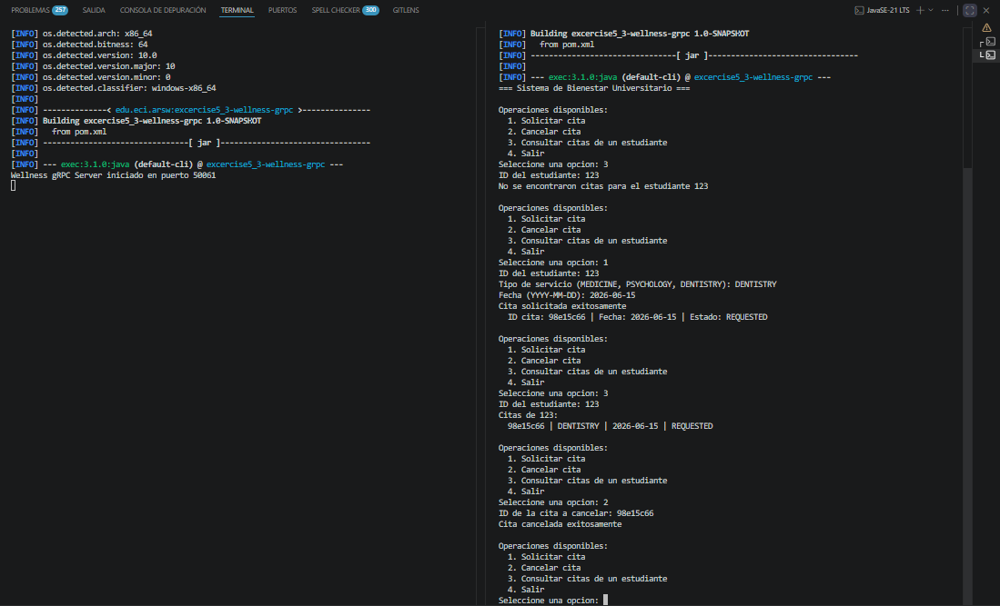

### Diagrama de Arquitectura

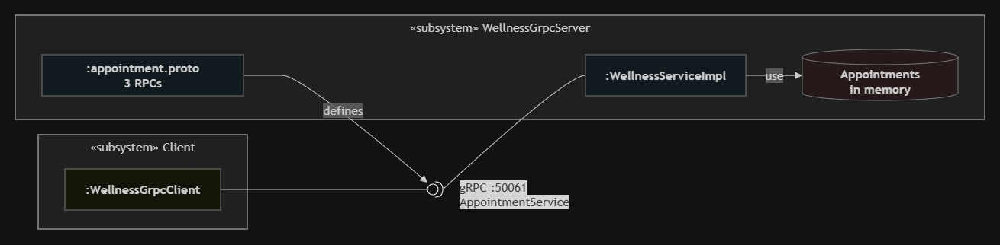

**Por que esta forma:** `WellnessGrpcClient` requiere gRPC :50061 para invocar `RequestAppointment`, `CancelAppointment` y `GetAppointments`. `WellnessGrpcServer` provee el servicio con contrato en `appointment.proto`. Frente a RMI (Ejercicio 4.3), gRPC anade contratos formales `.proto`, soporte multilenguaje y serializacion binaria eficiente. El costo es la compilacion de protobuf y la configuracion del plugin Maven.

## Guia 6.2 - Microservicios Peliculas

**Paquete:** `src/edu/eci/arsw/guide6_2/`

**Estado:** :ballot_box_with_check: Implementada.

### Descripcion

Descomposicion del sistema de peliculas en 3 microservicios independientes, cada uno en su propio puerto gRPC. A diferencia de la guia 5.2 (un solo servidor gRPC con todo el dominio), aqui cada servicio es un proceso independiente con su propio `.proto`, su propio `Server` y su propio puerto. El cliente debe conocer y conectarse a los 3 puertos individualmente.

### Novedades respecto a gRPC unico (Guia 5.2)

| Aspecto | Guia 5.2 (un solo servidor) | Guia 6.2 (microservicios) |
|---------|----------------------------|---------------------------|
| **Numero de servicios** | 1 servicio, 1 RPC | 3 servicios, 1 RPC cada uno |
| **Puertos** | 1 puerto (50051) | 3 puertos (50051-50053) |
| **Archivos `.proto`** | 1 archivo | 3 archivos (movie.proto, review.proto, recommendation.proto) |
| **Servidores** | 1 servidor (`MovieGrpcServer`) | 3 servidores independientes |
| **Cliente** | 1 stub, 1 canal | 3 stubs, 3 canales |
| **Despliegue** | Un solo proceso JVM | 4 procesos JVM (3 servidores + 1 cliente) |
| **Acoplamiento** | Bajo (cliente conoce solo 1 puerto) | Alto (cliente conoce 3 puertos) |

### Arquitectura

Cada microservicio es un proceso Maven independiente dentro del mismo modulo (mismo `pom.xml`). Comparten el mismo `groupId` y `pom.xml`, pero cada uno tiene su propio `.proto` con su propio `java_package`, lo que genera clases en paquetes separados y evita conflictos de nombres.

El cliente (`MicroserviceClient`) mantiene 3 canales gRPC separados, uno hacia cada servicio, y un menu interactivo para consultar cada servicio individualmente o los tres a la vez (opcion 4).

### Archivos

| Archivo | Ruta | Descripcion |
|---------|------|-------------|
| `pom.xml` | `guide6_2/pom.xml` | Configuracion Maven con dependencias gRPC (identico al de guide5_2) |
| `movie.proto` | `guide6_2/src/main/proto/movie.proto` | Define `MovieService` con `GetMovie` (identico al de guide5_2) |
| `review.proto` | `guide6_2/src/main/proto/review.proto` | Define `ReviewService` con `GetReviews` -> `ReviewList` (repeated `Review`) |
| `recommendation.proto` | `guide6_2/src/main/proto/recommendation.proto` | Define `RecommendationService` con `GetRecommendations` -> `RecommendationList` (repeated string titles) |
| `MovieServiceServer.java` | `guide6_2/src/main/java/.../movie/MovieServiceServer.java` | Servidor gRPC en puerto 50051 |
| `ReviewServiceServer.java` | `guide6_2/src/main/java/.../review/ReviewServiceServer.java` | Servidor gRPC en puerto 50052 |
| `RecommendationServiceServer.java` | `guide6_2/src/main/java/.../recommendation/RecommendationServiceServer.java` | Servidor gRPC en puerto 50053 |
| `MicroserviceClient.java` | `guide6_2/src/main/java/.../guide6_2/MicroserviceClient.java` | Cliente interactivo con 3 canales |

### Contratos (.proto)

Cada `.proto` define un unico servicio con un unico RPC, siguiendo el mismo patron de la guia 5.2 pero aislado en su propio paquete:

**movie.proto** (`java_package = "edu.eci.arsw.guide6_2.movie"`):
- `MovieService` / `GetMovie(MovieRequest) → MovieResponse`
- Mismos campos que guide5_2: `int32 id`, `string title`, `string director`, `int32 year`, `bool found`

**review.proto** (`java_package = "edu.eci.arsw.guide6_2.review"`):
- `ReviewService` / `GetReviews(MovieIdRequest) → ReviewList`
- `ReviewList` contiene `repeated Review` donde cada `Review` tiene: `string reviewer`, `int32 rating`, `string comment`

**recommendation.proto** (`java_package = "edu.eci.arsw.guide6_2.recommendation"`):
- `RecommendationService` / `GetRecommendations(MovieIdRequest) → RecommendationList`
- `RecommendationList` contiene `repeated string titles` (titulos de peliculas recomendadas)

### Conceptos clave

1. **Multiples `.proto` en un mismo proyecto:** Cada `.proto` se compila independientemente. El plugin protobuf genera clases en paquetes separados (`...movie.*`, `...review.*`, `...recommendation.*`). No hay conflictos de nombres porque los paquetes Java son distintos.
2. **Multiples canales gRPC:** El cliente crea un `ManagedChannel` por cada servidor. Cada canal mantiene una conexion HTTP/2 independiente. Esto es necesario porque cada servidor escucha en un puerto diferente.
3. **Despliegue independiente:** Cada microservicio puede iniciarse, detenerse y actualizarse sin afectar a los demas. Esto es la esencia de la arquitectura de microservicios.
4. **Acoplamiento cliente-puertos:** El cliente debe conocer los 3 puertos. Si un servicio cambia de puerto, el cliente debe actualizarse. Esto se resolvera en la guia 7.2 con un API Gateway.

### Flujo detallado

1. `run.bat guide6_2 compile` compila los 3 `.proto` y genera las clases Java en `target/generated-sources/protobuf/`.
2. Se inician 3 servidores en terminales separadas: MovieService (50051), ReviewService (50052), RecommendationService (50053).
3. Cada servidor registra su implementacion (`MovieServiceImpl`, `ReviewServiceImpl`, `RecommendationServiceImpl`) y queda a la espera de conexiones.
4. El cliente `MicroserviceClient` crea 3 canales y 3 stubs, luego presenta un menu con 5 opciones.
5. Dependiendo de la opcion, el cliente invoca el stub correspondiente y muestra la respuesta.

### Detalle de implementacion paso a paso

#### Paso 1 — Archivos `.proto`

Cada archivo sigue la misma estructura que `movie.proto` de la guia 5.2, pero con `java_package` unico:

```protobuf
// movie.proto
option java_package = "edu.eci.arsw.guide6_2.movie";

// review.proto
option java_package = "edu.eci.arsw.guide6_2.review";

// recommendation.proto
option java_package = "edu.eci.arsw.guide6_2.recommendation";
```

**Decision de diseno:** Se usa un `java_package` diferente para cada `.proto` para que las clases generadas (ej. `MovieRequest`, `ReviewRequest`, `RecommendationRequest`) vivan en paquetes distintos y no colisionen. Si todos usaran el mismo paquete, `MovieRequest` y `ReviewRequest` coexistirian, pero `Empty` o nombres genericos podrian conflictuar.

#### Paso 2 — Servidores

Cada servidor sigue el patron exacto de `MovieGrpcServer` de la guia 5.2:

```java
// MovieServiceServer.java (puerto 50051)
public class MovieServiceServer {
    public static void main(String[] args) throws Exception {
        Server server = ServerBuilder.forPort(50051)
                .addService(new MovieServiceImpl())
                .build().start();
        System.out.println("MovieService Microservicio iniciado en puerto 50051");
        server.awaitTermination();
    }

    static class MovieServiceImpl extends MovieServiceGrpc.MovieServiceImplBase {
        private Map<Integer, MovieResponse> movies = new HashMap<>();
        // mismos datos que guide5_2
    }
}
```

Los servidores `ReviewServiceServer` (50052) y `RecommendationServiceServer` (50053) son identicos en estructura pero con sus propios datos:

- **ReviewService:** Almacena 3 resenas hardcodeadas (una por pelicula) con campos `reviewer`, `rating` y `comment`.
- **RecommendationService:** Almacena 3 listas de recomendaciones hardcodeadas (peliculas relacionadas entre si).

**Decision de diseno:** Los datos son hardcodeados para mantener el foco en la arquitectura de microservicios, no en la persistencia. En un sistema real, cada servicio tendria su propia base de datos.

#### Paso 3 — Cliente (`MicroserviceClient.java`)

El cliente mantiene 3 canales gRPC separados y un menu interactivo:

```java
ManagedChannel movieChannel = ManagedChannelBuilder
        .forAddress("localhost", 50051).usePlaintext().build();
ManagedChannel reviewChannel = ManagedChannelBuilder
        .forAddress("localhost", 50052).usePlaintext().build();
ManagedChannel recommendationChannel = ManagedChannelBuilder
        .forAddress("localhost", 50053).usePlaintext().build();

MovieServiceGrpc.MovieServiceBlockingStub movieStub = ...;
ReviewServiceGrpc.ReviewServiceBlockingStub reviewStub = ...;
RecommendationServiceGrpc.RecommendationServiceBlockingStub recommendationStub = ...;
```

**Opciones del menu:**

| Opcion | Accion | Servicio consultado |
|--------|--------|-------------------|
| 1 | Consultar pelicula | MovieService (50051) |
| 2 | Consultar resena | ReviewService (50052) |
| 3 | Obtener recomendaciones | RecommendationService (50053) |
| 4 | Consultar todo (3 servicios) | Los 3 servicios |
| 5 | Salir | — |

**Decisiones de diseno:**
- **Opcion 4 (consulta completa):** Demuestra el patron "agregacion" donde el cliente orquesta llamadas a multiples servicios. Esto es analogo al patron API Gateway pero implementado en el cliente. La opcion 4 muestra la desventaja del microservicio sin gateway: el cliente debe hacer 3 llamadas de red en vez de 1.
- **Tres canales independientes:** Cada canal tiene su propia conexion HTTP/2. No se comparten. Esto es correcto pero ineficiente — en produccion se usaria un pool de conexiones.
- **Menu interactivo:** Sigue el mismo patron que los clientes de los ejercicios previos (excercise4_3, excercise5_3).

#### Paso 4 — Ejecucion

```bash
# Compilar desde la raiz
# Limpiar primero si es necesario: clean.bat
run.bat guide6_2 compile

# Terminal 1 — MovieService
run.bat guide6_2 server1

# Terminal 2 — ReviewService
run.bat guide6_2 server2

# Terminal 3 — RecommendationService
run.bat guide6_2 server3

# Terminal 4 — Cliente
run.bat guide6_2 client
```

**Orden:** Los servidores deben iniciar antes que el cliente. Si un servidor no esta corriendo, el cliente recibe `StatusRuntimeException` con codigo `UNAVAILABLE` al intentar conectarse.

**Prueba esperada:**

```
Terminal 1:
MovieService Microservicio iniciado en puerto 50051

Terminal 2:
ReviewService Microservicio iniciado en puerto 50052

Terminal 3:
RecommendationService Microservicio iniciado en puerto 50053

Terminal 4:
=== Movie Microservices Client ===

--- Consultar pelicula ---
Seleccione una opcion: 1
ID de la pelicula (1-3): 1
Pelicula: Interstellar - Christopher Nolan - 2014

--- Consultar resena ---
Seleccione una opcion: 2
ID de la pelicula (1-3): 1
Resena por Roger Ebert: 5/5 - Una obra maestra de la ciencia ficcion

--- Consultar todo ---
Seleccione una opcion: 4
ID de la pelicula (1-3): 1

=== Resultados completos para pelicula 1 ===
Pelicula: Interstellar - Christopher Nolan - 2014
Resena: Roger Ebert - 5/5 - Una obra maestra de la ciencia ficcion
Recomendaciones: Inception, The Matrix

--- Salir ---
Seleccione una opcion: 5
Saliendo...
```

#### Paso 5 — Verificacion

```bash
# Limpiar primero si es necesario: clean.bat
run.bat guide6_2 compile
# BUILD SUCCESS — 5 modulos compilados
```

### Comparacion: gRPC unico (Guia 5.2) vs Microservicios (Guia 6.2)

| Aspecto | Guia 5.2 (gRPC unico) | Guia 6.2 (microservicios) |
|---------|----------------------|---------------------------|
| **Numero de procesos** | 2 (servidor + cliente) | 4 (3 servidores + 1 cliente) |
| **Puertos** | 1 (50051) | 3 (50051, 50052, 50053) |
| **Contratos** | 1 `.proto` con 1 RPC | 3 `.proto` con 1 RPC cada uno |
| **Canales cliente** | 1 canal | 3 canales |
| **Responsabilidad** | Todo en un servicio | Separada por dominio |
| **Despliegue** | Un solo JAR | Cada servicio desde el mismo modulo |
| **Escalabilidad** | Escala vertical (mas recursos) | Escala horizontal (mas instancias por servicio) |
| **Aislamiento** | Bajo (fallo afecta todo) | Alto (fallo afecta solo un servicio) |

### Reflexion arquitectonica

- **Separacion de responsabilidades:** Cada microservicio tiene una unica responsabilidad (consulta de peliculas, resenas, recomendaciones). Esto sigue el principio de Responsabilidad Unica (SRP) aplicado a nivel arquitectonico.
- **Complejidad de operacion:** Pasamos de 2 procesos (guia 5.2) a 4 procesos (guia 6.2). La complejidad operativa aumenta: hay que iniciar 3 servidores en lugar de 1, y el orden de inicio importa.
- **El cliente conoce demasiado:** El cliente debe saber que MovieService esta en 50051, ReviewService en 50052 y RecommendationService en 50053. Cualquier cambio de puerto requiere actualizar el cliente. Esto es acoplamiento cliente-servicio, que se resolvera en la guia 7.2 con un API Gateway.
- **Orquestacion vs Coreografia:** La opcion 4 del menu implementa orquestacion: el cliente coordina las llamadas a los 3 servicios. Una alternativa seria coreografia: cada servicio emite eventos y otros reaccionan, pero esto requiere un bus de eventos (RabbitMQ, Kafka).
- **Proximo paso:** API Gateway (guia 7.2) introduce un unico punto de entrada que oculta los 3 puertos al cliente. El cliente solo conoce el Gateway, que internamente consulta los 3 microservicios y consolida la respuesta.

### Preguntas de reflexion

1. **?Que ventajas tiene dividir el sistema en 3 microservicios?**
   - Despliegue independiente: cada servicio puede actualizarse sin afectar a los demas.
   - Escalabilidad selectiva: si las resenas tienen mas carga, solo se escala ReviewService.
   - Aislamiento de fallos: si RecommendationService falla, MovieService y ReviewService siguen funcionando.
   - Equipos independientes: cada servicio puede ser mantenido por un equipo diferente.

2. **?Que desventajas introduce esta arquitectura?**
   - Mayor complejidad operativa: 3 servidores que iniciar y monitorear.
   - Mayor latencia: el cliente hace 3 llamadas de red en vez de 1 (opcion 4).
   - El cliente debe conocer la topologia completa (3 puertos).
   - Se necesita manejo de errores para cada servicio individual.

3. **?Como se compara con el enfoque monolitico de la guia 5.2?**
   - En guia 5.2, todo el dominio (peliculas, resenas, recomendaciones) estaria en un solo `.proto` y un solo servidor. El cliente haria una sola llamada.
   - En guia 6.2, cada subdominio es un servicio independiente. El cliente debe hacer 3 llamadas.
    - La guia 5.2 es mas simple de operar pero menos escalable. La guia 6.2 es mas compleja pero mas flexible.

### Como ejecutar

```bash
# Compilar desde la raiz
# Limpiar primero si es necesario: clean.bat
run.bat guide6_2 compile

# Terminal 1 — MovieService
run.bat guide6_2 server1

# Terminal 2 — ReviewService
run.bat guide6_2 server2

# Terminal 3 — RecommendationService
run.bat guide6_2 server3

# Terminal 4 — Cliente
run.bat guide6_2 client
```

---


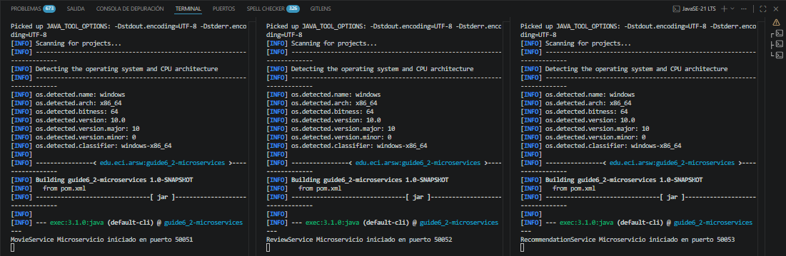
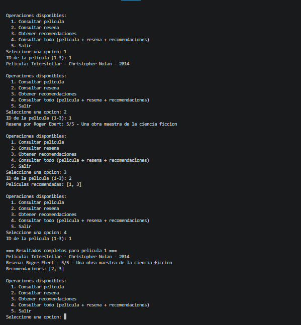

## Ejercicio 6.3 - Microservicios Bienestar

**Paquete:** `src/edu/eci/arsw/excercise6_3/`

**Estado:** :ballot_box_with_check: Implementada.

### Descripcion

Descomposicion del sistema de bienestar universitario en 4 microservicios, cada uno con una responsabilidad cohesiva. Sigue el mismo patron de la Guia 6.2 pero aplicado al dominio de bienestar universitario, con 4 servicios en vez de 3.

### Arquitectura

Cada microservicio es un proceso Maven independiente dentro del mismo modulo. El `.proto` de cada servicio define su propio contrato con `java_package` unico para evitar conflictos entre mensajes con el mismo nombre (como `Empty`).

El cliente (`WellnessClient`) mantiene 4 canales gRPC separados y un menu interactivo con 18 opciones (0-17) que cubren CRUD completo para los 4 servicios.

### Servicios

| Servicio | Responsabilidad | Puerto |
|----------|----------------|--------|
| AppointmentService | Gestionar citas y turnos | 50061 |
| MedicalService | Informacion de especialidades medicas | 50062 |
| GymService | Reservas de sesiones de gimnasio | 50063 |
| RecreationService | Prestamo de recursos recreativos | 50064 |

### Archivos

| Archivo | Ruta | Descripcion |
|---------|------|-------------|
| `pom.xml` | `excercise6_3/pom.xml` | Configuracion Maven (identico al de guide6_2) |
| `appointment.proto` | `excercise6_3/src/main/proto/appointment.proto` | Define `AppointmentService` con 3 RPCs |
| `medical.proto` | `excercise6_3/src/main/proto/medical.proto` | Define `MedicalService` con 2 RPCs |
| `gym.proto` | `excercise6_3/src/main/proto/gym.proto` | Define `GymService` con 2 RPCs |
| `recreation.proto` | `excercise6_3/src/main/proto/recreation.proto` | Define `RecreationService` con 2 RPCs |
| `AppointmentServer.java` | `excercise6_3/src/main/java/.../appointment/AppointmentServer.java` | Servidor gRPC en puerto 50061 |
| `MedicalServer.java` | `excercise6_3/src/main/java/.../medical/MedicalServer.java` | Servidor gRPC en puerto 50062 |
| `GymServer.java` | `excercise6_3/src/main/java/.../gym/GymServer.java` | Servidor gRPC en puerto 50063 |
| `RecreationServer.java` | `excercise6_3/src/main/java/.../recreation/RecreationServer.java` | Servidor gRPC en puerto 50064 |
| `WellnessClient.java` | `excercise6_3/src/main/java/.../excercise6_3/WellnessClient.java` | Cliente interactivo con 4 canales |

### Capacidades CRUD

| Servicio | Crear | Leer | Actualizar | Eliminar |
|----------|-------|------|------------|----------|
| AppointmentService | `RequestAppointment` | `GetAppointments` | `UpdateAppointmentDate` | `CancelAppointment` (soft), `DeleteAppointment` (hard) |
| MedicalService | `AddSpecialty` | `GetSpecialty`, `ListSpecialties` | — | `RemoveSpecialty` |
| GymService | `ReserveSession` | `GetSessions`, `GetAllSessions` | — | `CancelSession` (soft) |
| RecreationService | `AddResource` | `ListResources` | — | `ReturnResource` (toggle) |

### Contratos (.proto)

**appointment.proto** (`java_package = "edu.eci.arsw.excercise6_3.appointment"`):
- 5 RPCs: `RequestAppointment`, `CancelAppointment`, `GetAppointments`, `DeleteAppointment`, `UpdateAppointmentDate`
- Incluye las enumeraciones `ServiceType` y `Status`
- Mensajes nuevos: `DeleteAppointmentRequest`, `DeleteAppointmentResponse`, `UpdateDateRequest`, `UpdateDateResponse`

**medical.proto** (`java_package = "edu.eci.arsw.excercise6_3.medical"`):
- `MedicalService` con 4 RPCs: `GetSpecialty`, `ListSpecialties`, `AddSpecialty`, `RemoveSpecialty`
- `MedicalEmpty`: mensaje vacio para el listado (nombre unico para evitar conflictos con otros `.proto`)
- Mensajes nuevos: `AddSpecialtyRequest`, `AddSpecialtyResponse`, `RemoveSpecialtyRequest`, `RemoveSpecialtyResponse`

**gym.proto** (`java_package = "edu.eci.arsw.excercise6_3.gym"`):
- `GymService` con 4 RPCs: `ReserveSession`, `GetSessions`, `CancelSession`, `GetAllSessions`
- `GymEmpty`: mensaje vacio para listar todas las sesiones
- Mensajes nuevos: `CancelSessionRequest`, `CancelSessionResponse`

**recreation.proto** (`java_package = "edu.eci.arsw.excercise6_3.recreation"`):
- `RecreationService` con 4 RPCs: `ReserveResource`, `ListResources`, `ReturnResource`, `AddResource`
- `RecreationEmpty`: mensaje vacio para el listado (nombre unico para evitar conflictos)
- Mensajes nuevos: `ReturnResourceRequest`, `ReturnResourceResponse`, `AddResourceRequest`, `AddResourceResponse`
- Modela recursos recreativos con `id`, `name`, `available`

### Conceptos clave

1. **Nombres de mensajes unicos entre `.proto`:** Cuando se compilan multiples `.proto` juntos, los nombres de mensajes deben ser unicos globalmente (el espacio de nombres de protobuf es plano). Por eso se usa `MedicalEmpty`, `RecreationEmpty` y `GymEmpty` en vez de `Empty` en los tres.
2. **Dominios separados:** A diferencia de exercise5_3 (que tenia un solo servicio con 3 RPCs), aqui cada dominio (citas, medicina, gimnasio, recreacion) es un servicio independiente con su propia base de datos en memoria.
3. **CRUD completo:** Cada servicio fue extendido para soportar operaciones de crear, leer y eliminar. AppointmentService adicionalmente soporta actualizacion (reprogramar fecha) y dos tipos de eliminacion (soft cancel vs hard delete).
4. **Patron de servidor identico:** Todos los servidores siguen el mismo patron: `ServerBuilder.forPort(PUERTO).addService(new Impl()).build().start()`. La unica diferencia son los datos y la logica de negocio.

### Flujo detallado

1. `run.bat exercise6_3 compile` compila los 4 `.proto` con los nuevos mensajes (11 adicionales) y genera las clases Java.
2. Se inician 4 servidores en terminales separadas.
3. El cliente `WellnessClient` crea 4 canales y 4 stubs, luego presenta un menu con 18 opciones (0-17).
4. Dependiendo de la opcion, el cliente invoca el stub correspondiente: citas (ops 1-5), especialidades (ops 6-9), gimnasio (ops 10-13), recreacion (ops 14-17).

### Detalle de implementacion paso a paso

#### Paso 1 — Archivos `.proto`

Cada archivo define su propio `java_package`:

```protobuf
// appointment.proto
option java_package = "edu.eci.arsw.excercise6_3.appointment";

// medical.proto
option java_package = "edu.eci.arsw.excercise6_3.medical";

// gym.proto
option java_package = "edu.eci.arsw.excercise6_3.gym";

// recreation.proto
option java_package = "edu.eci.arsw.excercise6_3.recreation";
```

**Decision de diseno:** Los nombres de mensajes como `MedicalEmpty` y `RecreationEmpty` son unicos para evitar el error `"Empty" is already defined` de protoc. Aunque los paquetes Java son distintos, protobuf usa un espacio de nombres global para tipos de mensaje.

#### Paso 2 — Servidores

**AppointmentServer** (puerto 50061): Identico al `WellnessGrpcServer` del ejercicio 5.3, con los mismos 3 RPCs y la misma logica de `HashMap<String, Appointment>`.

**MedicalServer** (puerto 50062): Almacena 3 especialidades medicas hardcodeadas (Medicina General, Psicologia, Odontologia). Ofrece `GetSpecialty` (buscar por codigo) y `ListSpecialties` (listar todas).

**GymServer** (puerto 50063): Administra reservas de sesiones de gimnasio. Usa `UUID.randomUUID()` para generar IDs de sesion. Ofrece `ReserveSession` y `GetSessions`.

**RecreationServer** (puerto 50064): Administra prestamo de recursos recreativos (balones, raquetas, juegos de mesa). Usa `available` booleano para controlar disponibilidad. Ofrece `ReserveResource` y `ListResources`.

```java
// RecreationServer — ejemplo de logica de reserva con control de disponibilidad
public void reserveResource(ResourceRequest request,
                             StreamObserver<ResourceResponse> responseObserver) {
    RecreationResource resource = resources.get(request.getResourceId());
    if (resource == null) {
        responseObserver.onNext(ResourceResponse.newBuilder()
                .setSuccess(false).setMessage("ERROR: recurso no encontrado").build());
    } else if (!resource.getAvailable()) {
        responseObserver.onNext(ResourceResponse.newBuilder()
                .setSuccess(false).setMessage("ERROR: recurso ya reservado").build());
    } else {
        RecreationResource updated = resource.toBuilder().setAvailable(false).build();
        resources.put(request.getResourceId(), updated);
        responseObserver.onNext(ResourceResponse.newBuilder()
                .setSuccess(true).setMessage("Recurso reservado exitosamente").build());
    }
    responseObserver.onCompleted();
}
```

#### Paso 3 — Cliente (`WellnessClient.java`)

El cliente mantiene 4 canales gRPC y un menu interactivo:

```java
ManagedChannel appointmentChannel = ...localhost:50061...;
ManagedChannel medicalChannel = ...localhost:50062...;
ManagedChannel gymChannel = ...localhost:50063...;
ManagedChannel recreationChannel = ...localhost:50064...;
```

**Opciones del menu:**

| Opcion | Accion | Servicio |
|--------|--------|----------|
| 1 | Solicitar cita medica | AppointmentService (50061) |
| 2 | Consultar especialidad medica | MedicalService (50062) |
| 3 | Reservar sesion de gimnasio | GymService (50063) |
| 4 | Reservar recurso recreativo | RecreationService (50064) |
| 5 | Salir | — |

**Decisiones de diseno:** A diferencia del cliente de la guia 6.2, este cliente no tiene una opcion "consultar todo" porque los 4 servicios son semanticamente distintos (no hay una entidad unificadora como la pelicula). Cada opcion consulta un servicio diferente.

#### Paso 4 — Ejecucion

```bash
# Compilar desde la raiz
# Limpiar primero si es necesario: clean.bat
run.bat exercise6_3 compile

# Terminal 1 — AppointmentService
run.bat exercise6_3 server1

# Terminal 2 — MedicalService
run.bat exercise6_3 server2

# Terminal 3 — GymService
run.bat exercise6_3 server3

# Terminal 4 — RecreationService
run.bat exercise6_3 server4

# Terminal 5 — Cliente
run.bat exercise6_3 client
```

**Prueba esperada:**

```
Terminal 1:
Appointment Microservicio iniciado en puerto 50061

Terminal 2:
Medical Microservicio iniciado en puerto 50062

Terminal 3:
Gym Microservicio iniciado en puerto 50063

Terminal 4:
Recreation Microservicio iniciado en puerto 50064

Terminal 5:
=== Sistema de Bienestar (Microservicios) ===

--- Solicitar cita medica ---
Seleccione una opcion: 1
ID del estudiante: S123
Tipo de servicio (MEDICINE, PSYCHOLOGY, DENTISTRY): MEDICINE
Fecha (YYYY-MM-DD): 2026-06-15
Cita solicitada exitosamente
  ID cita: a1b2c3d4 | Fecha: 2026-06-15 | Estado: REQUESTED

--- Consultar especialidad medica ---
Seleccione una opcion: 2
Codigo de especialidad (MED01, MED02, MED03): MED01
Especialidad: Medicina General
Descripcion: Atencion medica primaria y prevencion
Disponible: Si

--- Reservar sesion de gimnasio ---
Seleccione una opcion: 3
ID del estudiante: S123
Horario (ej: Lunes 10:00): Lunes 10:00
Sesion reservada exitosamente
  ID sesion: e5f6g7h8

--- Reservar recurso recreativo ---
Seleccione una opcion: 4
ID del estudiante: S123
ID del recurso (REC01, REC02, REC03): REC01
Recurso reservado exitosamente
```

#### Paso 5 — Verificacion

```bash
# Limpiar primero si es necesario: clean.bat
run.bat exercise6_3 compile
# BUILD SUCCESS — 5 modulos compilados
```

### Comparacion: Bienestar gRPC unico (Ejercicio 5.3) vs Microservicios (Ejercicio 6.3)

| Aspecto | Ejercicio 5.3 (gRPC unico) | Ejercicio 6.3 (microservicios) |
|---------|----------------------------|-------------------------------|
| **Numero de procesos** | 2 (servidor + cliente) | 5 (4 servidores + 1 cliente) |
| **Puertos** | 1 (50061) | 4 (50061-50064) |
| **Contratos** | 1 `.proto` con 3 RPCs | 4 `.proto` con 2-3 RPCs cada uno |
| **Canales cliente** | 1 canal | 4 canales |
| **Responsabilidad** | Un solo servicio de bienestar | 4 servicios especializados |
| **Datos** | Citas en un solo HashMap | Cada servicio con sus propios datos |

### Preguntas de reflexion

1. **?Por que se necesitan nombres de mensaje unicos entre los 4 `.proto`?**
   - protobuf usa un espacio de nombres global para tipos de mensaje cuando se compilan varios `.proto` juntos. Si dos archivos definen `Empty`, protoc lanza error. La solucion es usar nombres descriptivos como `MedicalEmpty`, `RecreationEmpty` y `GymEmpty`.

2. **?Que ventaja tiene separar AppointmentService de los demas servicios?**
   - AppointmentService es el unico servicio con estado mutable completo (crear, cancelar, eliminar, reprogramar citas). Los otros servicios son principalmente consulta + reserva simple. Separarlos permite escalar AppointmentService independientemente si hay mucha demanda de citas.

3. **?Como se compara este diseno con el ejercicio 5.3?**
   - En 5.3, todo el dominio de bienestar estaba en un solo servidor con 3 RPCs. En 6.3, hay 4 servidores especializados con 17 RPCs en total (5+4+4+4). La ventaja es independencia de despliegue; la desventaja es que el cliente necesita 4 conexiones y gestiona mas operaciones.

4. **?Que patron de eliminacion se uso en cada servicio y por que?**
    - AppointmentService ofrece dos modos: `CancelAppointment` (soft delete, cambia Status a CANCELLED) y `DeleteAppointment` (hard delete, remueve del mapa). GymService solo soft delete via `CancelSession` (active=false). RecreationService usa toggle con `ReturnResource` (available=true). MedicalService usa hard delete directo con `RemoveSpecialty`. La decision depende del dominio: las citas medicas requieren auditoria (soft), los recursos recreativos necesitan retorno (toggle), las especialidades son datos maestros (hard).

### Como ejecutar

```bash
# Compilar desde la raiz
# Limpiar primero si es necesario: clean.bat
run.bat exercise6_3 compile

# Terminal 1 — AppointmentService
run.bat exercise6_3 server1

# Terminal 2 — MedicalService
run.bat exercise6_3 server2

# Terminal 3 — GymService
run.bat exercise6_3 server3

# Terminal 4 — RecreationService
run.bat exercise6_3 server4

# Terminal 5 — Cliente
run.bat exercise6_3 client
```

---


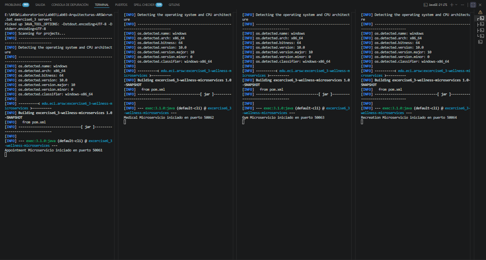
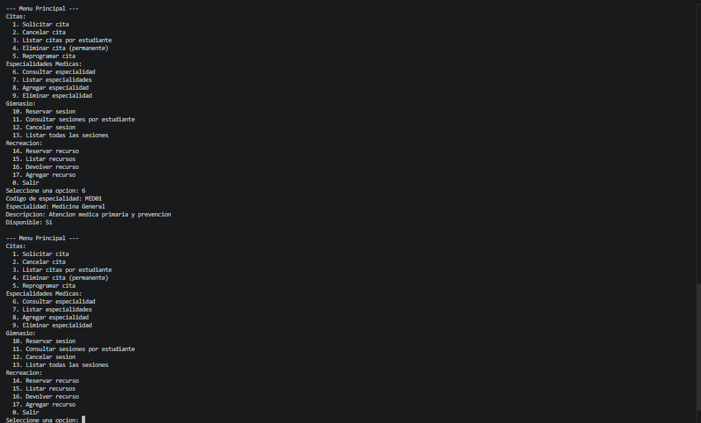

### Diagrama de Arquitectura

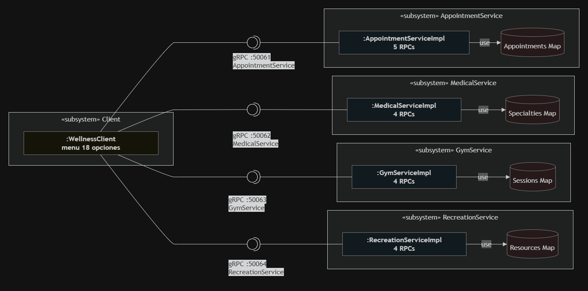

**Por que esta forma:** El servidor unico de gRPC del Ejercicio 5.3 se divide en 4 microservicios independientes, cada uno con su propio puerto gRPC y BD en memoria. `WellnessClient` requiere los 4 servicios y orquesta las llamadas segun un menu de 18 opciones. Mejora la separacion de dominios y el despliegue independiente, pero el cliente ahora conoce 4 puertos — el problema de acoplamiento que motiva el patron Gateway.

## Guia 7.2 - MovieGateway

**Paquete:** `src/edu/eci/arsw/guide7_2/`

**Estado:** :ballot_box_with_check: Implementada.

### Descripcion

Gateway de consola que centraliza el acceso a los microservicios de peliculas (MovieService, ReviewService, RecommendationService). El cliente solo conoce el Gateway, no los puertos individuales de cada servicio.

El Gateway recibe un ID de pelicula por consola (`Scanner`), consulta internamente los 3 servicios via gRPC y consolida la respuesta en una sola salida de texto. Esto resuelve el problema de acoplamiento cliente-servicios que surge en la guia 6.2.

### Arquitectura

`MovieGateway` ejecuta una aplicacion de consola que lee un ID de pelicula desde `Scanner(System.in)`. Internamente crea 3 canales gRPC (uno a cada microservicio) y actua como cliente gRPC. El metodo `printConsolidated` consulta los 3 servicios y produce una salida de texto consolidada en la consola.

> **Diagrama de arquitectura:** `docs/diagrams/guide7_2_architecture.puml`

### Novedades respecto a Microservicios (Guia 6.2)

| Aspecto | Guia 6.2 (sin Gateway) | Guia 7.2 (con Gateway) |
|---------|----------------------|----------------------|
| **Procesos** | 4 (3 servidores + cliente) | 4 (3 servidores + Gateway) |
| **Puertos que conoce el cliente** | 3 (50051, 50052, 50053) | 0 (Gateway los oculta) |
| **Interfaz del cliente** | gRPC (menu interactivo Java) | Consola (Scanner + texto) |
| **Orquestacion** | Lado del cliente (3 llamadas) | Lado del Gateway (1 metodo) |
| **Acoplamiento** | Cliente acoplado a topologia | Cliente desacoplado |

### Archivos

| Archivo | Descripcion |
|---------|-------------|
| `pom.xml` | Configuracion Maven con dependencia a `guide6_2-microservices` |
| `MovieGateway.java` | Gateway de consola (Scanner) + stubs gRPC para los 3 microservicios |

### Conceptos clave

1. **Inversion de descubrimiento:** En guia 6.2, el cliente descubria los servicios y los llamaba directamente. En guia 7.2, el Gateway descubre los servicios y el cliente solo interactua con el Gateway.
2. **Gateway como agregador:** El `printConsolidated()` orquesta las 3 llamadas gRPC internamente y presenta un unico bloque de texto. El cliente no necesita saber cuantos servicios existen ni como se llaman.
3. **Sin puerto de red:** A diferencia de los Gateways HTTP tradicionales, este Gateway es una aplicacion de consola que no expone un puerto de red. La comunicacion con el usuario es via `System.in`/`System.out`.
4. **Dependencia Maven entre modulos:** `guide7_2` declara dependencia en `guide6_2-microservices` para reutilizar las clases generadas por protobuf. Maven reactor compila guide6_2 antes que guide7_2.

### Flujo detallado

1. `MovieGateway` inicia creando 3 canales gRPC hacia MovieService (50051), ReviewService (50052) y RecommendationService (50053).
2. Solicita al usuario que ingrese un ID de pelicula por consola.
3. Lee la entrada con `Scanner.nextInt()`.
4. Invoca `printConsolidated(movieId)` que:
   - Llama `movieStub.getMovie()` → obtiene datos de la pelicula.
   - Llama `reviewStub.getReviews()` → obtiene lista de resenas.
   - Llama `recStub.getRecommendations()` → obtiene lista de titulos recomendados.
   - Imprime un bloque de texto con los resultados consolidados.

### Preguntas de reflexion

1. **?Que problema resuelve el Gateway respecto a la guia 6.2?**
   - En guia 6.2, el cliente conocia 3 puertos (50051, 50052, 50053) y tenia que orquestar las llamadas manualmente. El Gateway oculta esta topologia y orquestacion: el cliente solo ingresa un ID y recibe el resultado consolidado.

2. **?Cual es el trade-off de anadir un Gateway?**
   - **Pro:** Simplicidad del cliente (una sola entrada de consola), orquestacion centralizada, capacidad de anadir concerns transversales (logging, cache).
   - **Con:** Punto unico de falla, salto de red extra (latencia), complejidad operativa (un proceso mas que administrar).

3. **?Como se compara con el patron usado en guia 6.2 (client-side discovery)?**
   - Guia 6.2 usa Client-Side Discovery: el cliente llama a los servicios directamente. Guia 7.2 usa Server-Side Discovery: el Gateway es el unico punto de entrada y agrega los resultados de los 3 servicios.

### Como ejecutar

```bash
# Paso 1 — Instalar todos los artefactos (necesario para resolver dependencias del gateway)
# Limpiar primero si es necesario: clean.bat
run.bat guide7_2 compile

# Terminal 1 — MovieService
run.bat guide7_2 server1

# Terminal 2 — ReviewService
run.bat guide7_2 server2

# Terminal 3 — RecommendationService
run.bat guide7_2 server3

# Terminal 4 — Gateway
run.bat guide7_2 gateway

# El gateway solicita el ID por consola
# Ingrese ID de pelicula (1-3): 1
```

---

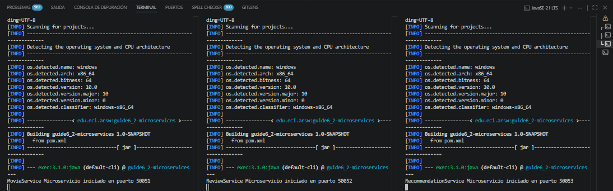
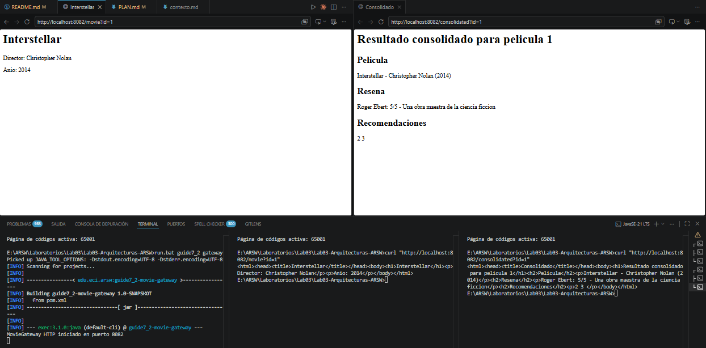

## Ejercicio 7.3 - WellnessGateway

**Paquete:** `src/edu/eci/arsw/excercise7_3/`

**Estado:** :ballot_box_with_check: Implementada.

### Descripcion

Gateway para centralizar el acceso a los servicios de bienestar universitario: AppointmentService, MedicalService, GymService, RecreationService. Sigue el mismo patron de la Guia 7.2 pero aplicado a los 4 microservicios de bienestar.

### Arquitectura

`WellnessGateway` ejecuta un servidor HTTP en el puerto 8083 y crea internamente 4 canales gRPC (uno a cada microservicio de bienestar). El cliente usa HTTP y desconoce la topologia gRPC.

| Endpoint | Metodo | Descripcion | Delega a |
|----------|--------|-------------|----------|
| `/appointment?studentId=X&serviceType=Y&date=Z` | POST | Crear cita | AppointmentService (50061) |
| `/wellness-summary?studentId=X` | GET | Consultar todos los datos de bienestar de un estudiante | Los 4 servicios |
| `/gym/reserve?studentId=X&timeSlot=Y` | POST | Reservar sesion de gimnasio | GymService (50063) |
| `/recreation/reserve?studentId=X&resourceId=Y` | POST | Reservar recurso recreativo | RecreationService (50064) |

### Archivos

| Archivo | Descripcion |
|---------|-------------|
| `pom.xml` | Configuracion Maven con dependencia a `excercise6_3-wellness-microservices` |
| `WellnessGateway.java` | Servidor HTTP (puerto 8083) + cliente gRPC para los 4 microservicios |

### Operaciones

| Operacion | HTTP | Parametros | Accion del Gateway |
|-----------|------|------------|-------------------|
| `requestAppointment` | `POST /appointment` | studentId, serviceType, date | Llama `appointmentStub.requestAppointment()` |
| `getStudentWellnessSummary` | `GET /wellness-summary` | studentId | Llama los 4 stubs y consolida en una pagina HTML |
| `reserveGymSession` | `POST /gym/reserve` | studentId, timeSlot | Llama `gymStub.reserveSession()` |
| `reserveRecreationResource` | `POST /recreation/reserve` | studentId, resourceId | Llama `recreationStub.reserveResource()` |

### Conceptos clave

1. **Mismo patron que Guia 7.2:** Front-end HTTP, back-end gRPC, un solo proceso en un solo puerto.
2. **Endpoint consolidado:** `/wellness-summary` consulta los 4 servicios y construye una unica pagina HTML con secciones para citas, especialidades, sesiones de gimnasio y recursos recreativos.
3. **Semantica de metodos HTTP:** POST para operaciones que cambian estado (crear cita, reservar), GET para consultas de solo lectura (resumen).
4. **Manejo de errores:** Retorna 400 para parametros faltantes, 405 para metodo HTTP incorrecto, y mensajes de error HTML informativos.

### Preguntas de reflexion

1. **?Como mejora el Gateway la experiencia del cliente respecto al ejercicio 6.3?**
   - En ejercicio 6.3, el cliente necesitaba 4 canales gRPC, 4 stubs, un cliente Java complejo y conocer 4 puertos. Con el Gateway, el cliente solo necesita HTTP y una URL. Cualquier lenguaje o herramienta (curl, navegador, Postman) puede interactuar con el sistema de bienestar.

2. **?Cuales son las implicaciones de escalabilidad del endpoint wellness-summary?**
   - `/wellness-summary` llama a los 4 servicios secuencialmente. Si un servicio es lento, toda la respuesta se retrasa. Esto podria mejorarse con llamadas paralelas (un hilo por servicio) pero anade complejidad. Para escenarios de baja carga, secuencial es mas simple y suficiente.

3. **?Que sucede si uno de los microservicios backend esta caido?**
   - El Gateway lanzara una `StatusRuntimeException` de gRPC. En la implementacion actual, esto propaga como error 500. Un Gateway de produccion anadiria reintentos, circuit breakers y degradacion gradual (retornar resultados parciales).

### Como ejecutar

```bash
# Paso 1 — Instalar todos los artefactos (necesario para resolver dependencias del gateway)
# Limpiar primero si es necesario: clean.bat
run.bat exercise7_3 compile

# Terminal 1 — AppointmentService
run.bat exercise7_3 server1

# Terminal 2 — MedicalService
run.bat exercise7_3 server2

# Terminal 3 — GymService
run.bat exercise7_3 server3

# Terminal 4 — RecreationService
run.bat exercise7_3 server4

# Terminal 5 — Gateway
run.bat exercise7_3 gateway

# Pruebas con curl
curl -X POST "http://localhost:8083/appointment?studentId=S123&serviceType=MEDICINE&date=2026-06-15"
curl "http://localhost:8083/wellness-summary?studentId=S123"
```

---


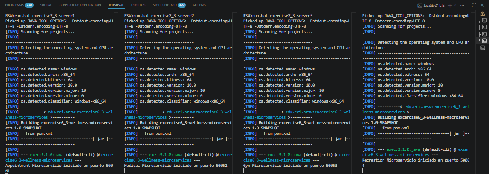
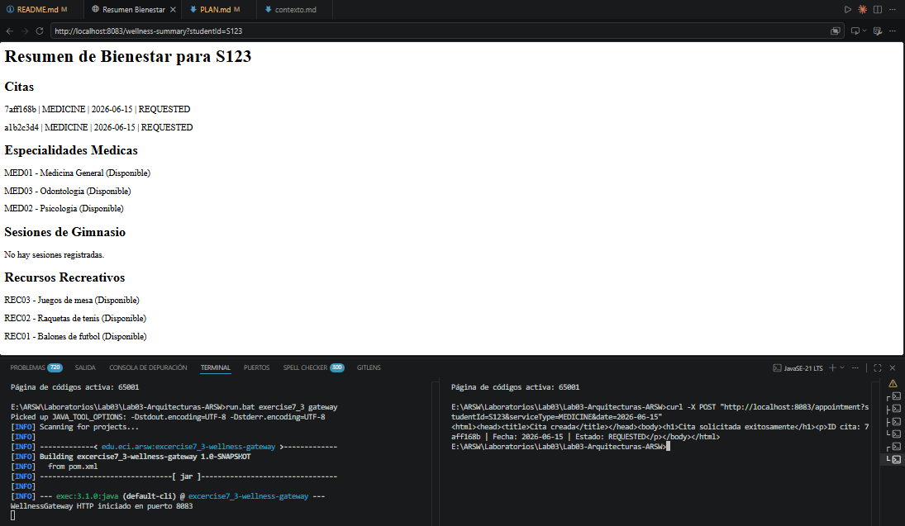

### Diagrama de Arquitectura

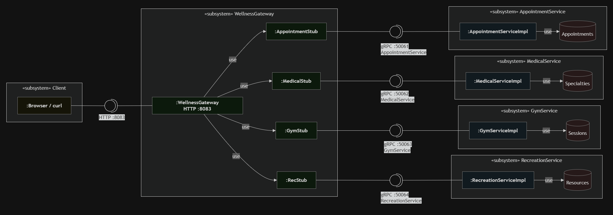

**Por que esta forma:** `WellnessGateway` provee HTTP :8083 al navegador y requiere internamente los mismos 4 servicios gRPC. El Gateway encapsula la creacion de stubs, el enrutamiento (`/appointment`, `/wellness-summary`, `/gym/reserve`, `/recreation/reserve`) y la construccion de respuestas HTML. El cliente ya no conoce los 4 puertos gRPC — solo necesita una URL HTTP. Resuelve el acoplamiento del Ejercicio 6.3 pero anade un punto unico de falla y una latencia extra.

## Ejercicio 8 - ECICIENCIA

**Paquete:** Modulo Maven en `src/edu/eci/arsw/excercise8/`

**Estado:** :white_check_mark: Implementado y funcional.

### Descripcion

Ejercicio integrador final: plataforma distribuida completamente implementada para la gestion del evento ECICIENCIA. Tres microservicios gRPC (AttendeeService, AgendaService, WorkshopService) y un API Gateway que expone endpoints HTTP.

### Estilo Arquitectonico

ECICIENCIA compone **tres estilos arquitectonicos** del taller:

| Estilo | Como se aplica | Por que |
|--------|---------------|---------|
| **gRPC** | 3 servicios con contratos en `eciciencia.proto` (10 RPCs). Comunicacion entre Gateway y microservicios usa serializacion binaria protobuf sobre HTTP/2. | Contratos formales detectan errores en compilacion, tipado fuerte, soporte multilenguaje, protocolo binario eficiente para comunicacion interna entre servicios. |
| **Microservicios** | 3 procesos independientes (AttendeeService :8091, AgendaService :8092, WorkshopService :8093), cada uno con su propia BD en memoria y responsabilidad unica. | Separacion de dominios: cada servicio es dueno de un subconjunto cohesivo de la plataforma (registro, agenda, reservas). Despliegue y escalabilidad independientes. Aislamiento de fallos — una caida en WorkshopService no afecta a AttendeeService. |
| **API Gateway** | `EcicienciaGateway` (:8090) es el unico punto de entrada HTTP. Enruta solicitudes al backend via stubs gRPC, agrega respuestas y oculta la topologia interna al cliente. | El cliente solo conoce una URL y un protocolo (HTTP). Los puertos backend (8091, 8092, 8093) y el protocolo gRPC quedan encapsulados detras del Gateway. Esto desacopla al cliente de la topologia de servicios. |

Los estilos inferiores del taller (Sockets TCP, HTTP sin framework, RMI) no se usan directamente, pero entenderlos es esencial — cada uno resuelve una limitacion del anterior, y ECICIENCIA se sostiene sobre los tres estilos mas avanzados.

### Arquitectura

```
Cliente / Navegador
      |
      v
ECICIENCIA Gateway (:8090) — HTTP (JDK)
      |
      +--- gRPC → AttendeeService (:8091)
      +--- gRPC → AgendaService    (:8092)
      +--- gRPC → WorkshopService  (:8093)
```

### 8.1 Contratos gRPC

Archivo: `src/edu/eci/arsw/excercise8/src/main/proto/eciciencia.proto`

Define 3 servicios con 10 RPCs total:

| Servicio | RPCs | Puerto |
|----------|------|--------|
| AttendeeService | RegisterAttendee, GetAttendee, ListAttendees | 8091 |
| AgendaService | GetActivitiesByTimeSlot, GetActivityDetails, CheckCapacity | 8092 |
| WorkshopService | ReserveSpot, CancelReservation, GetAttendeeReservations, GetAvailableSpots | 8093 |

### 8.2 Servidores Implementados

**AttendeeServer** — Puerto 8091. Datos precargados (Carlos Perez ID=1, Maria Gomez ID=2). Los IDs nuevos se autoincrementan.

**AgendaServer** — Puerto 8092. 4 actividades precargadas con titulo, ponente, ubicacion, horario, aforo maximo y contador de registrados.

**WorkshopServer** — Puerto 8093. Reservas con logica de lista de espera: si el aforo esta lleno, la reserva entra en estado WAITING con posicion en cola. Cancelacion libera cupo y actualiza el contador.

### 8.3 API Gateway

**EcicienciaGateway** — Puerto 8090. Usa `com.sun.net.httpserver.HttpServer`. Stubs gRPC para los 3 servicios internos.

| Metodo | Ruta | Parametros | Descripcion |
|--------|------|-----------|-------------|
| GET | `/attendee` | `id` | Obtener asistente por ID |
| POST | `/attendee/register` | `name`, `email` | Registrar nuevo asistente |
| GET | `/agenda` | `start`, `end` | Actividades por franja horaria |
| GET | `/agenda/activity` | `id` | Detalle + aforo de actividad |
| POST | `/workshop/reserve` | `attendeeId`, `activityId` | Reservar cupo |
| POST | `/workshop/cancel` | `reservationId` | Cancelar reserva |
| GET | `/workshop/attendee` | `id` | Reservas de un asistente |
| GET | `/consolidated` | `id` | Info completa + reservas |

### Capacidades

| Servicio | Que puede hacer |
|----------|----------------|
| **AttendeeService** (gRPC :8091) | Registrar asistentes (`name` + `email`, valida no vacio); consultar por ID (2 precargados: Carlos Perez ID=1, Maria Gomez ID=2); listar todos los asistentes; IDs autoincrementales desde 3 |
| **AgendaService** (gRPC :8092) | 4 actividades precargadas (ML 50 cupo, Arduino 20 cupo, Ciberseguridad 40 cupo, Robotica 15 cupo); consultar por franja horaria (`start`-`end`, comparacion string `HH:mm`); ver detalle (titulo, descripcion, ponente, lugar, horario); consultar capacidad actual |
| **WorkshopService** (gRPC :8093) | Reservar cupo → `CONFIRMED` + `success=true` si hay espacio; lista de espera → `WAITING` + `success=false` + posicion en cola si esta lleno; promocion automatica `WAITING`→`CONFIRMED` al cancelar una confirmada; cancelar reserva (solo si no estaba cancelada); consultar reservas por asistente; consultar disponibilidad; 1 reserva precargada (asistente 1 en actividad 2) |
| **Gateway** (HTTP :8090) | 8 endpoints HTTP↔gRPC; manejo de errores: params faltantes → 400, no encontrado → 404, metodo incorrecto → 405, backend caido → 500, numero invalido → 500; shutdown hook graceful |

### 8.4 Como compilar y ejecutar

```bash
# Desde la raiz: instalar dependencias primero
# Limpiar primero si es necesario: clean.bat
run.bat exercise8 compile

# Terminal 1: AttendeeService (puerto 8091)
run.bat exercise8 server1

# Terminal 2: AgendaService (puerto 8092)
run.bat exercise8 server2

# Terminal 3: WorkshopService (puerto 8093)
run.bat exercise8 server3

# Terminal 4: Gateway (puerto 8090)
run.bat exercise8 gateway
```

> **Nota:** El comando `run.bat exercise8 compile` se encarga de compilar el modulo. Si prefieres usar Maven directamente, ejecuta `mvn compile -pl src/edu/eci/arsw/excercise8 -am` desde la raiz.

### 8.5 Pruebas con curl

```powershell
# 1. Registrar nuevo asistente
curl -X POST "http://localhost:8090/attendee/register?name=Ana+Lopez&email=ana@mail.com"

# 2. Consultar asistente
curl "http://localhost:8090/attendee?id=1"

# 3. Agenda en franja matutina (09:00 - 12:00)
curl "http://localhost:8090/agenda?start=09:00&end=12:00"

# 4. Detalle de actividad con aforo
curl "http://localhost:8090/agenda/activity?id=2"

# 5. Reservar cupo en taller
curl -X POST "http://localhost:8090/workshop/reserve?attendeeId=1&activityId=2"

# 6. Reservas del asistente
curl "http://localhost:8090/workshop/attendee?id=1"

# 7. Info consolidada
curl "http://localhost:8090/consolidated?id=1"

# 8. Cancelar reserva
curl -X POST "http://localhost:8090/workshop/cancel?reservationId=2"
```

### 8.6 Salida esperada

Todas las respuestas son HTML. Ejemplos:

- Registro exitoso: `<h1>Asistente registrado</h1><p>ID: 3 | Nombre: Ana Lopez | Email: ana@mail.com</p>`
- Reserva confirmada: `<h1>Reserva confirmada para actividad 2</h1><p>ID reserva: 2 | Estado: CONFIRMED</p>`
- Aforo: `<p>Aforo: 18/20 (2 disponibles)</p>`
- Error parametros: `<h1>Faltan parametros: attendeeId, activityId</h1>` (HTTP 400)

### 8.7 Decisiones de Diseno

- **Modulo Maven con protobuf plugin:** Sigue el mismo patron de guide5_2 y excercise5_3.
- **gRPC para comunicacion interna:** Contratos formales detectan errores en compilacion.
- **Gateway como adaptador:** Clientes externos usan HTTP; nunca necesitan protobuf.
- **Lista de espera en WorkshopService:** Si el aforo esta lleno, la reserva entra en WAITING con posicion en cola.
- **Estado en memoria:** Datos precargados para pruebas inmediatas. Consistente con el resto del taller.
- **Nombres de mensajes unicos:** `RegisterRequest` (Attendee) vs `ReserveRequest` (Workshop) evitan colisiones.

### 8.8 Reflexion sobre la Evolucion Arquitectonica

El taller traza una progresion clara a traves de seis estilos, cada uno resolviendo un problema del anterior:

1. **Sockets TCP** — Protocolo manual (`MOVIE:id`), solo Java. Aprendimos el cable, pero impractico.
2. **HTTP** — Estructura estandar, cualquier navegador. Pero sin contratos formales.
3. **RMI** — Llamadas remotas como locales. Solo JVM.
4. **gRPC** — Contratos `.proto`, tipado fuerte, multilenguaje.
5. **Microservicios** — Responsabilidades separadas. Cliente conoce demasiados puertos.
6. **API Gateway** — Punto de entrada unico. Cliente simplificado.

ECICIENCIA compone gRPC (estilo 4), microservicios (estilo 5) y Gateway (estilo 6). Los estilos inferiores no se usan directamente, pero entenderlos explica por que existen los superiores.

**Leccion clave:** No hay estilo "mejor" absoluto. Cada decision es un intercambio entre control, simplicidad, interoperabilidad y acoplamiento.

---

---

## Puertos y tecnologias

| Componente | Tecnologia | Puerto |
|-----------|------------|--------|
| MovieServer (TCP) | Java Sockets | 35000 |
| RoomServer (TCP) | Java Sockets | 36000 |
| MovieHttpServer | com.sun.net.httpserver | 8080 |
| RoomHttpServer | com.sun.net.httpserver | 8081 |
| MovieGateway (Guia 7.2) | HTTP (JDK) | 8082 |
| WellnessGateway (Ejercicio 7.3) | HTTP (JDK) | 8083 |
| MovieService (RMI) | Java RMI | 23000 |
| EquipmentService (RMI) | Java RMI | 24000 |
| MovieGrpcServer (Guia 5.2) | gRPC | 50051 |
| MovieService (Microservicio Guia 6.2) | gRPC | 50051 |
| ReviewService (Microservicio Guia 6.2) | gRPC | 50052 |
| RecommendationService (Microservicio Guia 6.2) | gRPC | 50053 |
| WellnessGrpcServer (Ejercicio 5.3) | gRPC | 50061 |
| AppointmentService (Microservicio Ejercicio 6.3) | gRPC | 50061 |
| MedicalService (Microservicio Ejercicio 6.3) | gRPC | 50062 |
| GymService (Microservicio Ejercicio 6.3) | gRPC | 50063 |
| RecreationService (Microservicio Ejercicio 6.3) | gRPC | 50064 |
| ECICIENCIA Gateway | HTTP (JDK) | 8090 |
| AttendeeService (Ejercicio 8) | gRPC | 8091 |
| AgendaService (Ejercicio 8) | gRPC | 8092 |
| WorkshopService (Ejercicio 8) | gRPC | 8093 |

---

## Compilacion y ejecucion

### Proyectos Java puro (guide2_2, excercise2_3, guide3_2, excercise3_3, guide4_2, excercise4_3, guide7_2, excercise7_3, excercise8)

```bash
run.bat <directorio> compile
run.bat <directorio> server
run.bat <directorio> client
```

### Proyectos gRPC y microservicios (guide5_2, excercise5_3, guide6_2, excercise6_3)

```bash
run.bat <directorio> compile
run.bat <directorio> server|server1|server2|...
run.bat <directorio> client
```

---

## Orden sugerido de implementacion

1. guide2_2 -> excercise2_3 (Sockets TCP)
2. guide3_2 -> excercise3_3 (HTTP basico)
3. guide4_2 -> excercise4_3 (Java RMI)
4. guide5_2 -> excercise5_3 (gRPC + protobuf)
5. guide6_2/* -> excercise6_3/* (Microservicios)
6. guide7_2 -> excercise7_3 (API Gateway)
7. excercise8/* (Ejercicio integrador)

---

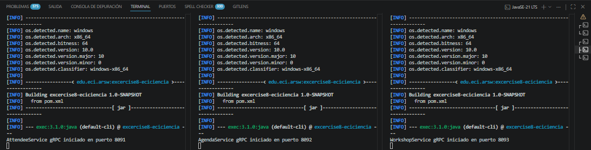

### Diagrama de Arquitectura

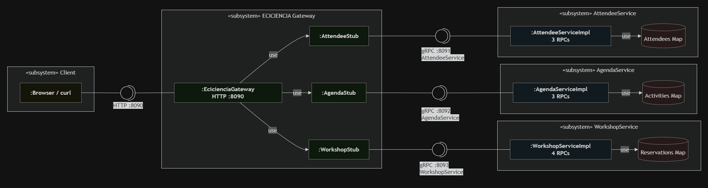

**Por que esta forma:** ECICIENCIA es la arquitectura mas compleja del taller y combina tres estilos:

1. **Gateway (HTTP :8090):** `EcicienciaGateway` provee HTTP al navegador y requiere 3 servicios backend via stubs gRPC. A diferencia del Ejercicio 7.3, este Gateway expone 8 endpoints con manejo completo de errores (400 para params faltantes, 404 para no encontrado, 405 para metodo incorrecto, 500 para fallos del backend). El endpoint `/consolidated` agrega datos de los 3 servicios en una sola pagina HTML — la maxima simplificacion para el cliente.

2. **Servicios gRPC (3 contratos independientes):** `AttendeeService` (:8091, 3 RPCs) gestiona el registro con IDs autoincrementales. `AgendaService` (:8092, 3 RPCs) maneja la agenda con filtrado por franja horaria y control de aforo. `WorkshopService` (:8093, 4 RPCs) implementa reservas con lista de espera — si el aforo esta lleno, la reserva entra en estado `WAITING` y se promueve automaticamente a `CONFIRMED` cuando se cancela una reserva previa. Los 10 RPCs estan definidos en un unico `eciciencia.proto`.

3. **Microservicios (separacion de dominios):** Cada servicio es dueno de su propia BD en memoria (Attendees Map, Activities Map, Reservations Map) y se ejecuta como proceso independiente. Sigue el mismo patron del Ejercicio 6.3 pero con logica de negocio mas rica (listas de espera, control de aforo, cancelaciones en cascada).

El diagrama muestra la topologia completa: Browser → HTTP → Gateway → gRPC → 3 servicios. Cada flecha representa un limite de protocolo: HTTP para clientes externos, gRPC para comunicacion interna entre servicios. Los stubs (`AttendeeStub`, `AgendaStub`, `WorkshopStub`) son internos del Gateway y no accesibles desde fuera, lo que refuerza el rol del Gateway como unico punto de entrada.

## Guía de Pruebas Paso a Paso

Esta sección detalla el procedimiento exacto para compilar, ejecutar y verificar cada guía y ejercicio del laboratorio.

---

### Guía 2.2 — MovieServer TCP

**Paso 1 — Compilar:**
```bash
run.bat guide2_2 compile
```
*Esperado:* `BUILD SUCCESS` (archivos .class generados en `bin/`)

**Paso 2 — Iniciar servidor (Terminal 1):**
```bash
run.bat guide2_2 server
```
*Esperado:* El servidor imprime "MovieServer started on port 35000" y queda esperando conexiones.

**Paso 3 — Ejecutar cliente (Terminal 2):**
```bash
run.bat guide2_2 client
```
*Esperado:* El cliente se conecta y solicita escribir un nombre de película.

**Paso 4 — Prueba:** Escriba un nombre (ej: `Batman`, `Superman`).
*Esperado:* El servidor responde con año y calificación (ej: `Batman (2022) - Rating: 7.2/10`). Escriba `quit` para salir.

---

### Ejercicio 2.3 — Gestión de Salones TCP

**Paso 1 — Compilar:**
```bash
run.bat exercise2_3 compile
```

**Paso 2 — Iniciar servidor (Terminal 1):**
```bash
run.bat exercise2_3 server
```
*Esperado:* "RoomServer started on port 36000"

**Paso 3 — Ejecutar cliente (Terminal 2):**
```bash
run.bat exercise2_3 client
```
*Esperado:* Menú interactivo (reservar, cancelar, listar salones).

**Paso 4 — Prueba:** Seleccione opción 1 (reservar) e ingrese "101".
*Esperado:* "Room 101 booked successfully." Luego liste salones para confirmar.

---

### Guía 3.2 — MovieHttpServer

**Paso 1 — Compilar e iniciar servidor:**
```bash
run.bat guide3_2 compile
run.bat guide3_2 server
```
*Esperado:* "MovieHttpServer started on port 8080"

**Paso 2 — Probar con curl:**
```bash
curl "http://localhost:8080/movies?name=Batman"
```
*Esperado:* `{"name":"Batman","year":2022,"rating":7.2}`

```bash
curl "http://localhost:8080/movies?name=Inexistente"
```
*Esperado:* `404 Not Found` o `{"error":"Movie not found"}`

---

### Ejercicio 3.3 — Gestión de Salones HTTP

**Paso 1 — Compilar e iniciar servidor:**
```bash
run.bat exercise3_3 compile
run.bat exercise3_3 server
```
*Esperado:* "RoomHttpServer started on port 8081"

**Paso 2 — Probar endpoints:**
```bash
curl -X POST "http://localhost:8081/rooms" -d "name=101"
curl "http://localhost:8081/rooms"
curl -X POST "http://localhost:8081/rooms/101/book"
curl -X POST "http://localhost:8081/rooms/101/cancel"
```

---

### Guía 4.2 — MovieService RMI

**Paso 1 — Compilar:**
```bash
run.bat guide4_2 compile
```

**Paso 2 — Iniciar servidor (Terminal 1):**
```bash
run.bat guide4_2 server
```
*Esperado:* "MovieService RMI Server started on port 23000" (también inicia `rmiregistry`)

**Paso 3 — Ejecutar cliente (Terminal 2):**
```bash
run.bat guide4_2 client
```
*Esperado:* Cliente obtiene lista de películas vía RMI. Ej: `Movies: [Batman (2022) - 7.2, Superman (1978) - 7.4, ...]`

---

### Ejercicio 4.3 — Inventario de Laboratorios RMI

**Paso 1 — Compilar e iniciar servidor:**
```bash
run.bat exercise4_3 compile
run.bat exercise4_3 server
```
*Esperado:* "EquipmentService RMI Server started on port 24000"

**Paso 2 — Ejecutar cliente:**
```bash
run.bat exercise4_3 client
```
*Esperado:* Menú interactivo para agregar, eliminar, listar y buscar equipos.

---

### Guía 5.2 — MovieService gRPC

**Paso 1 — Compilar:**
```bash
run.bat guide5_2 compile
```
*Esperado:* `BUILD SUCCESS`. Las clases protobuf se generan en `target/generated-sources/`.

**Paso 2 — Iniciar servidor (Terminal 1):**
```bash
run.bat guide5_2 server
```
*Esperado:* "MovieGrpcServer started, listening on port 50051"

**Paso 3 — Ejecutar cliente (Terminal 2):**
```bash
run.bat guide5_2 client
```
*Esperado:* Cliente envía peticiones gRPC e imprime detalles de películas.

---

### Ejercicio 5.3 — Bienestar Universitario gRPC

**Paso 1 — Compilar:**
```bash
run.bat exercise5_3 compile
```

**Paso 2 — Iniciar servidor (Terminal 1):**
```bash
run.bat exercise5_3 server
```
*Esperado:* "WellnessGrpcServer started, listening on port 50061"

**Paso 3 — Ejecutar cliente (Terminal 2):**
```bash
run.bat exercise5_3 client
```
*Esperado:* Cliente interactúa con servicios de bienestar (citas, historial médico, etc.) vía gRPC.

---

### Guía 6.2 — Microservicios de Películas

**Paso 1 — Compilar:**
```bash
run.bat guide6_2 compile
```

**Paso 2 — Iniciar 3 servidores (Terminales 1-3):**
```bash
run.bat guide6_2 server1    # MovieService → puerto 50051
run.bat guide6_2 server2    # ReviewService → puerto 50052
run.bat guide6_2 server3    # RecommendationService → puerto 50053
```
*Esperado:* Cada uno imprime "XxxService started, listening on port YYYYY"

**Paso 3 — Ejecutar cliente (Terminal 4):**
```bash
run.bat guide6_2 client
```
*Esperado:* Cliente consulta los 3 microservicios y muestra resultados agregados.

---

### Ejercicio 6.3 — Microservicios de Bienestar

**Paso 1 — Compilar:**
```bash
run.bat exercise6_3 compile
```

**Paso 2 — Iniciar 4 servidores (Terminales 1-4):**
```bash
run.bat exercise6_3 server1    # AppointmentService → puerto 50061
run.bat exercise6_3 server2    # MedicalService → puerto 50062
run.bat exercise6_3 server3    # GymService → puerto 50063
run.bat exercise6_3 server4    # RecreationService → puerto 50064
```

**Paso 3 — Ejecutar cliente (Terminal 5):**
```bash
run.bat exercise6_3 client
```
*Esperado:* Cliente agrega datos de los 4 servicios de bienestar.

---

### Guía 7.2 — MovieGateway

**Paso 1 — Instalar dependencias (solo una vez):**
```bash
run.bat guide7_2 compile
```
Esto ejecuta `mvn install -DskipTests` para asegurar que el JAR de guide6_2 esté disponible.

**Paso 2 — Iniciar 3 microservicios (Terminales 1-3):**
```bash
run.bat guide7_2 server1    # MovieService
run.bat guide7_2 server2    # ReviewService
run.bat guide7_2 server3    # RecommendationService
```

**Paso 3 — Iniciar gateway (Terminal 4):**
```bash
run.bat guide7_2 gateway
```
*Esperado:* "MovieGateway started on port 8082"

**Paso 4 — Probar vía gateway:**
```bash
curl "http://localhost:8082/movies?name=Batman"
```
*Esperado:* El gateway recibe la petición, delega a los microservicios y retorna la respuesta completa.

---

### Ejercicio 7.3 — WellnessGateway

**Paso 1 — Instalar dependencias:**
```bash
run.bat exercise7_3 compile
```
Esto ejecuta `mvn install -DskipTests` para asegurar que el JAR de exercise6_3 esté disponible.

**Paso 2 — Iniciar 4 microservicios (Terminales 1-4):**
```bash
run.bat exercise7_3 server1    # AppointmentService
run.bat exercise7_3 server2    # MedicalService
run.bat exercise7_3 server3    # GymService
run.bat exercise7_3 server4    # RecreationService
```

**Paso 3 — Iniciar gateway (Terminal 5):**
```bash
run.bat exercise7_3 gateway
```
*Esperado:* "WellnessGateway started on port 8083"

**Paso 4 — Probar vía gateway:**
```bash
curl "http://localhost:8083/appointments?user=123"
curl "http://localhost:8083/medical/records?user=123"
```
*Esperado:* El gateway agrega respuestas de los microservicios de bienestar.

---

### Ejercicio 8 — ECICIENCIA

**Paso 1 — Compilar:**
```bash
run.bat exercise8 compile
```

**Paso 2 — Iniciar 3 servidores (Terminales 1-3):**
```bash
run.bat exercise8 server1    # AttendeeService → puerto 8091
run.bat exercise8 server2    # AgendaService → puerto 8092
run.bat exercise8 server3    # WorkshopService → puerto 8093
```

**Paso 3 — Iniciar gateway (Terminal 4):**
```bash
run.bat exercise8 gateway
```
*Esperado:* "EcicienciaGateway started on port 8090"

**Paso 4 — Probar vía gateway:**
```bash
curl -X POST "http://localhost:8090/attendee/register?name=Ana+Martinez&email=ana%40mail.com"
curl "http://localhost:8090/attendee?id=3"
curl "http://localhost:8090/agenda?start=08:00&end=18:00"
curl -X POST "http://localhost:8090/workshop/reserve?attendeeId=3&activityId=1"
curl -X POST "http://localhost:8090/workshop/cancel?reservationId=1"
curl "http://localhost:8090/consolidated?id=3"
```
*Esperado:* El gateway retorna datos agregados de los 3 servicios backend (asistentes, agenda, talleres).
